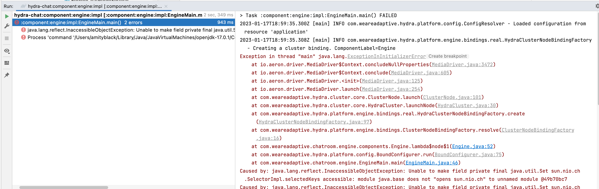
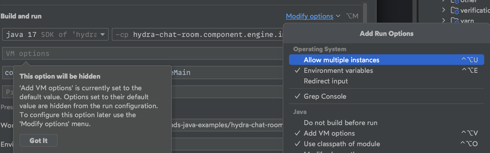
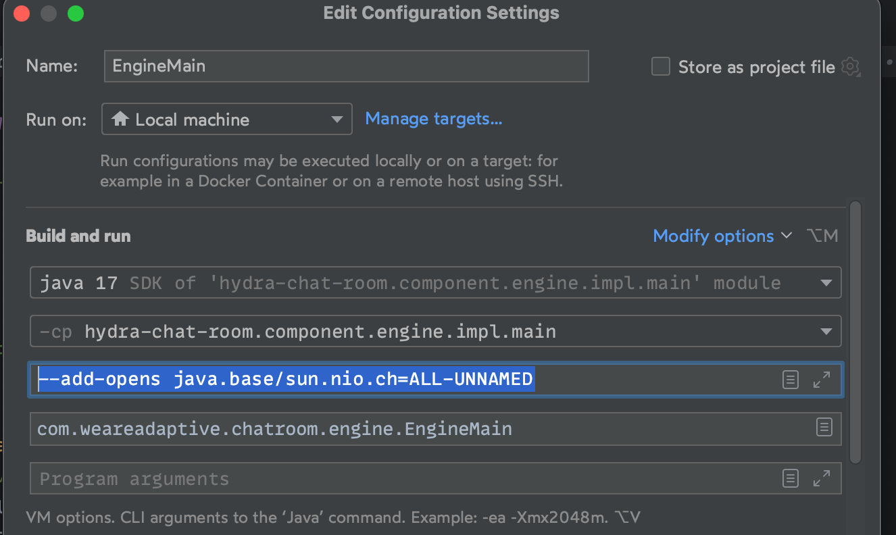

# hydra-chat-room

This repo contains a very simple example of consuming a Hydra infinite stream, via a replay channel.
It demonstrates this via a rudimentary chat-room implementation.


## How to spin this up
To keep this repo minimal there's no docker or anything, so you'll need to spin stuff up from within your IDE.
You'll find the classes:
* EngineMain
* SenderMain
* ReceiverMain
Note: see tips to learn how to run on Java 17

## Recommended scenarios
Before running this stuff it's recommended that you at least read the javadoc for each of the Main classes, such that 
you understand the expected arguments

### Scenario 1 
* Start EngineMain 
* Start ReceiverMain live
* Start SenderMain yourname yourmessage

Look at the logs in the engine, the sender and the receiver.
Now review the code in each of the Main classes, cross-reference with logs and ensure you understand what has just happened

### Scenario 2 (follows on)
* Kill ReceiverMain
* Start ReceiverMain earliest

Look at the receiver logs, you should see it has received the message sent during scenario 1
(note: this may not be the last log entry, so scroll about a bit until you find it)

* Start SenderMain yourname yourmessage>

Check your receiver logs. You should see it has now received this new message.

* What's happened in this scenario? 
* What does it imply about how events are delivered to consumers in Hydra-World?
* Take a look at the log entry relating to replay position.
  * What might this position mean?
  * How might it be useful in your next assignment?
* Have a look in the directory
```
    ./hydra-data
```

### Scenario 3 (follows on)
* Kill EngineMain
* Kill ReceiverMain
```
    rm -rf ./hydra-data
```
* Start EngineMain
* Start ReceiverMain earliest

Look in the receiver logs: 

* Are any historic messages received?
* What does that tell you about the contents of the ./hydra-data directory?

## The full picture
Given what we already know about Hydra, let's look at this scenario end-to-end and identify the key platform elements.


## Tips 
When running EngineMain and the other Main classes in Intellij configured with Java 17 you will encounter an error



You may find the root cause is listed as

`Caused by: java.lang.reflect.InaccessibleObjectException: Unable to make field private final java.util.Set sun.nio.ch.SelectorImpl.selectedKeys accessible: module java.base does not "opens sun.nio.ch" to unnamed module @49b70bc7`

Searching for this error (remove the @49b70bc7 at the end) you will find https://aeroncookbook.com/cookbook-content/aeron-jdk16/

To add arguments to the run configuration in Intellij:
(Choose Add VM options)

(Paste text from Aeron Cookbook)


Make sure to click Apply