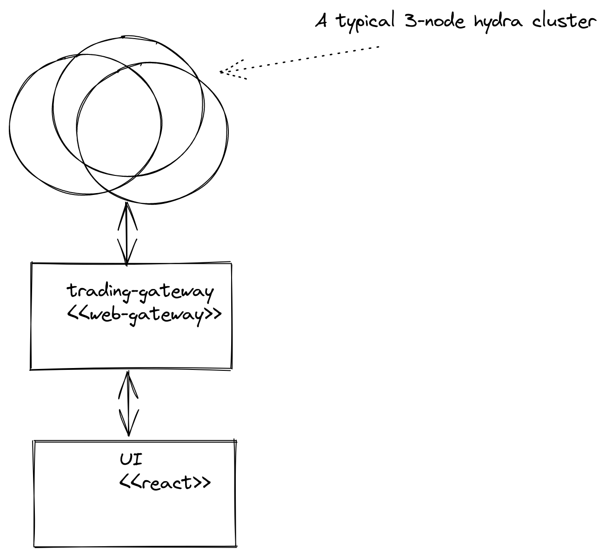
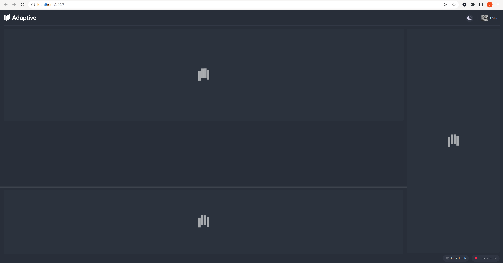
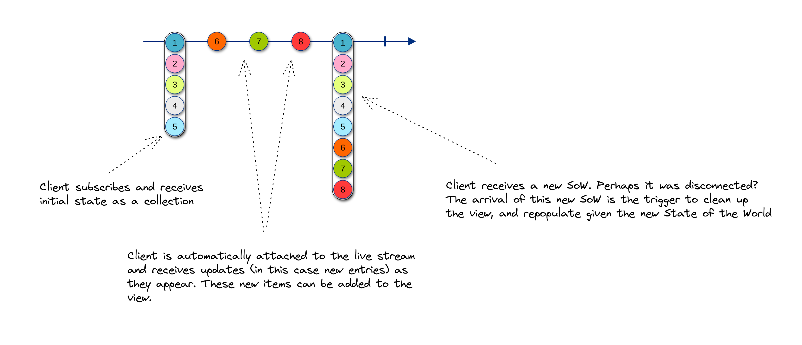
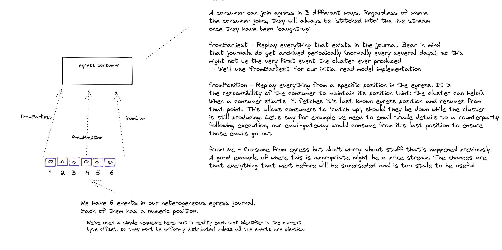
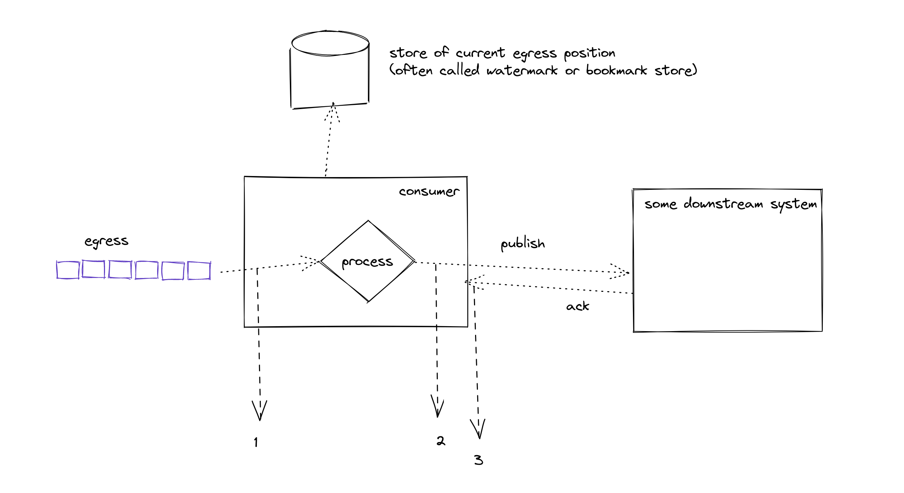

# Hydra Reactive Trader

Reactive Trader is Adaptive's foreign exchange (FX) demo application, and is open source on GitHub.

URL: https://www.reactivetrader.com  
Source code: https://github.com/AdaptiveConsulting/ReactiveTraderCloud

## Reactive Trader in Action

To give some context, let’s take a look at the Reactive Trader UI in action and try to map that to an underlying logical architecture.

https://github.com/AdaptiveConsulting/academy-guides/assets/3295115/2612c3f5-fcb9-4651-a1c9-303883230745

From this simple demo we can summarise the functionality thus:

- The UI is displaying _ticking_ prices for available currency pairs
- The trader can execute a _buy_ or _sell_ of a currency pair. This trade can:
  - Be accepted in a timely fashion
  - Be accepted, but slowly
  - Be rejected
- Accepted/ Rejected trades are shown in the _blotter_ at the bottom
- Profit and Loss _(PnL)_ is displayed
- Current positions are displayed, by currency _(CCY)_

### A quick exercise...

Given what you have learned so far, can you sketch out a high level architecture that might service the requirements of this UI? It doesn’t have to be Hydra based, but see if you can come up with solutions/ answers to some of the following:

- What are the different ways the UI could receive the ticking prices? Which of the identified options would you choose, and why?
- What state does your server need to maintain? What further questions might you need to ask of your analyst in relation to that state?
- What interactions might occur when the trader hits _execute?_ What kind of data might you want to pass in the execution request and why? What would be possible ways of passing that data and receiving a response from your back-end? How do you ensure the UI remains responsive while an execution is _in-flight?_
- What does restarting your system look like, following a crash or a controlled restart?

### Things to think about but not necessarily solve!

- Does your architecture make any provision for _fault tolerance?_
- Does your architecture _scale_? How might you add capacity if the client wanted to move from 10 internal traders to a million active retail clients?
- What kind of message formats might you use between the components and what are the some of the trade-offs?

## Getting Reactive Trader Running

### A quick look at the topology

The Reactive Trader architecture looks like this:



We don’t expect you to need to change the UI, but you will need to run it locally in order to prove back-end changes.

### Running the UI against the cloud instance of the Hydra back-end.

Clone the UI source code from https://github.com/AdaptiveConsulting/ReactiveTraderCloud.

Let’s prove we have everything we need in our environment to build and run the web UI. Initially we’ll point it at the Hydra instance that’s running in the cloud.

```bash
git clone git@github.com:AdaptiveConsulting/ReactiveTraderCloud.git
cd ReactiveTraderCloud/src/client
npm install
VITE_HYDRA_URL=wss://trading-web-gateway-rt-prod.demo.hydra.weareadaptive.com npm start
```

Now browse to http://localhost:1917.

Play around a bit, check prices are ticking and that the blotter is populated when you execute a trade.

<aside>
💡 It may take a while to render the page first time
</aside>

<aside>
💡 Some CCY pairs are stubbed to fail or to exhibit high latency. Try a few.
</aside>

### Building and running the back-end, locally

Clone the back-end source code from
https://github.com/AdaptiveConsulting/hydra-reactive-trader.

Firstly, let’s kill the web UI we had pointed to the cloud and restart it, this time pointing at our non-existent local Hydra instance.

```bash
VITE_HYDRA_URL=ws://localhost:8929 npm start
```

<aside>
💡 Note the difference in protocol, wss vs. ws. Make sure you understand the difference.
</aside>

Your browser should now look something like this:



To get our local Hydra instance running we need to do the following:

- Clone the repository, using the branch that has been setup for the early_careers programme
- Build and test it
- Build the docker images for the components
- Start instances of those containers

```bash
git clone git@github.com:AdaptiveConsulting/hydra-reactive-trader.git
```

All subsequent steps can be found in the project’s [README.md](http://README.md.cd)

<aside>

💡 Hopefully by this stage you’ve already got the [Hydra Platform Skeleton](https://github.com/AdaptiveConsulting/hydra-platform-skeleton) project building, so many of the steps in the README will not need repeating.

It is important not to run the <code>./onboarding-runtime.sh</code> script in this repo, run the runtime and credeintials scripts in the Adpative [Onboarding Repository](https://github.com/AdaptiveConsulting/onboarding) instead.

Ensure you get to the stage where the 3 engine nodes and the trading gateway are all running in docker. Your web app should connect and work as before (may need a refresh or even a restart of the client).

</aside>

<aside>

ℹ️ The README mentions starting and stopping the docker containers with `./gradlew startServices` and `./gradlew stopServices`.

This is just a thin wrapper around `docker compose up -d` and `docker compose down -v` (see below). It can be useful for your understanding to bring up and down the services in docker directly, instead of doing it with gradle.

To build the docker containers before running, you can use `./gradlew buildContainers`.

**Note**: Because the `docker-compose.yml` file is in the `docker` subfolder, you have to `cd` into that folder to run `docker compose up` and `docker compose down` , or use the `-f` switch to point to the file.

</aside>

#### Some useful docker commands; worth experimenting with

```bash
docker ps
docker logs <container>
docker logs -f <container>
docker kill <container>
docker kill $(docker ps -q)
docker stop <container>
docker start <container>
```

#### And some docker-compose commands

Run from within the docker folder of the Hydra back-end

```bash
# start all services in the background
docker compose up -d

# stop all services and delete volumes (useful for when you want to destroy
# persisted state
docker compose down -v
```

### A bit of a shortcut

Building the docker images every time you want to manually test a change quickly becomes laborious. Often we can rely on tests to drive our development, but the conscientious developer will always want to see it working with their own eyes. Luckily we can spin up a single engine node and a gateway from within the IDE.

- Find the EngineMain class, right-click, run
- Find the TradingGatewayMain class, right-click, run

<aside>

💡 Make sure you’ve stopped the docker instances else you’ll end up with port conflicts!

</aside>

The web app should now be able to connect to the instance you’ve started from within the IDE.

<aside>

💡 You can also start these components in debug mode, but beware of breakpoints causing missed heartbeats and component disconnection.

</aside>

## Tasks

### 1. Reference Data Admin

Reference data for traded currency pairs already exists in the system and is requested and utilised by the web front-end. There are a number of shortcomings in the back-end.

- The reference data is currently a hard-coded map, living within the Trading Gateway. In a real system we’d expect this state to be stored within the Hydra cluster itself.
- The UI is built to expect an infinite stream of CCY pair reference data updates (using a very common State of the world + Updates pattern). However, the current gateway simply emits the SoW and terminates the stream.
- The UI is built to handle the removal of CCY pairs. Given what we’ve just said above, the back-end isn’t.

#### Features

- As an admin I want to be able to both **add and remove** currency pairs, via a simple CLI
- As an admin I want my reference **data to be persisted**, such that when the system recovers my set of tradable CCY pairs is _as it was_ before the shutdown
- As a regulator I require that there is a **persisted record** somewhere of when CCY pairs were added/ removed
  - It is quite acceptable for a tech person to meet this requirement using existing Hydra tooling
- As a trader I want to be able to trade all **available currency pairs** when I open the app
- As a trader I want to be able to trade **newly added currency pairs**, without having to **refresh the app**
- As a trader I should **not** be able to trade **removed currency pairs**
  - Think about race conditions in this one. Which component in the architecture holds the _truth_ about the trade-ability of a currency pair?

#### Tip: State-of-the-world

The currency pair updates in Reactive Trader uses the common "state-of-the-world plus updates" streaming pattern,
as illustrated below.



### 2. Reporting

Currently there is no record of trade events outside of the cluster other than what is shown in the UI.

#### Features

- As a stakeholder I want access to a downstream CSV file with a record of trade events.
  - Every time a trade is executed (whether accepted or rejected) I want it to be written to a file, in CSV format
  - The intra-day file should be updated in as close to real-time as possible, new trades should be appended at the bottom.
  - All relevant trade information should be recorded, including the trade id, trade time, etc.
  - At the start of every new trading day, the records of the previous day should be archived
    to a separate file with the date in the name, and a new file should be started for the current day.
  - There must not be any duplicates in the file.
  - There should be no gaps in the file, i.e. even if the report writer goes down for some reason,
    it should be able to catch up on missed trades.
- As a stakeholder I would like to be able to configure how often the CSV trade report "rolls", e.g. daily, hourly, etc., and what naming pattern is used for the file.

#### Tips

- You can't write to file directly from the cluster (because IO is non-deterministic!)
- You may need to consume the _cluster egress_ (see below)
- You may need to look into _watermarking_ to catch up on trade events

### More about the Hydra Egress

You’ve hopefully got a pretty good grasp on the idea that there is a single _pipe_ into the
cluster and that we are able to reconstitute the cluster state by replaying those inbound
_commands_. We can employ a similar strategy for output and, indeed, there is a single persistent
event stream out the back of the cluster. We refer to this stream as _the egress_.

You’ll remember that a cluster is composed of a leader and _n_ followers and can operate whenever
a majority of nodes are correctly reporting their presence to the others. Incidentally, we often
refer to this setup as having a fault tolerance of _(n - 1) / 2._ You can see from the diagram
above that events emitted by a single node are written to a persistent egress journal and the same
is true for all active nodes in the cluster. This is an oft-missed subtlety in that, at runtime,
all nodes are receiving the commands, all nodes are processing the commands and all nodes are
publishing to their own instance of an egress topic. When a leader leaves the cluster, clients
begin _producing_ to the new leader. Equally, _consumers_ of egress begin consuming from the
leader’s egress. Think about this for a moment and you’ll begin to understand why so much emphasis
is placed on _determinism_ within the cluster. As soon as those egress journals diverge.... _all
bets are off and your system is broken, very broken!_



#### Delivery guarantees and idempotency

Whenever you’re consuming from a persistent stream then you’ll need to give some consideration to
delivery guarantees and idempotency. Let’s take a look at each of the possibilities, given the \
egress model we’ve described above.

_At-most-once_

If we _join at live_ then we aren’t utilising the replay potential of the stream. We can think of
this as providing _at-most-once_ delivery. We may not process events, if say we crash during
processing or if we’re simply not active at the point of production. Use this where it doesn’t
matter if you miss events.

_At-least-once_

In this (most common) model we are guaranteed to see each message, but we may well see some
messages more than once. Let’s look at that in more detail...



- Events are consumed, one-by-one, from egress
- Each event is processed
- Some output is published to a downstream system

In order that we can ensure each event is processed we’ve already seen how we’d need to store our
_processed_ egress position, such that we can resume from that point following an outage. The
question then is what we mean by _processed_, and we can discuss this in terms of where we choose
to store our _watermark, {1,2,3}._

1. We store the watermark as soon as we receive the event. What happens if we crash during
   processing? Well, we’ve marked that event as being consumed, so when we restart we will replay
   from the event immediately following it. We’ll never process the event that was in-flight when we
   crashed and the downstream system will never see it. We have only provided _at-most-once_ delivery
   guarantees to our downstream system. Of course, this might be fine; it won’t be in many cases.

2. We store the watermark as soon as we’ve done the processing, but before we publish to
   downstream. Same deal as 1. We’ve processed it, but there’s still no guarantee the downstream
   system gets to see the output of that processing.

3. We only store the watermark once we receive an acknowledgement from downstream that our publish
   has been successful. The exact meaning of this ack will obviously depend on the protocol agreed
   with the downstream system, but let’s assume it means “This message has been put on a queue and
   we’ll ensure the downstream app sees it eventually”. This looks perfect. The downstream system
   must always see our output exactly once, right? The answer is _no_. Consider what happens if
   _publish_ succeeds, but we crash before we receive the _ack._ When we recover we won’t have
   updated our watermark store, so we’ll see and process that event again. The end-result, our
   downstream system sees our output twice, hence, _at-least-once_ delivery. This brings us nicely to
   idempotency. Whenever you’re building streaming based systems it’s beneficial to make your
   components/ services idempotent if possible.

More on idempotence: https://www.bmc.com/blogs/idempotence/

You may be asking, “how do I achieve exactly once delivery then?”. To do that you need to somehow bake it into your protocol. For example, if you write the egress offset into the message you output it is then possible to query the _last_ message you published and use that to determine the truth about what you’ve processed.
