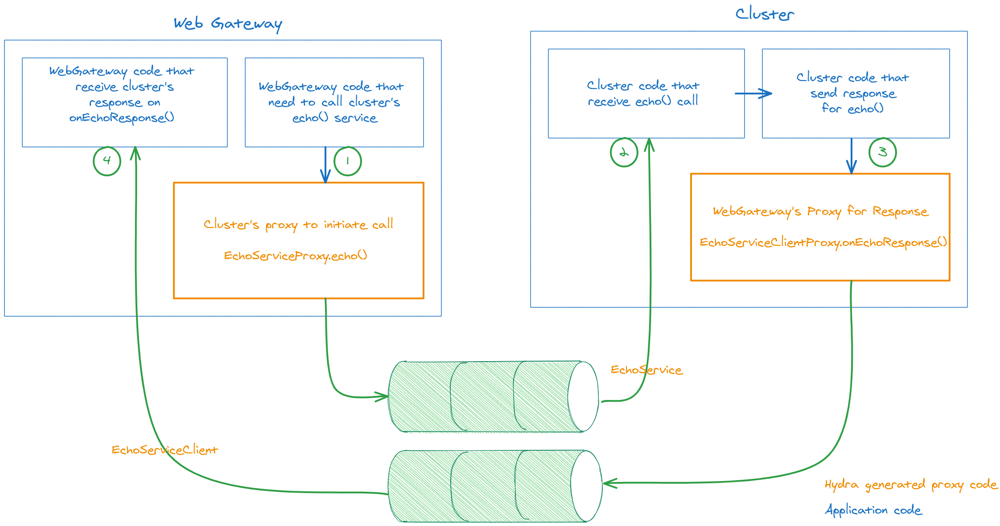

# Proxies and Stub & Skeleton

In a distributed software architecture, most components need to interact with each other. These interactions can often be across different machines, networks, or geographical locations.

Interaction between the distributed applications can be viewed as applications making method/ function/procedure calls to remote applications to avail of a service. The application that needs this service and initiates the call is identified as the client. The application that provides or implements the service is identified as the server.

These interactions or calls, when related, are typically bundled into groups known as Services, or in the context of Java, they are referred to as Interfaces.

Key actors in the scene of Remote Procedure Calls (RPC), the stubs and skeletons, handle the marshalling and unmarshalling of data. Marshalling involves packaging the data (parameters) into a format suitable for network communication, whereas unmarshalling involves converting the received data back into a format understandable by the receiving application.

Stubs and skeletons not only facilitate this data transformation but also provide developers with a simplified interface, making the communication process more seamless and less error-prone by abstracting the complexities of data transformation and network communication.

#### Client-Side Stub

This code, mostly autogenerated, on the client side provides the interface for the client application to make remote procedure calls. When a client application makes a procedure call, the client-side stub is responsible for packaging (marshalling) the procedure's parameters into a format that can be sent over the network, transmitting the request to the server, and then unmarshalling the server's response and presenting it to the client as a return value.

#### Server-Side Skeleton

The skeleton is a counterpart to the stub, residing on the server side. When a request comes in from the network, the skeleton is responsible for unpacking (unmarshalling) the request and dispatching it into the appropriate procedure call, executing the procedure on the server, packaging up (marshalling) the result, and sending it back to the client.

In essence, the client-side stub and the server-side skeleton give the illusion that the remote procedure is being executed locally by abstracting away the complexities of data marshalling, network communication, and data unmarshalling.

#### Code generation

As mentioned earlier, stubs and skeletons are typically not handcrafted. Instead, they are auto-generated from a shared service definition. This strategic approach ensures seamless compatibility - whatever the stub serialises; the skeleton can confidently deserialise. Furthermore, this methodology lends itself to enforcing stricter type-checking at compile time, elevating the overall robustness of the system.

#### Challenges
Unlike a monolithic system, where components typically evolve in a synchronised fashion, the constituents of a distributed ecosystem might find themselves at different stages of their life cycle at any given moment.

At one point in time, some components may be being built, and others might be undergoing testing, and yet others might be in deployment. Furthermore, it's not uncommon for multiple versions of the same application to coexist within an environment. The ability to roll back to a previous version of an application adds another dimension of flexibility and with it, another layer of complexity.

The timing of updates, too, can differ from component to component. While one application may undergo regular, rapid iterations, another may evolve more slowly, and its updates rolled out at longer intervals.

All these factors combine to make the landscape of distributed architecture a rich tapestry of constant change. The challenge lies not just in orchestrating these diverse updates but also in ensuring the ongoing integrity and interoperability of the system amidst such continuous flux.

Maintaining the system's functionality and efficiency under these conditions calls for robust and adaptable version control strategies, careful coordination of updates, and rigorous testing regimes to ensure compatibility and mitigate the risks associated with this highly dynamic environment..

The versioning of stubs and skeletons is normally part of the protocol. Still, it presents a complex challenge when start using it for compatibility checks to ensure forward and backward compatibility, i.e., the newer versions should operate seamlessly with older versions and vice versa. Sometimes compatibility can be achieved by transforming serialised details on the fly from a source to a target version with some optional rules.

#### Sources of incompatibility between RPC serialisation

The changes in the serialised details of an RPC call may not always be blatantly visible from the service definition. These subtleties can stem from any modifications made to the data representation of a parameter in the request or response or even related to associated data structures.

In essence, even seemingly minor changes to any object within the object graph of the request or response could potentially trigger the need for a version change. The object graph, the interconnected network of objects referenced directly or indirectly, can greatly influence the structure and semantics of the request or response.

Thus, maintaining compatibility and versioning in RPC calls requires a keen eye for detail and a thorough understanding of how changes to data structures might propagate through the object graph and impact the serialised representation. This underscores the need for rigorous testing and careful change management practices in distributed systems.

#### Automatic versioning

Automatic versioning can play a vital role in recognising when serialised details pertaining to an RPC call have undergone changes. However, identifying these changes and adjusting the version accordingly presents a new level of complexity.

Code generators, instrumental in producing stubs and skeletons, need to be equipped with knowledge of the previous version. More specifically, they require access to the serialisation details from the previously deployed version in the targeted environment. Having this historical knowledge allows the code generator to accurately determine if any changes were made that might affect the serialisation.

If a service remains unchanged in terms of its interface and serialisation details, there's no need to alter the version. Implementing this effectively implies maintaining a form of version history or dictionary that enables a comparison between versions. It also adds a new level of rigour to change management processes, as any alteration might potentially trigger a version change.

In essence, while automatic versioning can enhance the maintenance and evolution of distributed systems, it also necessitates meticulous tracking of service changes and robust change management strategies.
when transmitting serialised data over a network in a distributed system, security considerations such as permissions, encryption, and data integrity are of paramount importance.

#### Other challenges 

* **Permissions**: It's crucial to ensure that only authorised entities have the ability to send, receive, or manipulate data. This may involve authentication mechanisms to verify the identity of the entities and authorisation mechanisms to determine what actions they are allowed to perform.

* **Encryption**: Encryption transforms the data into a format that can't be understood without the decryption key, thereby protecting it from being read or modified during transit. There are many encryption algorithms available, with varying levels of security and performance characteristics. Transport Layer Security (TLS) is a common protocol for providing encryption in network communications.

* **Data Integrity**: This involves ensuring that the data has not been tampered with during transit. Techniques such as checksums or hashes can be used to verify the integrity of the data.

* **Confidentiality and Privacy**: Depending on the nature of the data being transmitted, there may be requirements to protect the confidentiality and privacy of the data. This can involve both technical measures (like encryption) and procedural measures (like not storing sensitive data or anonymising data).

* **Non-repudiation**: In certain applications, it may be necessary to ensure that a party involved in communication cannot deny having sent or received data.

### How the Hydra platform handles some of these complexities

Hydra platforms automatically create Skeleton for unmarshalling the request and dispatching it—application developers generally do not need to write any ceremonial code.
A client-side stub is also created automatically. Hydra RPC calls are always asynchronous. Responding to the client can be considered another RPC call. Wherever a response is needed Hydra platform automatically creates an RPC call for returning the response.

Even though many RPC literature use Stub and Skeleton in the terminology, within Hydra documentation or codebase, these terms are not used. Instead, the term Proxy and ClientProxy is used—proxy as a surrogate for a remote application (GoF proxy pattern).

Following diagram illustrate proxy for the example provided in [hydra doc on proxy](https://docs.hydra.weareadaptive.com/LATEST/Development/Services/UnderstandingGeneratedServiceCodeBasics.html#service-proxies) :

Please note in Hydra, for all _method_ definitions, the code generator produces two proxies. Hydra naming standard for a method _echo_ in service _EchoService_

1. EchoService***Proxy***.echo(...) to initiate the call from the client to the server.  
The server side receives the call as echo (...)
2. EchoService***ClientProxy.on***Echo***Response***() to send a response from the server to the client.
   The client-side receives the call as onEchoResponse (...)

Text in the ***bold and italics*** is part of the Hydra code generation standard.

Within hydra the RPC definition and implementation very simple and sleek.

### How Hydra handle the versioning challenge

Hydra's approach to handling the versioning challenge in distributed systems is indeed comprehensive and powerful.

Hydra offers a language-agnostic modelling language for service definition and the underlying object graphs. This provides a high level of flexibility, enabling service definitions to be created and read in multiple programming language.

The Hydra code generator carries a built-in version tracing mechanism to retrieve previous releases and notify changes if serialised represntatoin changed. This means it can keep track of service representation changes, release by release, for any chosen service. This tracking allows it to discern the precise changes between versions and maintain a detailed version history.

Hydra code generator can also build stubs, skeletons, and serialisation or codecs of all previous versions. This provides a robust foundation for maintaining backward compatibility. Magic it may seem, if an older version of a service is still in use, an additional supporting codec will be generated to interface with it, even if the service has since been updated.

This feature is particularly useful in environments where different components may be updated at different times, allowing for smooth interactions between components regardless of their individual update timelines. It facilitates seamless interoperability across different versions of services, significantly enhancing the robustness of the distributed system.

### On-the-fly codec transformation or migration

the on-the-fly transformation or migration of codecs takes the capabilities of Hydra a step further. Transforming from one version of a serialised representation to another version, and integrating it into the current stub and skeleton, is a complex task. It involves understanding the changes in data structures and serialisation protocols between the versions and applying these transformations accurately and reliably.

In some instances, the application code might need to fill in some details - this would be necessary when there are new fields or structures in the newer version that were not present in the old version. The application needs to provide suitable default values or calculations for these new elements.

In other cases, the Hydra platform can handle the conversion automatically. It does this by applying the transformations inferred from the changes between the versions. This requires that the changes are backwards-compatible, meaning that every element in the old version has a corresponding element in the new version.

However, there might be instances where the conversion should not be allowed - for instance, when a field or structure in the old version has been removed from the new version, and the application cannot function correctly without it.

Fortunately, the Hydra code generator meticulously identifies these instances and provides feedback on what is involved in the conversion. This guidance can help developers make informed decisions about version compatibility and migration strategies and ensure the reliability and integrity of the distributed system as a whole.

### Details of some popular RPCs

| Name of RPC | Date Introduced | Pros | Cons | Specification Link |
| --- | --- | --- | --- | --- |
| gRPC | 2015 | High performance, supports multiple languages, uses HTTP/2 protocol, supports Protocol Buffers. | Learning curve for Protocol Buffers, HTTP/2 not fully supported in all environments. | [gRPC](https://grpc.io/docs/what-is-grpc/introduction/) |
| JSON-RPC | 2001 | Simple and lightweight, language agnostic, human-readable data format. | Not as efficient or robust as binary protocols, no streaming or flow control support. | [JSON-RPC](https://www.jsonrpc.org/specification) |
| XML-RPC | 1998 | Simple, language-agnostic, human-readable data format. | Verbosity of XML leads to larger payloads, not as efficient or robust as binary protocols. | [XML-RPC](http://xmlrpc.scripting.com/spec.html) |
| Java RMI | 1995 | Allows for direct method invocation, includes garbage collection of remote objects, supports dynamic class loading. | Limited to Java environments, has fallen out of favor due to the rise of web services. | [Java RMI](https://docs.oracle.com/en/java/javase/17/docs/specs/rmi/index.html) |
| SOAP | 1998 | Highly extensible, language and platform independent, supports WS-Security. | Verbosity of XML leads to larger payloads, complexity can make development and debugging difficult. | [SOAP](https://www.w3.org/TR/soap/) |
| Apache Thrift | 2007 | Supports many programming languages, efficient binary protocol, allows for synchronous and asynchronous communication. | Interface definition language can be complex to learn, less community support compared to newer protocols. | [Apache Thrift](https://thrift.apache.org/docs/idl) |
| RESTful APIs | 2000 | Simple to understand and use, leverages standard HTTP protocol, language-agnostic, large support community. | Not a binary protocol, less efficient than some other methods, lacks real-time communication support. | [REST](https://www.ics.uci.edu/~fielding/pubs/dissertation/rest_arch_style.htm) |

