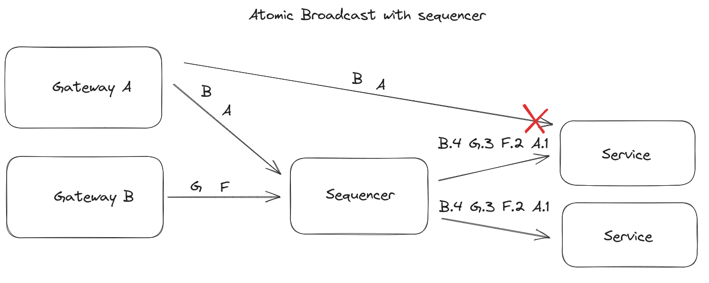
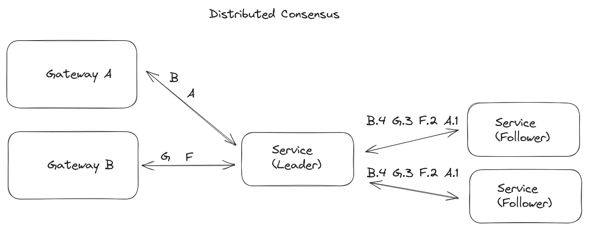
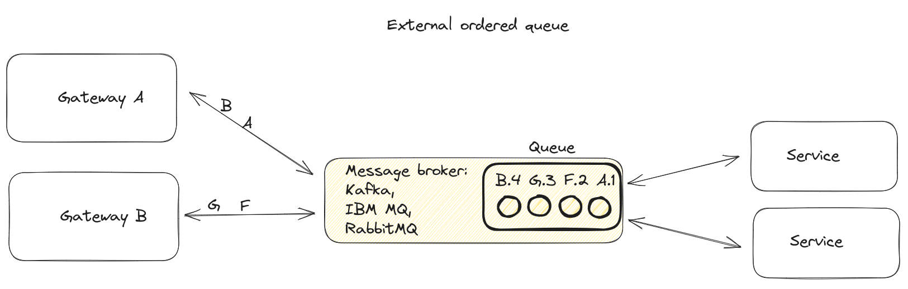

# Module 2 - Replicated state machines & distributed consensus

Goal: To ensure a solid understanding of distributed consensus-based systems

Contents

- [State machines and the need for replication](#state-machines-and-the-need-for-replication)
- [Total ordering architectures](#total-ordering-architectures)
- [Consensus](#what-is-consensus)
    - [What is consensus?](#what-is-consensus)
    - [Why do we need consensus?](#why-do-we-need-consensus)
    - [What are some consensus algorithms that I can use?](#what-are-some-consensus-algorithms-that-i-can-use)
    - [What is Raft?](#what-is-raft)
    - [Raft leader election](#raft-leader-election)
    - [Log replication](#log-replication)
    - [Safety Rules in Raft](#safety-rules-in-raft)
    - [State machine safety](#state-machine-safety)
- [Aeron Cluster](#aeron-cluster)
- [Event-driven, event-sourced, command-sourced and command-query responsibility segregation (CQRS) architecture](#event-driven-event-sourced-command-sourced-and-command-query-responsibility-segregation--cqrs--architecture)

## State machines and the need for replication

Think, for example, of the software managing your bank account: at any given time, you want it to always be in exactly
one state (your bank account has either a positive, zero, or negative balance, but not more than one at once),
you want it to change its state in a predictable way (ie. if you withdraw some amount, you know the balance
you expect to have after the withdrawal), and you want it to continue operating in case of some failure.

Consequently, software running in finance should have these desirable properties:

- Definite: the application must be in only one state at any given time.
- Deterministic: the application must change its state in a predictable way given its current state and input.
- [Fault-tolerant](https://en.wikipedia.org/wiki/Fault_tolerance): the application must continue to operate properly in
  the event of a failure

Meeting this criteria can be achieved
using [deterministic state machines](https://en.wikipedia.org/wiki/Deterministic_finite_automaton), which are software
programs that do the following:

- At any given time, it can be in exactly one state out of a finite number of possible states
- It can change from one state to another in response to some input
- Transitions from one state to another in a predictable way based only on the input and current state,
  which does not include any randomness.

By default, deterministic state machines possess the first two properties of finance software (definite and
deterministic). In order to achieve fault-tolerance, we can run multiple instances of the same deterministic state machine,
and pass the same **sequence** of inputs to each instance. After executing any particular input, we expect every
instance to be in the same state because they are deterministic. A fault occurs if any instance is in a different state than the other replicas.
This type of fault, where every observer of the faulty node views the same state is named non-byzantine
(unlike a [Byzantine fault](https://en.wikipedia.org/wiki/Byzantine_fault) where different observers of the faulty
node would observe different states for it). We will focus on non-byzantine faults from now on.

In that case, when a fault occurs, how do we know which state is correct? If we have two replicas and each has a
different state after
running the same input, we would not be able to tell which has the correct state, and therefore we need
at least 3 replicas, and would assume that the single replica that differs in state is the faulty one.

Run the `Main` class in folder `code/state_machines` to see an example demonstrating two state machines almost
identical, a
deterministic state machine and a faulty state machine that sometimes skips one state transition.

## Total ordering architectures

In the previous section about state machines, we mentioned that in order to achieve fault-tolerance, we could
have several replicas of a deterministic state machine and pass them a **sequence** of inputs. It is
critical to have all the inputs that the state machines will process **sorted in a consistent sequence**, but in a
distributed
system we could have inputs arriving from different sources, how can we sort them?

There are
several [approaches to "total ordering"](https://aeroncookbook.com/distributed-systems-basics/total-ordering/):

- Atomic broadcast using a sequencer: There is a sequencer service that does receive the requests and imposes an order (
  i.e. sets
  a sequence number to each request). The replicas only process "ordered" requests (those having the sequence number
  set),
    and do so without skipping any request. 
- distributed consensus: only one replica receives the requests (the "leader") which requests the other replicas
    ("follower" replicas) to replicate the request. Only when a consensus of all replicas acknowledge having replicated
    the request is the request processed. 
- external ordered queues: an external service (Kafka, or a message broker) receives all the requests and orders them,
    placing them in a queue that is persisted. 

## What is consensus?

Consensus refers to the process by which a collection of nodes reaches a consistent state regarding a given value. A
consensus algorithm would be the implementation of this process of achieving consensus.

### Why do we need consensus?

Consensus enables fault tolerance in distributed systems by ensuring that every node agrees on a common value or state,
even in the presence of errors and failures. If a node goes down, you can be assured that another node is running with
the same state prior to the crash. This potentially enables you to resume your application as normal or, at the very
least, reduce system downtime.

### What are some distributed consensus algorithms that I can use?

There are two widely used consensus algorithms for distributed systems that offer non-byzantine fault tolerance: Paxos
and Raft. However, we will only be discussing Raft as this relates specifically to Aeron and Hydra.

### What is Raft?
Raft was created to be a more clear and simple alternative to Paxos. It divides nodes into leader, follower, and candidate roles and uses leader election and log replication to ensure consistency and fault tolerance.

## Raft leader election

In a distributed system, the leader node is responsible for managing replication and consistency. Raft is a consensus
algorithm that provides a straightforward and easy-to-understand approach to leader election in distributed systems. It
ensures that only one leader is elected at a time, and the leader is changed when the current leader fails.

### Why would a leader node fail?

Leader nodes can fail due to various reasons, such as network partition, hardware malfunction, or software failure. In
such cases, the followers will not receive heartbeats from the leader, and they will initiate an election to select a
new leader. This process ensures that only one leader is elected at a time, and the leader is changed when the current
one fails.

### What is the relationship between a leader and followers?

As soon as a leader node is elected by a majority of the nodes, the leader of that term regularly sends **heartbeat**
messages to the followers to indicate its continued presence and authority.
This message prevents an election from being initiated and maintains the leader's position, therefore each term lasts as
much time as the leader can successfully send heartbeats that the followers can receive.
It is worth noting that the term number of the leader affects the behavior of the follower:

- If a follower node receives a heartbeat with a lower term number than its own, it rejects the leader's heartbeats and
  starts a new election.
- If a follower node receives a heartbeat with a higher term number than its own, it updates its number and follows the
  new leader.

### How does Raft elect a leader node?

The steps involved in the process are simple and easy to follow, making Raft a popular choice for distributed systems. A
visualization of this process can be [found here](https://thesecretlivesofdata.com/raft/).

1. Initially, all nodes start as **followers**.
2. If a node does not receive a heartbeat from the leader within a certain period of time (which is randomly generated
   for each node), it initiates an **election**, and the node that initiated the election becomes a **candidate**.
   During an election, the candidate starts sending RequestVote messages to the other nodes.
   If any follower node does not receive a heartbeat from the leader in that randomly generated period of time, it
   assumes that the leader has failed and initiates a new election— this called an *election timeout*.
3. Peers vote for the candidate by sending a **Vote** message back. However, before granting its vote, a follower checks
   that the candidate's log is at least as up-to-date as its own log. If the candidate's log is missing entries that the
   follower has already committed, the follower rejects the vote request.
4. When a candidate receives votes from the majority of the nodes, it becomes the node responsible for managing
   replication and consistency in the system. This node is referred to as the **leader**.

## Log replication

### What is Raft Log Replication?

A cluster of nodes managed by Raft consensus algorithm can be either undergoing leader election, or log replication.
In log replication phase, there is an active leader in the cluster, and when the leader receives a request,
it appends it in its log and requests the followers to append it to their logs.
Once a majority of the nodes (leader and followers) have appended the request to their logs,
that request is considered committed by the leader, which executes it and notifies the followers.
This ensures that the followers will eventually have the same state as the leader.

The followers then apply the committed entries to their state machines. This means that they update their own state
based on the entries that the leader has committed. By doing this, they ensure that they are in sync with the leader and
the rest of the system. Once the followers have applied the committed entries, consensus is reached among the nodes.

### How does it happen?

1. The client process sends the command and the leader accepts client requests. Each client request consists of a
   command to be executed by the replicated state machines in the cluster.
2. The leader consensus module appends the command to the local log. In parallel, the consensus model forwards the
   commands to the follower nodes as AppendEntries messages to replicate in their local log.
3. Only after it has received an acknowledgement of the replication by more than half of the nodes on their own local
   logs the request is the command then considered committed.
4. The committed command is then handed off to the Replicated State Machine for processing(business logic).
5. After processing, the Replicated State Machine then produces events which are then sent back to the client.

### Safety Rules in Raft

In order to ensure that the protocol runs efficiently and reduce the chances of failure or data loss,
***Raft guarantees each of these safety properties are enforced:***

1. **Election safety:** at most one leader can be elected in a given term.
2. **Leader append-only:** a leader can only append new entries to its logs (it can neither overwrite nor delete
   entries).
3. **Log matching:** if two logs contain an entry with the same index and term, then the logs are identical in all
   entries up through the given index.
4. **Leader completeness:** if a log entry is committed in a given term then it will be present in the logs of the
   leaders since this term.
5. **State machine safety:** if a server has applied a particular log entry to its state machine, then no other server
   may apply a different command for the same log.

The first four rules are guaranteed by the details of the algorithm described in the previous section. The State Machine
Safety is guaranteed by a restriction on the election process, described below.

### State machine safety

This rule is ensured by a simple restriction: a candidate can't win an election unless its log contains all committed
entries. In order to be elected, a candidate has to contact a majority of the cluster, and given the rules for logs to
be committed, it means that every committed entry is going to be present on at least one of the servers the candidates
contact.

Raft determines which of two logs (carried by two distinct servers) is more up-to-date by comparing the index term of
the last entries in the logs. If the logs have a last entry with different terms, then the log with the later term is
more up-to-date. If the logs end with the same term, then whichever log is longer is more up-to-date.

In Raft, the request from a candidate to a voter includes information about the candidate's log. If its own log is more
up-to-date than the candidate's log, the voter denies its vote to the candidate. This implementation ensures the State
Machine Safety rule.

## Aeron Cluster

Aeron Cluster is one of the three components of Aeron available. It provides an implementation of Raft Consensus upon
which highly available services can be built.

It can be used with Aeron Transport and Aeron Archive to achieve fault-tolerant, high throughput services.

Aeron Cluster has the following capabilities:

- Sequences multiple client connections into a single, replicated log
- Provides efficient fault tolerance with 2 or more nodes
- Provides Aeron Archive endpoints for writing to snapshots and reading from snapshots on start
- Allows 1 or more clustered services to be run, with support for inter-service sequenced messaging
- Reliable, sequenced timers
- Very high levels of performance

## Event-driven, event-sourced, command-sourced and command-query responsibility segregation (CQRS) architecture

An event is something that has occurred in the system, which can trigger specific activities in various parts of the
system.
On the other hand, a command is a request to do some action. Depending on whether the messages exchanged between
different components of a distributed system are commands or events, and how these messages are processed, we can
classify the different distributed system architectures as follows:

**Event Notification** is a communication paradigm where different software applications communicate with each other
through events.
A software component generates an event when a state change occurs, a simple event notification (not carrying many
details about the event itself).
The component receiving the event then reacts to the event, and it might need to query for details about the event, or
some additional information to other
services in order to process the event. For instance, an OrderShipping service might get an event notification
OrderSuccessfullyPaid containing just an order Id.
The OrderShipping service might need to query for details about the order in order to know what has to be shipped, the
destination address, and also could
itself publish an OrderShipped event notification.

**Event Sourcing (ES)** is another architecture where all the changes to the state of an application are published as a
sequence of events.
These events carry enough information to confidently rebuild the system state by processing the events (and **only** the
events).
The event log is the source of truth for the system's state. However, the event log does not capture how the system
reached its state,
just the fact that it did. For instance, a UserService might process a UserDeleted event, but if there are different
ways for
that event to happen (i.e. admin deleted the user manually, the user herself removed her account), an event sourcing
architecture
might not be able to tell what triggered that event.

**Command Sourcing (CS)** is an architecture that persists in all requests that change the system's state.
The system can then execute the same commands in the same order at a later moment in time, and as long as it does
have a deterministic behaviour, it will have the same final state.

**Command Query Responsibility Segregation (CQRS)** architecture segregates all requests into commands that modify
the system state, (i.e. create a new user) and queries that do not (i.e. list all users). In the distributed
architecture context, Command and Query functions can be segregated into separate applications, therefore enabling
scaling them separately.

