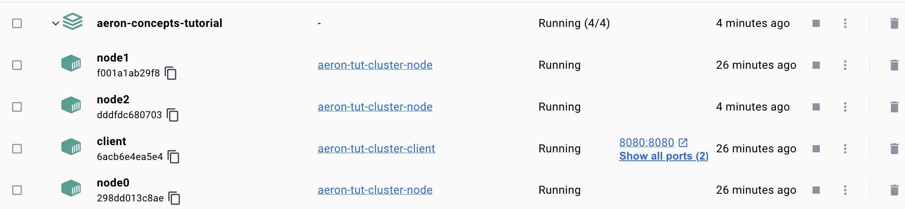

# Aeron Concepts Tutorial

In this tutorial, you will walkthrough the following steps to demonstrate concepts in Module 2.

## Part 1: Starting a Single Node Cluster in IntelliJ

### Starting an single node cluster in IntelliJ

You can do this very easily in IntelliJ by running the ```ClusterMain``` class.

If successful, you should see a console output as follows:

```
17:02:34.344 [main] INFO  c.weareadaptive.cluster.ClusterNode - Starting Cluster Node...
17:02:34.351 [main] INFO  c.weareadaptive.cluster.ClusterNode - Base Dir: /Users/adam.cao/Desktop/Academy-Guides/aeron-hydra/aeronCluster/aeron-cluster-0
17:02:34.351 [main] INFO  c.weareadaptive.cluster.ClusterNode - Aeron Dir: /var/folders/b0/8vjz234s10l9ms7rtv2r_kw00000gn/T/aeron-adam.cao-0-driver
17:02:34.897 [main] INFO  c.weareadaptive.cluster.ClusterNode - Started Cluster Node...
17:02:34.926 [clustered-service] INFO  i.a.cluster.service.ClusteredService - Cluster node is now: LEADER
17:02:34.931 [clustered-service] INFO  i.a.cluster.service.ClusteredService - Cluster node 0 is now Leader, previous Leader: -1
```

- We can see that the node-0 has been elected as the cluster leader, as it is the only node in the cluster.

- The previous leader is represented as -1, as the cluster has just launched therefore there is no previous leader.

### Starting an Aeron client in IntelliJ

Now that our cluster is running, we can now launch a Aeron client to connect to the cluster.

Run the ```ClientMain``` class.

If successful, you should see a console output for your client as follows:

```
17:05:34.852 [main] INFO  com.weareadaptive.client.Client - Starting Aeron Client...
17:05:35.110 [main] INFO  com.weareadaptive.client.Client - Aeron Client connected to cluster successfully.
17:05:35.130 [main] INFO  c.w.c.c.ClientIngressSender - Ingress Message sent to cluster | 0
17:05:35.136 [main] INFO  c.w.c.c.ClientEgressListener - Received Cluster Egress | 1
```

From the client logs, we can see that it has started and connected to our running cluster.
- Immediately in our client logic, it sends a 0 as a ingress message to our cluster.
- From which, the cluster receives and responses with an egress message of 1 back to our client.


You should also see the following logs in your cluster console output:
```
17:05:35.125 [clustered-service] INFO  i.a.cluster.service.ClusteredService - [Client-1] Connected
17:05:35.133 [clustered-service] INFO  i.a.cluster.service.ClusteredService - [Client-1] Ingress Message | 0
```

From the cluster logs, we can see that the client successfully connected and sent a ingress message of 0.

## Part 2: Starting a 3 Node Cluster within terminals

To start a multi-node Aeron cluster within terminals, you can do this by using the compiled build jar.

- To start, ensure you have run Gradle build, you should have `build/libs/code-aeron-concepts-tutorial.jar`.

Cluster nodes can be launched via this command format:

`java --add-opens java.base/sun.nio.ch=ALL-UNNAMED -cp build/libs/code-aeron-concepts-tutorial.jar com.weareadaptive.cluster.ClusterMain [NODEID] [MAXNODES] [TESTMODE]`

You should launch the following command in seperate terminal instances

- Node 0 Terminal: `java --add-opens java.base/sun.nio.ch=ALL-UNNAMED -cp build/libs/code-aeron-concepts-tutorial.jar com.weareadaptive.cluster.ClusterMain 0 3 false`

- Node 1 Terminal: `java --add-opens java.base/sun.nio.ch=ALL-UNNAMED -cp build/libs/code-aeron-concepts-tutorial.jar com.weareadaptive.cluster.ClusterMain 1 3 false`

- Node 2 Terminal: `java --add-opens java.base/sun.nio.ch=ALL-UNNAMED -cp build/libs/code-aeron-concepts-tutorial.jar com.weareadaptive.cluster.ClusterMain 2 3 false`

Once all three have launched, you should see that a leadership election has taken place and one of the nodes has been elected leader.

To launch a client to connect to the cluster, you can open a fourth terminal and run the following command:

- Format: `java --add-opens java.base/sun.nio.ch=ALL-UNNAMED -cp build/libs/code-aeron-concepts-tutorial.jar com.weareadaptive.client.ClientMain [MAXNODES]`

- Actual: `java --add-opens java.base/sun.nio.ch=ALL-UNNAMED -cp build/libs/code-aeron-concepts-tutorial.jar com.weareadaptive.client.ClientMain 3`

The client will send a ingress to the cluster, which all three nodes log and then respond with a egress.

## Part 3: Demonstrating Fault Tolerance and Leadership Elections

Fault Tolerance is a key feature of using Aeron Cluster.

- Aeron ensures that the system remains operational and experiences no data loss even in the case of node failures, by employing a Raft consensus algorithm which makes use of a replicated log.

- Leadership elections are an integral aspect of Aeron Cluster, where nodes in the cluster elect a leader to dictate the state and synchronize logs. In the event that a leader fails or becomes unresponsive, a new leader is elected amongst the remaining nodes, ensuring uninterrupted service and consistency in data across the cluster.

- This combination of features makes Aeron Cluster a highly reliable solution for critical high-performance computing applications.

Now that we have a 3 node Aeron cluster running in separate terminals, we can demonstrate fault tolerance and leadership elections in Aeron very easily.

- Within the logs you should be able to find which node is currently elected as the leader (May be a different node for you).

- For example:
```
13:27:46.584 [clustered-service] INFO  i.a.cluster.service.ClusteredService - Cluster node 2 is now Leader, previous Leader: -1
```

In this case the leader is node 2. Therefore if we shutdown the container of node 2, a new leader should be elected.


```
13:49:46.900 [clustered-service] INFO  i.a.cluster.service.ClusteredService - Cluster node 1 is now Leader, previous Leader: 2
```

A Leadership election has taken place as we specifically shutdown the leader node. If we were to shutdown a non-leader node, a leadership election would not be necessary as the current leader is still alive.

## Part 4: Log replication, replay and snapshotting

When the Aeron client sends an ingress message into the cluster, the leader accepts log entries from clients and replicates them across the followers. we can see it being replicated across all 3 nodes via RAFT consensus.
The leader node is responsible for managing the log replication. The follower nodes passively replicate the log entries sent by the leader.

You should see a similar output across all three node terminals such as this:

`[clustered-service] INFO  i.a.cluster.service.ClusteredService - [Client-1] Ingress Message | 0`

From the previous parts, you may have noticed when stopping and starting nodes in the console logs, it replays previous commands such as client connections, snapshots, ingress etc..

In situations such as system restarts, crashes, or joining of a new node in a clustered environment, it is crucial to ensure that the cluster node is consistent and up-to-date with the others. Aeron's log replay functionality allows for historical commands to be replayed, essentially reconstituting the state and ensuring data consistency across the cluster or recovering the state after a failure.

This is known as command sourcing.

- Command sourcing involves storing the sequence of commands that change the state of the system, allowing the system to rebuild its state by replaying these commands.

- Aeron Cluster stores the client commands in a replicated log among the cluster members. When a command is received, it is appended to the log, and then it is executed. This enables strong consistency and the ability to recover the state by replaying the log in case of failures.

However, in the scenario in which we could have millions of messages sent to the cluster. If a node restarted it may take a much longer startup time. This is why Aeron also has a feature called Snapshotting.

- In Aeron Cluster, snapshotting is a process used to capture the current state of the cluster at a particular point in time. This is crucial for efficiency and performance, as it prevents the need to replay an ever-growing log of commands from the beginning of time during recovery or when a new node joins the cluster.

- When a snapshot is taken, it is stored and used as a starting point for replaying only the commands that have been logged after the snapshot was created. This significantly speeds up the process of rebuilding state, minimizing downtime and ensuring faster recovery in case of node failures or restarts.

In the case of this tutorial, we have a very basic state of the total amount of messages received being stored. After cluster has received numerous ingress messages from clients. You can demonstrate snapshotting by executing this command in a new terminal (You will have to adjust the command to the appropriate leader nodeID):

`java --add-opens java.base/sun.nio.ch=ALL-UNNAMED -cp build/libs/code-aeron-concepts-tutorial.jar io.aeron.cluster.ClusterTool aeronCluster/aeron-node-[NODEID]/cluster snapshot`

You should see this reflected in each node terminal across your cluster:

```
14:36:45.413 [clustered-service] INFO  i.a.cluster.service.ClusteredService - Cluster has taken snapshot | Messages Received: 5
```

Now, if you were to restart a node, instead of replaying the previous commands, it would restore the state using the snapshot taken.

```
14:38:18.413 [clustered-service] INFO  i.a.cluster.service.ClusteredService - Cluster has restored snapshot | Messages Received: 5
```

## Bonus: Running Aeron Cluster in Docker

- Requires Docker installed (Desktop version is best for visuals)

Once you have Docker installed, you can run the `buildDocker` bash script to Dockerise the cluster and client.

- This script automatically ensures your project has built and turns your cluster nodes/client into containers.
- It then uses docker compose to setup the cluster configuration such the networking configuration.

It should look like this afterwards in Docker Desktop:



Within your docker containers, you should see similar logs to the previous steps indicating the status/messages of your cluster nodes and client.

### Snapshotting in a Dockerised cluster
You should run the following command in specifically the terminal of the elected leader node in Docker:

`java --add-opens java.base/sun.nio.ch=ALL-UNNAMED -cp aeron-concepts-cluster.jar io.aeron.cluster.ClusterTool aeronCluster/aeron-node-[NODEID]/cluster snapshot`

## JDK 16/17 Error

If you are JDK 16 / 17+ and encounter this error:

```
Caused by: java.lang.reflect.InaccessibleObjectException: Unable to make field private final java.util.Set sun.nio.ch.SelectorImpl.selectedKeys accessible: module java.base does not "opens sun.nio.ch" to unnamed module @XXXXXX
```

Add `--add-opens java.base/sun.nio.ch=ALL-UNNAMED` to the JVM arguments.

## Active Media Driver Error

Starting and stopping Aeron Cluster nodes to quickly in a short space of time may result in Active Media Driver Errors, if you are getting this even after waiting more than 30 seconds, then closing all Java instances normally helps.
