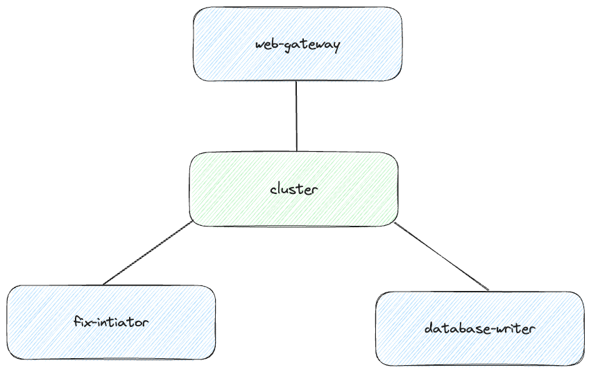
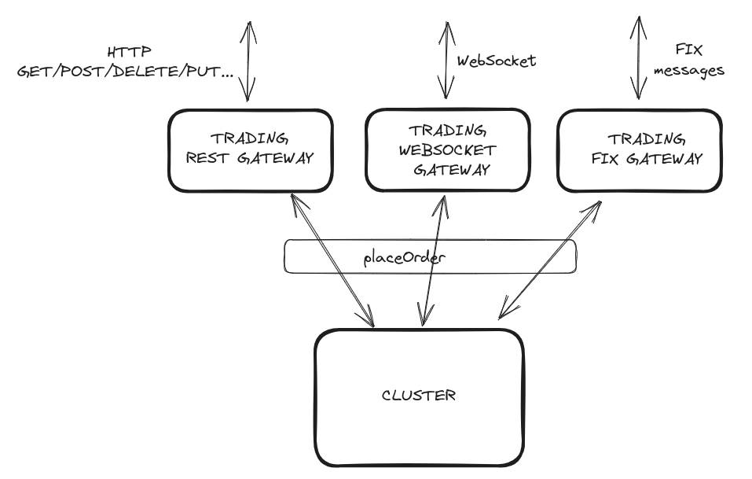
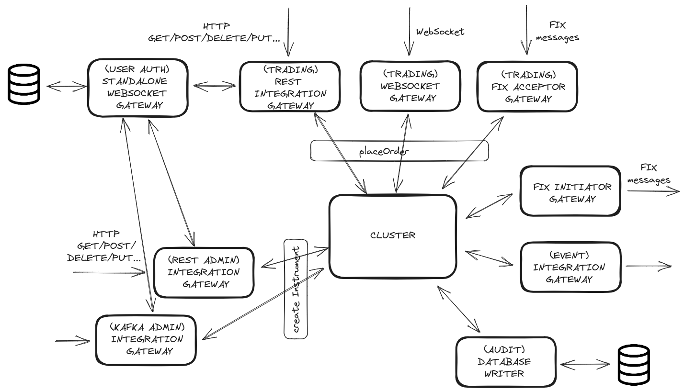

# Module 4 - Hub-and-spoke architecture

Goal: To ensure an understanding of how gateways interact with the cluster

MISSING (REMOVE ENTRIES OF THIS LIST AS YOU MERGE THAT SECTION):
- What type of cluster clients are needed / what is the role of gateways
  - Websockets
  - FIX
  - Database
  - Custom (imperative clients)
- Ingress vs. egress / inbound vs. outbound gateways
- Snapshotting

## What is a hub-and-spoke architecture?

The hub-and-spoke network architecture is a networking model where a central node or “hub" serves as a central point for
communication and connects to several outlying nodes or "spokes". In this architecture, the central hub serves as the
conduit for all communication between the surrounding nodes in the system. However, we don’t purely follow this concept
as there are scenarios where it may be preferable to communicate directly with another gateway (spoke) without going
through the cluster (hub), see section about Cluster Bypass.

## Introduction to Hydra
[Hydra](https://docs.hydra.weareadaptive.com/LATEST/index.html) is an internal framework within Adaptive that we use to leverage our experience in trading in finance to make it easier
and faster to build trading applications. It is built on top of Aeron cluster (i.e. therefore, a Hydra cluster also implements the Raft distributed
consensus algorithm), and uses Aeron Transport for low latency communication between its components, which follow the hub-and-spoke architecture.
On top of Aeron cluster and Aeron Transport, the Hydra team at Adaptive added a way to define the different components, and how they are interconnected, and the
different service methods and API using the hydra language (hy-lang) specification.

There is a Gradle plugin that [generates code](https://docs.hydra.weareadaptive.com/LATEST/Development/CodeGen/CodeGenOverview.html) based on the contents
of the hy-lang files (i.e. hydra files), and you can have a look here for a [sample of the hy-lang file](https://docs.hydra.weareadaptive.com/LATEST/Development/GettingStarted/HydraPlatformOverview.html#hydra-codecs),
but the specific details will be covered in *Module 5 Hydra Services and Code Generation*.

From this point on the code samples will all use Hydra. Please make sure that you have cloned the [`onboarding` repository](https://github.com/AdaptiveConsulting/onboarding) and
successfully followed its instructions to prepare your laptop to access the Adaptive's private artifactory repository where Hydra dependencies are located.

## Why do we need cluster clients?
*Cluster clients* act as intermediaries between incoming messages and the underlying cluster. They are essential in distributed systems with a deterministic cluster because they provide a space for non-deterministic code and additional computation that would otherwise burden the performance of the cluster.

In previous modules, we have stressed the importance of the logic within a cluster being deterministic. However, non-deterministic behavior may still be necessary in a distributed system, and this type of code can be placed into a cluster client outside of the cluster. Examples of non-deterministic code include generating random numbers and making an external call to a 3rd party. By utilizing a cluster client, these actions can be performed and incorporated inside a message passed to the cluster itself. This allows developers to take advantage of non-deterministic code without directly introducing it into the cluster.

Furthermore, utilizing cluster clients also ensures that the cluster does not run non-essential code, which can affect its performance. Running non-essential code can take up resources that are needed for essential tasks, which is why cluster clients employ various optimization techniques to enhance overall performance. This may include validating messages and their authentication outside of the cluster.

Cluster clients can ensure that the cluster only processes the essential tasks required to maintain high throughput and low latency— meaning the cluster clients can take on the burden of converting messages between different kinds of encodings. For example, a Websocket gateway can handle Websocket messages, a REST gateway can handle REST requests, and a FIX acceptor gateway can handle FIX messages. Even having a single gateway that handles both FIX and REST requests would still reduce the cluster's burden since message parsing is moved outside the cluster. In the picture below, each gateway would be responsible for converting its incoming messages into the same type of command that is sent to the cluster.

## What type of cluster clients are available?
The mechanism by which components communicate with each other is through Services. You can think of components in terms of the client-server paradigm.
From the point of view of a Hydra service, components can be:
- servers, which expose services to other components
- clients, which call services exposed by other components
- both servers (of the services they expose) and clients (of the services other components expose)

For example, a Web Gateway is a server in that it exposes services to clients on the internet, but it is also a client in that it can call services exposed by the cluster.
A typical pattern to avoid non-deterministic behaviour in the cluster is to have the main business logic of your application in the cluster, and interactions with anything outside of the Hydra Platform application will be done through Gateways. There may also be other internal components, which only interact with other components within the application.

Excluding the Cluster itself, the other components in Hydra are Web Gateway, Fix Gateways (Acceptor and Initiator), Database Writer and Integration Gateways:

- Web Gateways

The Web Gateway is a WebSocket gateway that accepts inbound connections. It is a server to external websocket clients and is a client of Hydra services of other components. The way you define your web gateway in the Hydra language is the following:

    web-gateway TradingGateway = {
    connectsTo: Cluster
    services: {
      PlaceOrder
      }
    }

Typically, Web Gateways will export some services and its WebSocket clients will consume them using code generated by Hydra with efficient binary encoding on both sides.

Under the hood, the web gateway is actually multi-threaded and it converts multiple inbound WebSocket connections into a sequence. You can learn more about the thread model in [Hydra Documentation](https://docs.hydra.weareadaptive.com/LATEST/Development/Components/WebGatewayOverview.html#thread-model).

- FIX

FIX (Financial Information Exchange) is an electronic communications protocol with the purpose of exchanging financial information.
If you need more information about the different messages in FIX have a look at the following [link](https://fiximate.fixtrading.org/).

In Hydra, you can build either a [FIX Initiator](https://docs.hydra.weareadaptive.com/LATEST/Development/Components/HowToBuildFixInitiator.html), a [FIX Acceptor](https://docs.hydra.weareadaptive.com/LATEST/Development/Components/HowToBuildFixAcceptor.html). An acceptor listens for connections and waits for counterparties to connect to it. An initiator does not listen for connections, it actively establishes connections to counterparties. A single gateway can support only one of these modes.

For instance, you would declare a FIX Initiator or a FIX Acceptor as follows:
    
    fix-dictionary MyFixDictionary = {
      dictionaryFile: "MyFixDictionary.xml"
    }
    
    fix-initiator MyFixInitiator = {
      connectsTo: MyCluster
      fixDictionaries: {
        MyFixDictionary
      }
    }

    fix-acceptor MyFixAcceptor = {
      connectsTo: MyCluster
      fixDictionaries: {
        MyFixDictionary
      }
    }

- Database Writer

The Database Writer is a component that receives events from the Cluster and persists them in a Database.
The component itself is agnostic of any used database. In the simplest terms, it's responsible for subscribing to cluster events from the last persisted position.

    database-writer HistoryDatabaseWriter = {
      connectsTo: Engine
    }

See [How To Persist Events Into a Relational Database](https://docs.hydra.weareadaptive.com/LATEST/Development/Persistence/HowToPersistEventsIntoRelationalDatabase.html) for more details.

- Integration Gateway

The standard component types that Hydra Platform provides are suitable for many common use cases, however you are likely to have other use cases for which these standard types are not suitable. In these cases you can build an Integration Gateway which includes an Imperative Cluster Client to allow it to communicate with the Cluster.

    client OutboundIntegrationGateway = {
      connectsTo: Engine
    }

See [How To Use The Imperative Client](https://docs.hydra.weareadaptive.com/LATEST/Development/Components/HowToUseTheImperativeClient.html) for more details.

## Ingress vs. egress / inbound vs. outbound gateways

Ingress is the set of inbound message streams clients send to the cluster. All the messages are sequenced into the cluster log.
Sending too many messages to the cluster can cause backpressure. Normally, if the cluster is not able to accept the
messages, they will be sent again until it can accept them.

Egress is a channel where the cluster broadcast messages to enabled clients. This is a single channel, every client will
receive all the messages and will parse them in two cases:
- The message contains the matching cluster client session id (The specific field is `targetSessionId` in the header message).
- The message is a broadcast.
If a client can't process the egress at the same speed of the other clients, it will be disconnected.

Both the ingress and egress are stored to disk thanks to the archive. In case of a cluster restart, the
ingress will be replayed from the last snapshot or from the beginning of the log. The egress will query the position and
compare it with the recording end position. If they match, the new messages will be appended to the recording. If they
don't [the behaviour will depend on the set strategy](https://docs.hydra.weareadaptive.com/LATEST/HydraCluster/Egress.html#if-the-cluster-is-restarted).

### Divergence Monitor

The divergence monitor is a tool that checks the content of the egress channel and reports any divergence between the
nodes. For more information you can check
the [Divergence Monitor page](https://docs.hydra.weareadaptive.com/LATEST/Operations/DivergenceMonitor.html).

## Divergence
We previously stressed the importance of all the nodes behaving in a deterministic way: the outcome of applying each command of
the log to the state machine must be the same in all the nodes, and when this is not the case, we say the nodes have diverged.

[Hydra documentation](https://docs.hydra.weareadaptive.com/LATEST/HydraConcepts/UnderstandingDivergence.html) has a whole section on Divergence, with several examples
which can be summarized in the advice we gave in the Module 3 section on how to write deterministic code:
- avoid randomness
- have a consistent order in collections of elements
- avoid using the node's system time (use instead Hydra's provided TimeSource)
- avoid reading state from anywhere else but the commands themselves (because that might change)

Hydra does have a [divergence monitor](https://docs.hydra.weareadaptive.com/LATEST/Operations/DivergenceMonitor.html) that
checks the content of the egress channel and reports any divergence between a node and the leader. Sometimes, though, the divergence
occurs but the egress might not include the "divergent" field, for instance, if random IDs were assigned to a new instrument but the
egress channel does not include the instrument ID, then the divergence monitor would not catch this divergence, or it might detect it much later,
only when the diverged values are included in the egress.

There is another case where the divergence monitor might not catch divergences: those caused by "snapshot-restore" bugs.
If there is some value that is not stored in a Hydra repository (i.e. some counter whose value is not persisted to a Hydra repository
neither is set from the input command). For further reference, Hydra documentation includes sections on
[how to test for non-determinism](https://docs.hydra.weareadaptive.com/LATEST/Development/Testing/NonDeterminismTesting.html) and
[how to test for snapshot and restore bugs](https://docs.hydra.weareadaptive.com/LATEST/Development/Testing/SnapshotRestoreTesting.html).

## Cluster Bypass messaging

Cluster bypassing refers to the concept of establishing direct communication between gateways within a system, bypassing the involvement of the cluster. In this setup, the gateways form their own communication network, allowing them to exchange messages, synchronize data, or coordinate actions directly with each other. By bypassing the cluster, gateways can achieve faster and more efficient communication, reducing latency and overhead.

This approach is beneficial in scenarios where gateways need to exchange information quickly and efficiently without relying on the cluster for communication. Gateways can establish direct connections among themselves, enabling seamless communication within the gateway network. The specifics of cluster bypassing may vary depending on the system or framework being used, but the core concept remains the same: gateways communicating with each other while bypassing the involvement of the cluster.

For further reference, Hydra documentation includes sections on
[Cluster Bypass Messaging](https://docs.hydra.weareadaptive.com/LATEST/Development/Services/ClusterBypassCommunication.html)
