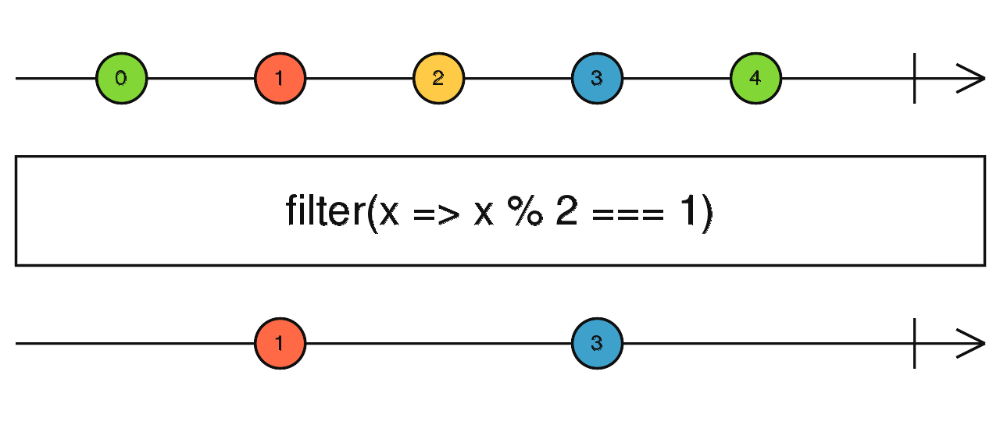
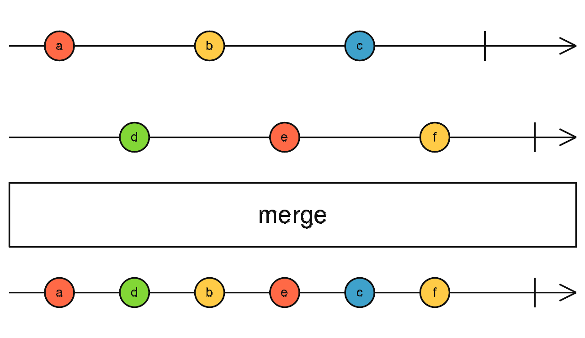

# Day 4: RxJS Operators and TypeScript Generics

RxJS is mostly useful for its _operators_, even though the Observable is the foundation. Operators are the essential pieces that allow complex asynchronous code to be easily composed in a declarative manner.

## What are operators?

Operators are **functions**. There are two kinds of operators:

- **Pipeable Operators** are the kind that can be piped to Observables using the syntax `observableInstance.pipe(operator)` or, more commonly, `observableInstance.pipe(operatorFactory())`. Operator factory functions include, `filter(...)`, and `mergeMap(...)`.

When Pipeable Operators are called, they do not _change_ the existing Observable instance. Instead, they return a _new_ Observable,
whose subscription logic is based on the first Observable.

> _A Pipeable Operator is a function that takes an Observable as its input and returns another Observable. It is a pure operation: the previous Observable stays unmodified._

> _A Pipeable Operator Factory is a function that can take parameters to set the context and return a Pipeable Operator. The factory’s arguments belong to the operator’s lexical scope._

A Pipeable Operator is essentially a pure function which takes one Observable as input and generates another Observable as output. Subscribing to the output Observable will also subscribe to the input Observable.

**Creation Operators** are the other kind of operator, which can be called as standalone functions to create a new Observable. For example: of(1, 2, 3) creates an observable that will emit 1, 2, and 3, one right after another. [More on creation operators here](#creation-operators).

For example, the operator called [`map`](https://rxjs.dev/api/operators/map) is analogous to the Array method of the same name. Just as `[1, 2, 3].map(x => x * x)` will yield `[1, 4, 9]`, the Observable created like this:

```js
import { of, map } from 'rxjs';

of(1, 2, 3)
  .pipe(map((x) => x * x))
  .subscribe((v) => console.log(`value: ${v}`));

// Logs:
// value: 1
// value: 4
// value: 9
```

will emit `1, 4, 9`. Another useful operator is [`first`](https://rxjs.dev/api/operators/first):

```js
import { of, first } from 'rxjs';

of(1, 2, 3)
  .pipe(first())
  .subscribe((v) => console.log(`value: ${v}`));

// Logs:
// value: 1
```

Note that `map` logically must be constructed on the fly, since it must be given the mapping function to. By contrast, `first` could be a constant, but is nonetheless constructed on the fly. As a general practice, all operators are constructed, whether they need arguments or not.

### Piping

Pipeable operators are functions, so they _could_ be used like ordinary functions: `op()(obs)` — but in practice, there tend to be many of them convolved together, and quickly become unreadable: `op4()(op3()(op2()(op1()(obs))))`. For that reason, Observables have a method called `.pipe()` that accomplishes the same thing while being much easier to read:

```js
obs.pipe(op1(), op2(), op3(), op4());
```

As a stylistic matter, `op()(obs)` is never used, even if there is only one operator; `obs.pipe(op())` is universally preferred.

### Creation Operators

Distinct from pipeable operators, creation operators are functions that can be used to create an Observable with some common predefined behavior or by joining other Observables.

A typical example of a creation operator would be the `interval` function. It takes a number (not an Observable) as input argument, and produces an Observable as output:

```js
import { interval } from 'rxjs';

const observable = interval(1000 /* number of milliseconds */);
```

Take a look at other creation operators [here](https://www.learnrxjs.io/learn-rxjs/operators/creation).

### Marble Diagrams

To explain how operators work, textual descriptions are often not enough. Many operators are related to time, they may for instance delay, sample, throttle, or debounce value emissions in different ways. Diagrams are often a better tool for that. _Marble Diagrams_ are visual representations of how operators work, and include the input Observable(s), the operator and its parameters, and the output Observable.

> _In a marble diagram, time flows to the right, and the diagram describes how values ("marbles") are emitted on the Observable execution._


## Understanding Generics with RxJS

> RxJS uses generics heavily in their definition files to describe how types flow through different interfaces and function calls. We can provide our own type information when we create Observables to enable all of the auto-complete & type-safety features that you would expect from Typescript. This can be achieved with minimal annotations thanks to the power of generics.

Snippet from [this article](https://egghead.io/lessons/typescript-understanding-generics-with-rxjs) also has a video explaining generics with RxJS.

#### Ways RxJS leverages generics:

1. **Observable Creation**: When creating an Observable, you can specify the generic type parameter to indicate the type of values it will emit. For instance:

```ts
import { Observable } from 'rxjs';

const source$: Observable<number> = new Observable<number>((subscriber) => {
  subscriber.next(1);
  subscriber.next(2);
  subscriber.next(3);
  subscriber.complete();
});
```

In this example, we create an Observable `source$` that emits numbers of type `number`. By specifying `Observable<number>`, we indicate that this Observable will emit values of type `number`.

2. **Operator Usage**: RxJS operators are functions that operate on an Observable and return a new Observable. Generics are used to propagate the type information through the operator chain. For example:

```ts
import { from, Observable } from 'rxjs';
import { map } from 'rxjs/operators';

const source$: Observable<number> = from([1, 2, 3]);

const doubled$: Observable<number> = source$.pipe(
  map((value: number) => value * 2)
);
```

In this example, we have an Observable `source$` that emits numbers. We use the `map` operator to transform each emitted value by doubling it. The resulting Observable `doubled$` also has the same generic type `number`.

3. **Subscriber/Observer Type Inference**: When you subscribe to an Observable, TypeScript can infer the type of values emitted by the Observable based on the generic type parameter provided. For example:

```ts
import { Observable } from 'rxjs';

const source$: Observable<number> = ...

source$.subscribe((value) => {
  // TypeScript infers 'value' as 'number'
  console.log(value);
});
```

In this example, when we subscribe to `source$`, TypeScript can infer that the `value` emitted by the Observable is of type `number`. This inference is possible because of the generic type parameter specified when creating the Observable.

---

## Transforming observables with map, filter, and reduce operators

RxJS provides a set of powerful operators that allow you to transform a stream of some value type into a stream of another value type. For instance, an observable of click events can be transformed into an objects containing just `clientX` and `clientY` coordinates. Or you may need to filter out values from a stream of input that are only divisible by 2. Perhaps, you need to accumulate a set of values into a single accumulated value. The scenarios are endless regardless on how you may want to transform your input streams.

More on transforming observables from RxJS docs [here](https://www.learnrxjs.io/learn-rxjs/operators/transformation).

### [`map`](https://www.learnrxjs.io/learn-rxjs/operators/transformation/map)

The `map` operator transforms each value emitted by an Observable into a new value based on a provided transfomation function. Here's an example:

```ts
import { of } from 'rxjs';
import { map } from 'rxjs/operators';

const source$ = of(1, 2, 3);

const mapped$ = source$.pipe(
  map((value) => value * 10)
);

mapped$.subscribe((value) => {
  console.log(value); // Output: 10, 20, 30
});
```

> _Similar to `Array.prototype.map()`, it passes each source value through a transformation function to get corresponding output values. This operator applies a projection to each value and emits that projection in the output Observable._


### [`filter`](https://www.learnrxjs.io/learn-rxjs/operators/filtering/filter)

The `filter` operator allows you to selectively emit values from an Observable based on a condtion. Here's an example:

```ts
import { of } from 'rxjs';
import { filter } from 'rxjs/operators';

const source$ = of(0, 1, 2, 3, 4);

const filtered$ = source$.pipe(
  filter((value) => value % 2 === 1)
);

filtered$.subscribe((value) => {
  console.log(value); // Output: 1, 3
});
```

> _Like `Array.prototype.filter()`, it only emits a value from the source if it passes a criterion function. This operator takes values frmo the source Observable, passes them through a `predicate` function and only emits those values that yielded `true`._



### [`reduce`](https://www.learnrxjs.io/learn-rxjs/operators/transformation/reduce)

The `reduce` operator aggregates the values emitted by an Observable into a single accumulated value. Here's an example:

```ts
import { of } from 'rxjs';
import { reduce } from 'rxjs/operators';

const source$ = of(1, 3, 5);

const reduced$ = source$.pipe(
  reduce((accumulator, value) => accumulator + value, 0)
);

reduced$.subscribe((value) => {
  console.log(value); // Output: 9
});
```

> _Like `Array.prototype.reduce()`, `reduce` applies an `accumulator` function against an accumulation and each value of the source Observable (from the past) to reduce it to a single value, emitted on the output Observable. Note that `reduce` will only emit one value, only when the source Observable completes._


---

## Combining observables with merge, concat, and zip operators

The combination operators allow the joining of information from multiple observables.


### [`merge`](https://www.learnrxjs.io/learn-rxjs/operators/combination/merge)

The `merge` operator combines multiple Observables by merging their emissions into a single Observable. Here's an example:

```ts
import { of, merge } from 'rxjs';

const source1$ = of('a', 'b', 'c');
const source2$ = of('d', 'e', 'f');

const merged$ = merge(source1$, source2$);

merged$.subscribe((value) => {
  console.log(value); // Output: 'a', 'd', 'b', 'e', 'c', 'f'
});
```

> _Flattens multiple Observables together by blending their values into one Observable._



`merge` subscribes to each given input Observable (as arguments), and simply forwards (without doing any transformation) all the values from all the input Observables to the output Observable. The output Observable only completes once all input Observables have completed. Any error delivered by an input Observable will be immediately emitted on the output Observable.

> :bulb: It is also important to note that your output stream is dependent on your input streams' arrival intervals.


### [`concat`](https://www.learnrxjs.io/learn-rxjs/operators/combination/concat)

The `concat` operator concatenates multiple Observables, emitting values in a sequential manner. It creates an output Observable which sequentially emits all values from the first given Observable and then moves on to the next. Here's an example:

```ts
import { of, concat } from 'rxjs';

const source1$ = of('a', 'b');
const source2$ = of('x', 'y');

const concatenated$ = concat(source1$, source2$);

concatenated$.subscribe((value) => {
  console.log(value); // Output: 'a', 'b', 'x', 'y'
});
```

> _Concatenates multiple Observables together by sequentially emitting their values, one Observable after the other._


`concat` joins multiple Observables together, by subscribing to them one at a time and merging their results into the output Observable. It will subscribe to first input Observable and emit all its values, without changing or affecting them in any way. When that Observable completes, it will subscribe to then next Observable passed and, again, emit its values. Once the last Observable completes, `concat` will complete as well.

### [`zip`](https://www.learnrxjs.io/learn-rxjs/operators/combination/zip)

The `zip` operator combines the values emitted by multiple Observables in a pairwise manner, emitting an array of the corresponding values. It combines multiple Observables to create an Observable whose values are calculated from the values, in order, of each of its input Observables. Here's an example:

```ts
import { of, zip } from 'rxjs';

const source1$ = of(1, 2, 3, 4, 5);
const source2$ = of('A', 'B', 'C', 'D');

const zipped$ = zip(source1$, source2$);

zipped$.subscribe((value) => {
  console.log(value); // Output: [1, 'A'], [2, 'B'], [3, 'C'], [4, 'D']
});
```


A few things to remember:
- `zip` doesn't start to emit a value until each inner observable emits at least one value.
- `zip` emits as long as the emitted values can be collected from all inner observables.
- `zip` emits values as an array