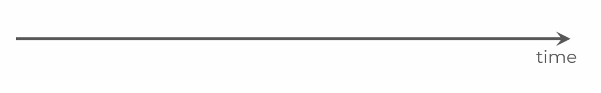
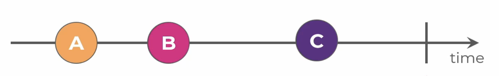
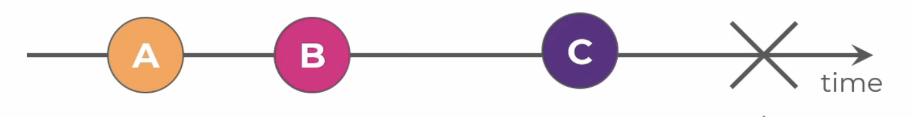
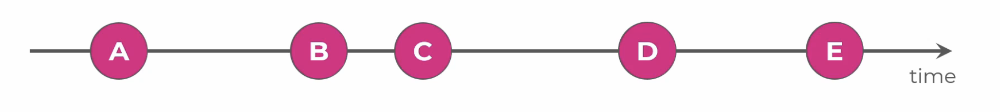
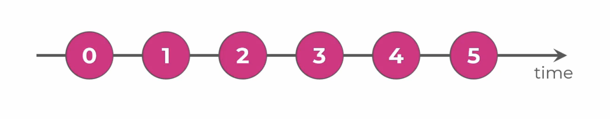
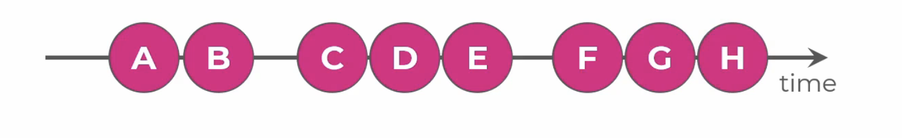
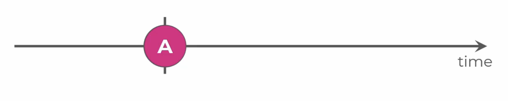
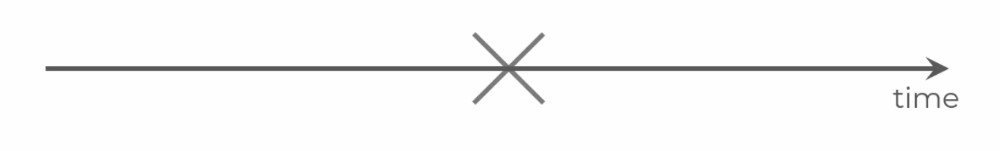

# RxJS 7 and Observables Introduction Course Outline

## Array vs Stream

Observables are based around the idea of streams, which means that the data can come at various points of time, and the number of emitted values might be _theoretically_ infinite. It can be compared to a conveyor belt situation where the items are processed one at a time.

In Observables, we can emit values at any point of time. Most of us are already familiar with arrays where each value can be easily accessed at any point in time and you can see how long the array is.

How does arrays differ with a stream? How can we work with them?

Items in a stream can arrive at various points in time, so let's draw a timeline.

```ts
----(Lemon)----(Coconut)----(Onion)----(Mushroom)---->
                                                    time
```

Let's imagine that we just entered a grocery store looking to buy some groceries.
1. First, we see a lemon. We can react to it or not if it is written in our shopping list.

    then as time passes...

2. Second, a coconut. Again, we can react to it or not.

    as more time passes...

3. Third, an onion. Again, we can put in our basket if its written on our list.

4. Lastly, a mushroom. Maybe this type of mushroom should not be found in the store because it is inedible. Hence, we react to it by calling the store manager.
  
As explained, the stream approach is more about reacting to the things as they show up. The next value is unpredictable nor do we know whether it will show up at all. We simply provide some code which will react to the emitted data when it does show up. This approach is called **Reactive Programming**, and Observables are based around this idea.

Examples of streams:
- subscribing to an Observable of mouse positions as you move the mouse over time
- a stream representing the latest value of a text input data

---

## Observable, Observer, Subscription - Key Elements

### Observable
The idea of an Observable is simple. It's based around a single callback function with a set of rules and guarantees regarding the interface and behavior.

Once the Observable is executed, it can emit some notifications, `next`, `error`, and `complete`. For now, we will only focus on the `next` notification.

```ts
const observable$ = new Observable(subscriber => {
  subscriber.next('Alice');
  subscriber.next('Ben);
})
```

> :bulb: A trailing $ (dollar) sign is the naming convention for an Observable. [Angular Docs](https://angular.io/guide/rx-library#naming-conventions-for-observables) explains it in detail. This convention was added after Angular 5. 

Looking at this code snippet, we can create a new Observable by using the `new Observable` constructor to which we pass the logic of the Observable as a callback function.

In our example, the Observable will call `.next` on the subscriber twice with values 'Alice' and 'Ben'.

> On its own, the observable doesn't run any code. Its just a special object that has some callback function stored inside.

<br />

### Observer
- the observer describes the reaction to each emitted value
- the `next` function in the Observer provides the behavior for the next notifications emitted by the observable.

```ts
const observer = {
  next: (value) => console.log(value)
};
```

To connect our Observer to the Observable, we use the `.subscribe` method.

<br />

### Subscription

- the subscription is what executes the observable. It runs the callback inside the observable and passes our Observer object to it

To start a new subscription, we simply call the subscribe method on the Observable and pass the Observer as argument.

```ts
observable$.subscribe(observer);
```

Combining everything together, we get:

```ts
// Observable
const observable$ = new Observable(subscriber => {
  subscriber.next('Alice');
  subscriber.next('Ben);
})

// Observer
const observer = {
  next: (value) => console.log(value)
};

// Subscription
observable$.subscribe(observer);
```

When we run this code, a new subscription is made and the callback in the Observable is run with the provided Observer - converted into a subscriber object.

<br />

#### Code Exercises

Let's take a look at some code.

```ts
import { Observable } from 'rxjs';

const observable$ = new Observable<string>(subscriber => {
  console.log('Observable executed');
  subscriber.next('Alice');
  subscriber.next('Ben');
  subscriber.next('Charlie');
});

observable$.subscribe();
```

In this snippet, we create a new Observable using the `new Observable` constructor - importing it from `rxjs`. As we've seen previously, this constructor accepts a function which is run when we subscribe to this Observable. This callback function provides us with a subscriber object on which we can call the `next` method to emit 'Alice', 'Ben' and 'Charlie' string values. Let's also add a console log to indicate the start of the Observable.

If we run this as it is, we can see that only `Observable executed` is logged. To provide some reaction, we need to create a handler for the `next` notifications. So let's create an Observer object which console logs the value and pass our Observer to the subscribe method to execute the Observable's logic with our new Observer.


```ts
// ...continued

const observer = {
  next: (value) => console.log(value)
};

observable$.subscribe(observer);
```

Now if we run this code, we can see that all the emitted values logged into the console.

> As a side note, we can also pass a single function to the subscribe method and this function will act as the next notification handler shown below.

```ts
observable$.subscribe((value) => console.log(value));
```

If we are no longer interested in receiving values from the Observable, we should unsubscribe. To better see the unsubscribing in action, let's spread the values in time by using `setTimeout`. Let's emit 'Ben' at 2 seconds and 'Charlie' at 4 seconds the only caveat is to unsubscribe at the 3 second mark.

In order to unsubscribe, we need to get to the reference to our subscription returned by the subscribe method.

```ts
import { Observable } from 'rxjs';

const observable$ = new Observable<string>(subscriber => {
  console.log('Observable executed');
  subscriber.next('Alice');
  setTimeout(() => subscriber.next('Ben'), 2000);
  setTimeout(() => subscriber.next('Charlie'), 4000);
});

const subscription = observable$.subscribe((value) => console.log(value));

setTimeout(() => {
  console.log('Unsubscribe');
  subscription.unsubscribe();
}, 3000);
```

If we run this code now, we can see that only 'Alice' and 'Ben' were emitted since the subscription gets closed before the next notification, Charlie, gets emitted.

<br />

##### Multiple Subscriptions

What would happen if we call the subscribe method on the same Observable multiple times? Let's take a look.

```ts
//...continued from previous example

import { Observable } from 'rxjs';

const observable$ = new Observable<string>(subscriber => {
  console.log('Observable executed');
  subscriber.next('Alice');
  setTimeout(() => subscriber.next('Ben'), 2000);
  setTimeout(() => subscriber.next('Charlie'), 4000);
})

console.log('Subscription 1 starts');
observable$.subscribe(value => console.log('Subscription 1:', value));

setTimeout(() => {
  console.log('Subscription 2 starts');
  observable$.subscribe(value => console.log('Subscription 2:', value));
}, 1000);
```

We've modified our code for subscription 1 to start immediately and for subscription 2 to start after a 1 second delay. We've also added some labels to recognize which subscription is which.

These subscriptions will execute our Observable's logic independently from each other. And as the second Subscription is made a second later, we see a one second difference between the emitted values in the console.

In summary:
> We need to subscribe to an Observable to run its logic

> When we subscribe a few times to the same Observable, the logic of the Observable will be run independently for each new subscription

> Each time you subscribe to an Observable, the Observable's logic is executed and the provided Observer is wrapped into a Subsciber object and passed to the Observable's logic

> We can make an Observable stop emitting values by unsubscribing from the Observable

---

## Marble Diagrams

Marble Diagrams are a graphical way of representing the behavior of the Observables. 

#### Appearance

So how does a Marble diagram look like? Let's start with a simple timeline. It represents the passing time after we subscribe to an Observable.


This is what a marble diagram for an Observable with no emissions would look like.

<br />


In this scenario, we have an Observable that emits some value A, B, and C. These three marbles represent three `next` notifications with some values. The vertical line in the end represents a `complete` notification. This line indicates that the Observable's data source has finished and there are no more values to be emitted. By default, `complete` ends the subscription.

<br />


Similar to the previous image, we see an Observable that emits values A, B, and C. Except this Observable ends with an X which represents an `error` notification. This is used whenever something unexpected happens or the Observable wants to signal that its data source has failed. Similar to `complete`, this also ends the subscription. The difference is that, `error` can carry a payload - to possibly pass some value describing the error.

<br />

To summarize, there are three different types of notifications that can be emitted by an Observable - `next`, `error`, and `complete`.

- `next` is used to emit values. This type of notification can be emitted any number of times during the subscriptions lifetime.

- `error` is used to signal an error or some type of failure, and it can also carry a payload with the error details with it. It can only be emitted once as it ends the subscription.

- `complete` is used to inform that the observable has no more values to emit. It can only be emitted once as it finalizes the subscription.

<br />

Marble diagrams are often an approximate representation of the actual situation.



So in this case, the emitted values are most often not A or B, but some JavaScript objects, and the letters are used to make it more readable.

Different colors might be used to differentiate the emitted values, and sometimes different colors are just used for a nicer look and better readability.

> :bulb: Marbles diagrams can also be represented in an ASCII form. This is often used to provide an expected behavior when writing unit tests.

<br />

#### Types of Scenarios 

Let's take a look at a few marble diagrams and consider what are the possible sources of these emissions as an exercise.


This is an example of an Observable with multiple emissions at regular intervals and the values emitted are growing. The source of this observable can be some time/interval counter.

<br />


In this case, we see an Observable with emissions at uneven intervals. These emissions might have been caused by mouse movements, text input events, or button clicks. Some emissions can be quite general and difficult to identify.

<br />


This one takes some time and immediately completes. This could be an HTTP request as subscribing starts the request, then takes some time and emits the next notification with the response, then immediately completes as it has nothing more to do.

<br />


This one takes some time as well and then emits an error, nothing else. This could have been a failed HTTP request.

> it can be difficult to distinguish the source of emissions from a marble diagram since they can all behave similarly

[More interactive examples of RxJS marble diagrams can be found here](https://rxmarbles.com/)

--- 

## Code samples: Observable, Observer, and Subscription

Let's take a look into a Subscription's lifecycle with some code examples.

### Execution timing with an empty observable
```ts
import { Observable } from 'rxjs';

const observable$ = new Observable<string>((subscriber) => {
  console.log('Observable executed');
});

console.log('Before subscribe');
observable$.subscribe();
console.log('After subscribe');

// LOG
// Before subscribe
// Observable executed
// After subscribe
```

In this example, we create an Observable which won't emit values. But lets add a few console logs to see how this is Observable is run. If you run this code example, the key take away is that the subscribe method immediately runs the logic inside the Observable and not **asynchronous** in any way.

<br />

### Synchronous emission with a next notification
```ts
import { Observable } from "rxjs";

const observable$ = new Observable<string>(subscriber => {
  console.log('Observable executed');
  subscriber.next('Alice');
});

console.log('Before subscribe');
observable$.subscribe(value => console.log(value));
console.log('After subscribe');

// LOG
// Before subscribe
// Observable executed
// Alice
// After subscribe
```

We start from where we left off from the previous example and emit the value 'Alice' by calling `subscriber.next` and providing the value. We also add a callback handler for the next notification, in this case we simply `console.log` the value. When we run this snippet we can see that the emitted values are passed to the Observer's next notification handler immediately in a synchronous way.

<br />

### Asynchronous emission with more next notifications

```ts
import { Observable } from "rxjs";

const observable$ = new Observable<string>(subscriber => {
  console.log('Observable executed');
  subscriber.next('Alice');
  subscriber.next('Ben');
  setTimeout(() => subscriber.next('Charlie'), 2000);
});

console.log('Before subscribe');
observable$.subscribe(value => console.log(value));
console.log('After subscribe');

// LOG
// Before subscribe
// Observable executed
// Alice
// Ben
// After subscribe
// Charlie
```

Starting from where we left off in the previous example, let's emit 'Ben' immediately after 'Alice'. Now lets emit 'Charlie' after two seconds using the `setTimeout` call. When we run this code, we can see that 'Alice' and 'Ben' are immediately emitted after subscribing (synchronously). Then, two seconds later we see 'Charlie' was emitted and this value was handled asynchronously. Key note here is that values can emitted synchronously and asynchronously.

<br />

### Teardown for complete notification

```ts
import { Observable } from "rxjs";

const observable$ = new Observable<string>(subscriber => {
  console.log('Observable executed');
  subscriber.next('Alice');
  subscriber.next('Ben');
  setTimeout(() => {
    subscriber.next('Charlie');
    subscriber.complete();
  }, 2000);

  return () => {
    console.log('Teardown');
  };
});

console.log('Before subscribe');
observable$.subscribe({
  next: value => console.log(value),
  complete: () => console.log('Completed')
});
console.log('After subscribe');

// LOG
// Before subscribe
// Observable executed
// Alice
// Ben
// After subscribe
// Charlie
// Completed
// Teardown
```

In a subscription lifecycle, a teardown logic is run whe the subscription ends. This allows the Observable to clean-up after itself. The teardown logic can be added inside the callback we provide to the Observable. We return a function at the end of the callback and it will be run during the teardown phase of the subscription.

This is especially useful to run clean-up logic to prevent memory leaks or to provide cancellation logic. If we have an observable which would call the server using an HTTP request, we can abort that HTTP request in the teardown logic.

<br />

### Error notification

```ts
import { Observable } from "rxjs";

const observable$ = new Observable<string>(subscriber => {
  console.log('Observable executed');
  subscriber.next('Alice');
  subscriber.next('Ben');
  setTimeout(() => {
    subscriber.next('Charlie');
  }, 2000);
  setTimeout(() => subscriber.error(new Error('Failure')), 4000);

  return () => {
    console.log('Teardown');
  };
});

console.log('Before subscribe');
observable$.subscribe({
  next: value => console.log(value),
  error: err => console.log(err.message),
  complete: () => console.log('Completed')
});
console.log('After subscribe');

// LOG
// Before subscribe
// Observable executed
// Alice
// Ben
// After subscribe
// Charlie
// Failure
// Teardown
```

In this example, we emit the error notification four seconds after the subscription starts using `setTimeout`. We can provide any type as the error's payload. It can be a string, some object, or a JavaScript error object. Similar to the complete notification, the teardown logic is also run after the error notification was emitted.

<br />

### Cancellation - Unsubscribe

```ts
import { Observable } from "rxjs";

const interval$ = new Observable<number>(subscriber => {
  let counter = 1;

  setInterval(() => {
    console.log('Emitted', counter);
    subscriber.next(counter++);
  }, 2000);
});

const subscription = interval$.subscribe(value => console.log(value));

setTimeout(() => {
  console.log('Unsubscribe');
  subscription.unsubscribe();
}, 7000);

// LOG
// Emitted 1
// 1
// Emitted 2
// 2
// Emitted 3
// Unsubscribe
// Emitted 4
// Emitted 5
// Emitted 6
// Emitted 7
// Emitted 8
// ...so on
```

In this code snippet, lets get a better understanding when we unsubscribe and what happens during teardown. If we run this code, we can see that the code inside of the observable is still running because we did not clean-up after unsubscribing. This is what the teardown logic is for. So let's implement the teardown logic where clear the interval so we don't have any side effects.

```ts
import { Observable } from "rxjs";

const interval$ = new Observable<number>(subscriber => {
  let counter = 1;

  const intervalId = setInterval(() => {
    console.log('Emitted', counter);
    subscriber.next(counter++);
  }, 2000);

  return () => {
    clearInterval(intervalId);
  };
});

const subscription = interval$.subscribe(value => console.log(value));

setTimeout(() => {
  console.log('Unsubscribe');
  subscription.unsubscribe();
}, 7000);

// LOG
// Emitted 1
// 1
// Emitted 2
// 2
// Emitted 3
// Unsubscribe
```

This time around, we can see that our Observable properly clean up after the subscription ended. There will be no memory leaks or any left over code running.

---

## Types of Observables

### Cold Observable
- A cold observable is an Observable that starts producing values only when a subscription is made to it. Each subscription to a cold observable triggers a new independent execution of the observable sequence, and subscribers receive the same sequence of values independently. The cold observable don't always need to emit the exact same values at the same points in time after subscribing.

Key characteristics of cold observables:

- **Lazy Execution:** Cold observables are lazy in nature. They do not start emitting values until someone subscribes to them. This means that if you have a cold observable that performs an expensive computation or makes an HTTP request, it won't start the computation or the request until someone subscribes.

- **Independent Execution:** Every subscription to a cold observable initiates an independent execution of the observable sequence. Each subscriber gets its own set of values, and the observable does not share the produced values between different subscribers.

- **New Producer for Each Subscription:** When a new subscriber subscribes to a cold observable, a new producer of values is created. It doesn't matter if the previous subscription has completed or is still ongoing; each subscriber gets its own execution and emission of values.

```ts
import { ajax } from "rxjs/ajax";

const ajax$ = ajax<any>('https://random-data-api.com/api/name/random_name');

ajax$.subscribe(
  data => console.log('Sub 1:', data.response.first_name)
);

ajax$.subscribe(
  data => console.log('Sub 2:', data.response.first_name)
);

ajax$.subscribe(
  data => console.log('Sub 3:', data.response.first_name)
);

// LOG
// Sub 1: Dion
// Sub 2: Coy
// Sub 3: Tobias
```

Let's take a look at an example if we subscribe to this observable multiple times. If we run this code snippet, we should have three HTTP requests made, one by each subscription and each subscription should receive the random value.

### Hot Observable
- A hot observable is an Observable that starts emitting values as soon as it is created, regardless of whether there are any subscribers or not. Hot observables continue to emit values independently of subscriptions, and all subscribers receive the same sequence of emitted values.

Key characteristics of hot observables:

- **Eager Execution:** Hot observables are eager in nature. They start emitting values immediately upon creation, even if there are no subscribers. This is in contrast to cold observables, which start emitting values only when someone subscribes to them.

- **Shared Execution:** Unlike cold observables, hot observables share the same source of data among all subscribers. This means that all subscribers receive the same sequence of values emitted by the hot observable.

- **Independent Subscriptions:** Hot observables don't create a new producer of values for each subscription. Instead, all subscribers share the same sequence of values, and late subscribers may miss some emissions if they subscribe after the hot observable has already emitted values.

Lets take a look at examples:

```ts
import { Observable } from "rxjs";

const helloButton = document.querySelector('button#hello');

const helloClick$ = new Observable<MouseEvent>(subscriber => {
  helloButton.addEventListener('click', (event: MouseEvent) => {
    subscriber.next(event);
  });
});

helloClick$.subscribe(
  event => console.log(event.type, event.x, event.y)
);
```

If we run this snippet and click on the button, we can see the event type and the x and y coordinates where the user clicked in relation to the viewport of the page.

```ts
import { Observable } from "rxjs";

const helloButton = document.querySelector('button#hello');

const helloClick$ = new Observable<MouseEvent>(subscriber => {
  helloButton.addEventListener('click', (event: MouseEvent) => {
    subscriber.next(event);
  });
});

helloClick$.subscribe(
  event => console.log('Sub 1:', event.type, event.x, event.y)
);

helloClick$.subscribe(
  event => console.log('Sub 2:', event.type, event.x, event.y)
);
```

Lets duplicate the subscription and label each one as 'Sub 1' and 'Sub 2'. If we run this code, we can see that the exact click is passed to all subscriptions. We can say that it's multicasted. So even though the code inside of the Observable is run independently for each subscription, they receive the same values at the same time because the actual source of the emissions is the globally available button's click event. Hence, making this Observable **hot**.

```ts
import { Observable } from "rxjs";

const helloButton = document.querySelector('button#hello');

const helloClick$ = new Observable<MouseEvent>(subscriber => {
  helloButton.addEventListener('click', (event: MouseEvent) => {
    subscriber.next(event);
  });
});

helloClick$.subscribe(
  event => console.log('Sub 1:', event.type, event.x, event.y)
);

setTimeout(() => {
  console.log('Subscription 2 starts');
  helloClick$.subscribe(
    event => console.log('Sub 2:', event.type, event.x, event.y)
  );
}, 5000);
```

Lets take a look at this example where we run the subscription 5 seconds after the initial subscription starts. If we run the code and quickly click a couple times, only the first subscription will emit values. As 5 seconds pass and if we start clicking again, we can see that both the first and second subscriptions are emitting values. And as always, we should add a teardown logic to remove the listener after we unsubscribe.

To summarize:
> **Cold Observable** - produces data inside of the Observable and each new Subscription generates the data/emissions independently from other Subscriptions. New subscriber - new data.

> **Hot Observable** - multicasts the data from a common source to all of the active Subscriptions. All subscribers - common data.


## Creation Functions

## Pipeable Operators

## Subjects
