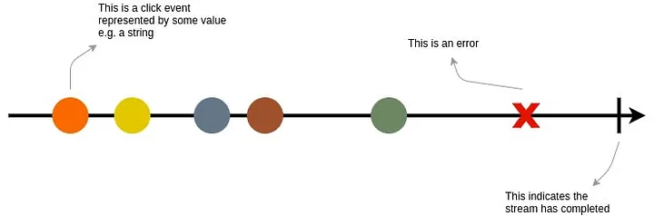
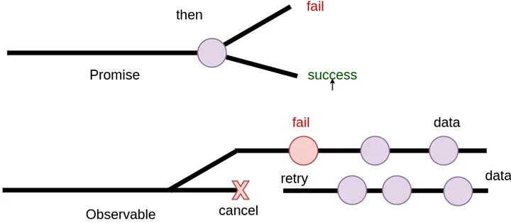
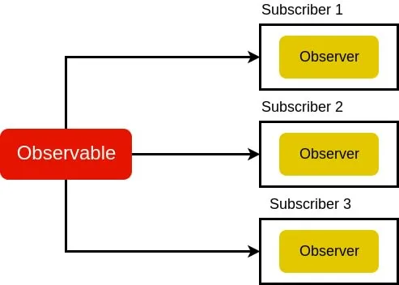
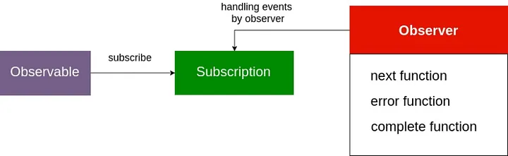

# Day 2: Overview of RxJS and TypeScript

## Key Concepts & Terminology

RxJS introduces Observables, a new Push system for JavaScript. An Observable is a Producer of multiple values, "pushing" them to Observers (Consumers).

## Observables

Observables are the core building blocks in RxJS. They represent a source of data streams that emit values over time. Observables can emit multiple values asynchronously, including primitive types, objects, or even other observables.



### Difference between Observables and Promises

> A Promise is an eventual value that can be rejected or resolved

> An Observable is a series of eventual values



### Creating Observables

You can create observables using various creation methods provided by RxJS. Here are a few common ways to create observables:

- **Creating an Observable from Scratch:**

```javascript
import { Observable } from 'rxjs'

const customObservable = new Observable((subscriber) => {
  subscriber.next(1)
  subscriber.next(2)
  subscriber.next(3)
  subscriber.complete()
})

//In this example, we create an observable customObservable using the Observable constructor.
//Inside the constructor, we call the next method to emit values and the complete method to signal the completion of the observable.
```

- **Creating an Observable from Existing Data**

```Javascript
import {from} from 'rxjs'

const numberArray = [1,2,3,4,5,6]

const dataObservable = from(numberArray)
```

### Hot and Cold Observables

Observables can be categorized as hot or cold, depending on how they handle subscriptions and the emission of values.

- **Cold Observales:** A cold observable starts emitting values only when a subscription is made to it. Each subscription triggers the creation of an independent execution of the observable, ensuring that each subscriber receives the entire sequence of emitted values from the beginning.

```Javascript
import { Observable } from 'rxjs'

const coldObservable = new Observable(() => {
  subscriber.next(1)
  subscriber.next(2)
  subscriber.next(3)
  subscriber.complete()
})

coldObservable.subscribe((value) => {
  console.log('Subscription A:', value)
})

setTimeout(() => {
  coldObservable.subscribe((value) => {
    console.log('Subscription B:', value)
  })
}, 5000)

//In this example, we create a cold observable coldObservable and make two subscriptions to it.
//Both subscribers, A and B, will receive the entire sequence of emitted values from the beginning.
```

- **Hot Observable:** A hot observable, on the other hand, emits values regardless of whether there are active subscriptions. Subscribers that join late might miss previously emitted values.

```Typescript
import { Observable, Subject } from 'rxjs';

const hotObservable = new Subject<number>();

hotObservable.next(1);
hotObservable.next(2);
hotObservable.next(3);

hotObservable.subscribe((value) => {
  console.log('Subscriber A:', value);
});

hotObservable.subscribe((value) => {
  console.log('Subscriber B:', value);
});

//In this example we we create an observable with a `Subject` (Later chapter)
//We are emitting values before subscribing
//Subscriber A and Subscriber B will receive values emitted after their respective subscriptions but will miss any values emitted before their subscriptions.

```

## Use case

### Cold Observable

- **Data Fetching:** When you need to fetch data from an external source (e.g., an API) and multiple subscribers might want to receive the same set of data independently, a cold observable is a suitable choice. Each subscriber will receive the complete sequence of emitted values, ensuring consistency.

```Typescript
 import { Observable } from 'rxjs';
import { ajax } from 'rxjs/ajax';

const fetchData = (): Observable<any> => {
  return ajax.getJSON('https://api.example.com/data');
};

const dataObservable = fetchData();

dataObservable.subscribe((data) => {
  console.log('Subscriber A:', data);
});

dataObservable.subscribe((data) => {
  console.log('Subscriber B:', data);
});

//In this example, the fetchData function returns a cold observable that fetches data from an API.
//Both Subscriber A and Subscriber B will receive the complete data sequence independently, ensuring that they have consistent and up-to-date information.
```

### Hot Observable

- **User Interaction:** When dealing with user interactions, such as mouse movements, keyboard inputs, or button clicks, where subscribers may join at any time, a hot observable is more appropriate. Subscribers will receive only values emitted after they have subscribed.

```Javascript
import { fromEvent } from 'rxjs'

const button document.getElementById('buttonId')

const clickObservable = fromEvent(button, 'click')

clickObservable.subscribe(() => {
  console.log('button clicked')
})

//In this example, the clickObservable is a hot observable created from button click events using fromEvent.
//If multiple subscribers subscribe to the clickObservable, they will only receive the click events that occur after their subscriptions,
//and any events that happened before their subscriptions will be missed.
```

- **Real-Time data Stream:** When dealing with real-time data streams, such as stock market updates, where the data is continuously being emitted, a hot observable allows subscribers to join the stream and start receiving values from that moment onwards.

```javascript
import { Observable } from 'rxjs'

let counter = 0

const hotObservable = new Observable((subscriber) => {
  const intervalId = setInterval(() => {
    subscriber.next(++counter)
  }, 1000)

  return () => {
    clearInterval(intervalId)
  }
})

hotObservable.subscribe((value) => {
  console.log('Subscriber A:', value)
})

setTimeout(() => {
  hotObservable.subscribe((value) => {
    console.log('Subscriber B:', value)
  })
}, 3000)
```

## Data Stream

A data stream refers to a sequence of events or values emitted over time.It represents the flow of data within an application, where events occur asynchronously and are propagated to subscribers. Think of it as a continuous and reactive channel through which data travels, allowing us to observe, transform, and react to these events as they occur.

Streams emit three things during its timeline, a value, an error, and complete signal where the Observable is the source of the values emitted. The use of `Operators` are important as these functions allows us to transform and manipulate values as we need them.

## Subscriptions

Subscriptions represent the connection between an observer and an observable. When you subscribe to an observable, you create a subscription, which allows you to receive and handle the emitted values. Subscriptions can also be used to unsubscribe and release the resources associated with the observable when no longer needed.

Subscription have a few essential things to know about:

- `unsubscribe()`: This method is used to terminate the subscription and free up resources. By calling unsubscribe(), you detach the subscriber from the observable, preventing further emissions from being received. It's important to unsubscribe when you no longer need to receive values to avoid memory leaks.
- `closed`: `true` if the subscription is closed. This happens when the subscription is unsubscribed but can also be used to indicate that the subscription is still active by checking `subscription.closed`.



## Observer

An observer is an entity that represents a consumer of values emitted by an observable. It serves as a bridge between the observable and the code that processes or reacts to those emitted values.

The `Observer` is an object literal with three optional callbacks:

- `next(value)`: This is used when a new value is emitted by the `Observable`.It receives the emitted value as an argument and defines the logic to handle that value. The next method is responsible for processing the data emitted by the observable and performing any necessary operations or side effects based on the received values.
- `error(error)`: This is used when an error is encountered within the `Observable`. When the observable encounters an error, it invokes the error method on the observer, passing the corresponding error object as an argument. After the error method is called, the observable stops emitting values, and no further values are received.
- `complete`: This method is invoked when the observable completes—meaning it has finished emitting all values successfully. It signifies the end of the observable's lifecycle.

_**Note: When an Observable is emitting values, after a `next`, there can only be an `error` or a `complete` message as nothing will be emitted after either of them is invoked.**_



## Operators

Operators in RxJS allow you to transform, filter, combine, or modify the emitted values from observables. Operators are functions that can be chained together to create a pipeline of transformations on the data streams. Some common operators include `map`, `filter`, `merge`, `concat`, and many more. To apply any of these operators you will need to to use the `pipe` function.

- An Operator is essentially a pure function which takes one Observable as input and generates another Observable as output.
- Operators pass each value from one operator to the next before proceeding to the next value in the set. This is different from array operators (map and filter) which will process the entire array at each step.

| Type           | Operator                         |
| -------------- | -------------------------------- |
| Creation       | `from`, `fromEvent`, `of`        |
| Combination    | `combineLatest`, `concat`, `zip` |
| Filtering      | `take`, `filter`, `takeUntil`    |
| Transformation | `concatMap`, `map`, `switchMap`  |
| Utility        | `tap`                            |
| Multicast      | `share`                          |

## Subject

A `subject` is a special type of observable that can be used as both a source of values and an observer

# Comparison of RxJS with other JavaScript Libraries

RxJS is not the only library available for reactive programming in JavaScript. Here's a brief comparison of RxJS with other popular libraries:

- **jQuery:** jQuery is primarily focused on manipulating the DOM and simplifying AJAX requests. It doesn't provide the same level of abstraction and flexibility for handling asynchronous data streams and complex event compositions as RxJS does.

- **Promises:** Promises are a built-in feature of JavaScript for handling asynchronous operations. While promises are excellent for handling a single asynchronous event, they lack the ability to handle complex event compositions and continuous data streams like RxJS does.

- **Lodash:** Lodash is a utility library that provides a wide range of functions for manipulating arrays, objects, and other data structures. While it can be used alongside RxJS, Lodash doesn't provide the same level of abstraction and composition capabilities for handling reactive data streams.

## Introduction to TypeScript Types with RxJS

TypeScript is a statically typed superset of JavaScript that adds type annotations and compile-time type checking to JavaScript code. When using RxJS with TypeScript, you can benefit from enhanced type safety and better code editor support.

RxJS leverages TypeScript's type system to provide type definitions for its core concepts, such as observables, operators, and subscriptions. This enables you to catch potential type-related errors early in the development process and write more robust and maintainable code.

TypeScript also provides features like interfaces and generics, which can be used to define and enforce specific types for observables and their emitted values. This allows you to have better control over the shape and behavior of your reactive code.

RxJS leverages TypeScript's type system to provide type definitions for its core concepts, such as observables, operators, and subscriptions. This enables you to catch potential type-related errors early in the development process and write more robust and maintainable code.

### Type Annotations for Observables

TypeScript allows you to specify the types of emitted values in observables, making it easier to understand and enforce the shape of data streams. You can use type annotations with generics to specify the type of emitted values:

```typescript
import { Observable } from 'rxjs'

const numberObservable: Observable<number> = new Observable((subscriber) => {
  subscriber.next(1)
  subscriber.next(2)
  subscriber.next(3)
  subscriber.complete()
})

numberObservable.subscribe((value: number) => {
  console.log('Received number:', value)
})
```

### TypeScript with Operators

RxJS operators also work seamlessly with TypeScript, allowing you to leverage type information in your data transformations.

```typescript
import { of } from 'rxjs'
import { map } from 'rxjs/operators'

const sourceObservable = of(1, 2, 3, 4, 5)

sourceObservable.pipe(map((value: number) => value * 2)).subscribe((value: number) => {
  console.log('Transformed number:', value)
})
```

### Interfaces for Complex Data Structures

When dealing with complex data structures, such as objects or custom data models, TypeScript interfaces can be used to define and enforce specific types.

```typescript
import { Observable } from 'rxjs'

interface User {
  id: number
  name: string
  email: string
}

const userObservable: Observable<User> = new Observable((subscriber) => {
  const user: User = {
    id: 1,
    name: 'John Doe',
    email: 'john@example.com',
  }

  subscriber.next(user)
  subscriber.complete()
})

userObservable.subscribe((user: User) => {
  console.log('Received user:', user)
})
```
