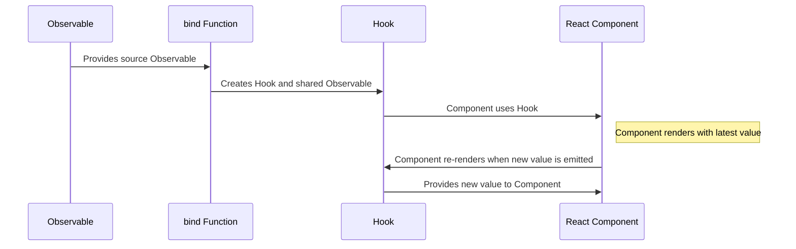

# A Guide to Bind

The `bind` function from `react-rxjs` is a powerful tool that creates a React hook connected to an RxJS Observable. It manages the lifecycle of the Observable subscription within the React component lifecycle.

**Here's how it works:**

1. **Subscription:** When a component that uses the hook returned by `bind` mounts, it subscribes to the Observable. This happens during the render phase of the component, before the actual effectful DOM updates take place. This is important because it ensures that the component has the latest value from the Observable when it renders.
2. **Unsubscription:** When the component unmounts, the subscription to the Observable is automatically cleaned up, preventing memory leaks. This is handled by React's built-in cleanup mechanism for hooks.
3. **Re-rendering:** Whenever a new value is emitted from the Observable, the component will re-render with the new value. This is achieved by using the `useState` and `useEffect` hooks internally within the hook returned by `bind`.
4. **Sharing Subscriptions:** The Observable returned by `bind` is a shared Observable, which means that it will share the subscription between multiple consumers. If multiple components use the hook returned by `bind`, they will all share a single subscription to the source Observable. This is efficient and avoids unnecessary side effects or computations.
5. **Suspense and Error Boundaries:** The hook returned by `bind` supports React's Suspense and Error Boundaries out of the box. If the Observable has not yet emitted a value, the hook will suspend. If the Observable emits an error, the hook will throw that error, which can be caught by an Error Boundary.

<aside>
💡 Remember, under the hood, `bind` uses React’s `useState` & `useEffect` to ‘magically’ handle the lifecycle of a stream. From RxJS, `bind` uses `shareLatest` to ensure a single stream can not only multicast but ensures the last entry emitted from the stream is available for new components that subscribe to the stream.

</aside>

---

Below is a visual representation of `bind`:



In this diagram:

- **Observable** represents the source Observable that you provide to the `bind` function.
- **bind Function** represents the `bind` function from React-RxJS.
- **Hook** represents the React hook that is returned by the `bind` function.
- **React Component** represents a React component that uses the hook.

This diagram shows how an Observable is provided to the `bind` function, which creates a hook and a shared Observable. The React component uses the hook to subscribe to the Observable and re-render whenever a new value is emitted.

---

### Basic Usage

The `bind` function takes an Observable and an optional default value as arguments. It returns a tuple containing a React hook and a shared Observable.

```jsx
import { bind } from "@react-rxjs/core"
import { interval } from "rxjs"

const [useCount, count$] = bind(interval(1000), 0)

```

In this example, `useCount` is a React hook that yields the latest emitted value of the Observable. If the Observable doesn't synchronously emit a value, it will return the default value (0 in this case). If no default value is provided, it will leverage React Suspense while it's waiting for the first value.

`count$` is the shared Observable that the hook uses. It replays the latest emitted value and can be used for composing other streams that depend on it.

---

### Using the Hook and Observable

The hook returned by `bind` can be used in a React component to subscribe to the Observable and re-render the component whenever a new value is emitted.

```jsx
function CountDisplay() {
  const count = useCount()

  return <div>{count}</div>
}

```

The shared Observable can be used to compose other streams. For example, you can create a new Observable that emits a value every time the count is even:

```jsx
import { filter } from "rxjs/operators"

const evenCount$ = count$.pipe(filter(count => count % 2 === 0))
```

---

### Factory Overload

`bind` can also take a factory function that returns an Observable. This is useful when you need to create an Observable based on some arguments.

```jsx
import { bind } from "@react-rxjs/core"
import { ajax } from "rxjs/ajax"

const [useUser, user$] = bind((id: number) => ajax.getJSON(`https://api.github.com/users/${id}`))

```

In this example, `useUser` is a React hook that takes a user ID as an argument and yields the latest user data from the GitHub API. `user$` is a function that takes a user ID as an argument and returns the shared Observable that the hook uses.

---

### Tricky Scenarios & Gotchas

While `bind` is designed to be straightforward to use, there are a few scenarios to be aware of:

- **Synchronous Emissions**: If the Observable emits a value synchronously (i.e., immediately upon subscription), the component will render with that value. However, if the Observable does not emit a value synchronously and no default value is provided, the hook will suspend until a value is emitted.
- **Completion**: `bind` does not propagate completions from the source stream. The shared subscription is closed as soon as there are no subscribers to that Observable. This means that you don't need to worry about unsubscribing from the Observable when the component unmounts.
- **Factory Overload**: `bind` can take a factory function that returns an Observable. This is useful when components need to access a particular instance. However, it's important to remember that each unique argument to the factory function will create a new Observable instance, so it's best to avoid passing objects or arrays directly as arguments.
- **Error Handling**: If the Observable emits an error, all components subscribed to that Observable will unmount and the error will be propagated to the nearest Error Boundary. It's important to have Error Boundaries in place to handle these scenarios.

---

## When Not to Use `bind`

1. **Simple Local State**: If you're managing simple local state within a component, the built-in `useState` hook is often simpler and more straightforward. `bind` shines when dealing with asynchronous or event-driven state, but for simple synchronous state updates, `useState` is usually sufficient.
2. **Complex State Management**: For complex state management scenarios involving multiple actions and reducers, you might want to consider using a state management library like Redux or MobX. While `react-rxjs` can handle complex state, it's primarily designed for handling asynchronous and event-driven state, and other libraries might provide a more structured approach to managing complex state.
3. **Non-React Environments**: The `bind` function is specifically designed to work with React components. If you're working in a non-React environment, or if you need to share state between React and non-React code, you might need to use plain RxJS or another state management solution.
4. **Performance Considerations**: While `react-rxjs` is generally quite performant, there can be scenarios where the overhead of creating a new observable for each component instance can impact performance, especially in large component trees. In such cases, it might be more efficient to use context or other state management solutions.
