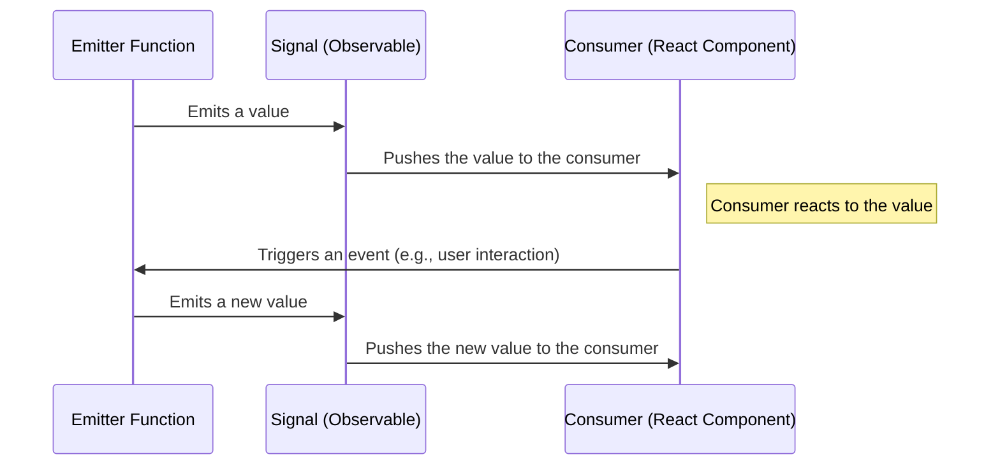

# Deep Dive into Signals with React-RxJS

In this tutorial, we'll explore the concept of signals in React-RxJS, a library that combines the principles of React and RxJS. Signals are a key part of the library, providing a way to handle events in a reactive manner.

## What is a Signal?

In React-RxJS, a Signal is a concept that is similar to a Subject in RxJS, but with a key difference: it splits the producer and the consumer. This means that the part of your code that emits values (the producer) is separated from the part of your code that reacts to those values (the consumer).

The `createSignal` function is used to create a Signal. It optionally takes a mapper function as an argument, which is used to map the arguments of the emitter function into the value of the Observable. It **returns a tuple containing an Observable and an emitter function**.



In this diagram:

- **Emitter Function** represents the function returned by `createSignal` that is used to emit values.
- **Signal (Observable)** represents the Observable returned by `createSignal` that emits the values.
- **Consumer (React Component)** represents a React component that uses a hook created by `bind` to subscribe to the Observable and react to the emitted values.

The diagram shows how a value is emitted by the Emitter Function, pushed through the Signal, and then reacted to by the Consumer. It also shows how an event in the Consumer (like a user interaction) can trigger the Emitter Function to emit a new value, starting the cycle again.

---

## Creating a Signal

You can create a Signal using the `createSignal` function. If you don't provide a mapper function, the arguments of the emitter function will be used as the value of the Observable.

```jsx
import { createSignal } from "@react-rxjs/utils"

const [value$, setValue] = createSignal<number>()

```

In this example, `value$` is an Observable that emits a number, and `setValue` is a function that takes a number as an argument and emits it through the Observable.

## Using the Observable

You can use the Observable returned by `createSignal` just like any other Observable. For example, you can subscribe to it to react to the emitted values:

```jsx
value$.subscribe(value => {
  console.log(`The current value is ${value}`)
})

```

You can also use it with the `bind` function from `@react-rxjs/core` to create a React hook:

```
import { bind } from "@react-rxjs/core"

const [useValue] = bind(value$, 0)

```

## Using the Emitter Function

The emitter function returned by `createSignal` is used to emit values through the Observable. You can call this function whenever you want to emit a new value:

```jsx
setValue(42)

```

In a React component, you might use the emitter function in an event handler:

```jsx
function NumberInput() {
  const [value, setValue] = useState(0)

  const handleChange = (event: React.ChangeEvent<HTMLInputElement>) => {
    setValue(Number(event.target.value))
  }

  const handleSubmit = () => {
    setValue(value)
  }

  return (
    <div>
      <input type="number" value={value} onChange={handleChange} />
      <button onClick={handleSubmit}>Submit</button>
    </div>
  )
}

```

In this example, the `setValue` function is called when the Submit button is clicked, emitting the current value of the input through the `value$` Observable.

## Advanced Usage: Combining Signals

Signals can be combined just like any other Observables. For example, you can use the `combineLatest` function from RxJS to create a new Observable that emits a value whenever any of its input Observables emit a value:

```jsx
import { combineLatest } from "rxjs"

const [firstName$, setFirstName] = createSignal<string>()
const [lastName$, setLastName] = createSignal<string>()

const fullName$ = combineLatest([firstName$, lastName$]).pipe(
  map(([firstName, lastName]) => `${firstName} ${lastName}`)
)

const [useFullName] = bind(fullName$)

```

In this example, `fullName$` is an Observable that emits the full name of the user whenever the first name or the last name changes.

## Advanced Usage: Error Handling with Signals

Just like with any other Observable, you can handle errors in a Signal using the `catchError` operator from RxJS:

```jsx
import { catchError } from "rxjs/operators"

const [fetchUser$, doFetchUser] = createSignal<string>()

const user$ = fetchUser$.pipe(
  switchMap(id => ajax.getJSON(`https://api.github.com/users/${id}`)),
  catchError(error => of({ error }))
)

const [useUser] = bind(user$)

```

In this example, `fetchUser$` is a Signal that emits the ID of a user to fetch from the GitHub API. If the fetch operation fails, the `catchError` operator catches the error and emits an object with an `error` property.

---

## Tricky Scenarios & Gotchas

Signals in `react-rxjs` are a powerful tool for handling events in a reactive manner. However, like any tool, there are some scenarios and gotchas to be aware of:

1. **Signal Emission**: Signals are not like typical RxJS Observables. They are designed to be "hot", meaning they start emitting as soon as they are created. This is different from typical "cold" Observables, which start emitting only when they are subscribed to. This means that if you create a Signal and then subscribe to it later, you might miss some emissions.
2. **Signal Completion**: Unlike typical Observables, Signals do not complete. This means that you don't need to worry about unsubscribing from a Signal, but it also means that you can't use operators that rely on completion, like `toArray` or `takeLast`.
3. **Signal Error Handling**: If a Signal emits an error, it will not stop emitting. This is different from typical Observables, which stop emitting as soon as they encounter an error. This means that you need to handle errors at the point of subscription, rather than at the point of emission.
4. **Signal Multicasting**: Signals are multicasted, meaning they can have multiple subscribers and they share the same execution among all subscribers. This is different from typical Observables, which are unicast and create a separate execution for each subscriber. This means that side effects in a Signal will only be executed once, no matter how many subscribers there are.
5. **Signal Backpressure**: Because Signals are designed to be used with user events, they do not support backpressure. This means that if you have a slow consumer, it might miss some emissions if the Signal is emitting too quickly. If you need to handle backpressure, you might need to use a different tool or pattern.
6. **Signal and React Component Lifecycle**: Signals are not tied to the React component lifecycle. This means that a Signal can continue emitting even after the component that created it has unmounted. If you need to clean up a Signal when a component unmounts, you will need to handle this manually.

---

## When Not to Use Signals

While signals are a powerful tool in React-RxJS, they are not always the best solution for every problem. Here are a few scenarios where you might want to consider alternatives:

### 1. Simple State Updates

If you're dealing with simple state updates that don't involve asynchronous operations or complex logic, the `useState` hook from React might be a better fit. Signals are great for handling events and managing state in a reactive manner, but they can be overkill for simple state updates.

```jsx
// Using useState for simple state updates
const [count, setCount] = useState(0);

const increment = () => setCount(count + 1);

```

### 2. Static Data

If your data is static and doesn't change over time, you don't need to use a signal. A simple variable or a constant would be sufficient.

```jsx
// Using a constant for static data
const PI = 3.14159;

```

### 3. Non-Event-Based Scenarios

Signals are designed to handle events, which are inherently asynchronous and can occur at any time. If you're dealing with a scenario that is not event-based, a signal might not be the best tool for the job.

```jsx
// Using a regular function for a non-event-based scenario
const calculateArea = (radius) => PI * radius * radius;

```

### 4. When You Need to Control the Subscription

Signals automatically manage the subscription to the underlying observable, which is great for most use cases. However, if you need to manually control when to subscribe or unsubscribe to the observable, you might want to use RxJS observables directly.

```jsx
// Using an RxJS observable when you need to control the subscription
const source$ = interval(1000);

const subscription = source$.subscribe(value => console.log(value));

// Later...
subscription.unsubscribe();

```

Remember, while React-RxJS and signals provide powerful tools for managing state and handling events in a reactive manner, they are just tools. It's important to understand the problem you're trying to solve and choose the right tool for the job.
