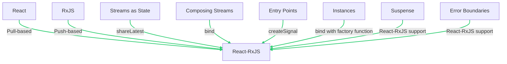

# Getting Started with react-rxjs Hooks

React-RxJS is a library that combines the principles of React and RxJS. It allows you to create a **push-based application state** that works seamlessly with the **pull-based nature of React**. Here are the core concepts you will need to understand in order to effectively use the library:





## Push vs Pull

React uses a pull-based architecture where it requests a new value when it needs to re-render. On the other hand, RxJS uses a push-based approach where changes are propagated from one stream to the next. React-RxJS bridges the gap between these two behaviors.

## Streams as State

RxJS streams are used to represent events or changing values over time. They are declarative and don't execute the effect until someone subscribes to it. React-RxJS provides `shareLatest` to share the state between many components and keep the latest value.

```javascript
import { interval } from "rxjs"
import { take } from "rxjs/operators"
import { shareLatest } from "@react-rxjs/core"

const first5SpacedNumbers = interval(1000).pipe(take(5), shareLatest())
```

## Composing Streams

The stream returned by `bind` is shared and can be easily composed with other streams.

```javascript
import { interval } from "rxjs"
import { take } from "rxjs/operators"
import { bind } from "@react-rxjs/core"

const [useSeconds, second$] = bind(interval(1000))
const [useLatestNSeconds, latestNSeconds$] = bind((n: number) => second$.pipe(take(n)))
```

## Entry Points

Data for the state can come from various sources. For data coming directly from the user, RxJS Subjects are used. In React-RxJS, this is abstracted into signals which separate the producer and the consumer of that subject.

```javascript
import { scan } from "rxjs/operators"
import { bind } from "@react-rxjs/core"
import { createSignal } from "@react-rxjs/utils"

const [newTodos$, postNewTodo] = createSignal();
const [useTodoList, todoList$] = bind(newTodos$.pipe(scan((acc, todo) => [...acc, todo], [])), [])
```

## Instances

`bind` can take a factory function that returns an Observable for a particular instance. This is useful when components need to access a particular instance.

## Suspense

React-RxJS comes with full support for Suspense, a feature in React that allows you to represent values that are not yet ready. By default, using a hook from a stream that hasn't emitted any value will result in that hook suspending the component.

## Error Boundaries

If a stream emits an error, the components that are subscribed to that stream will propagate that error to the nearest Error Boundary. This allows for graceful error recovery.

```javascript
import { bind } from "@react-rxjs/core"
import { interval } from "rxjs"
import { map, startWith } from "rxjs/operators"
import { ErrorBoundary } from "react-error-boundary"

const [useTimedBomb, timedBomb$] = bind(interval(1000).pipe(map((v) => v + 1), startWith(0), map((v) => { if (v === 3) { throw new Error("boom") } return v })))
```

<hr>

Great, now you know the key terms & concepts behind this library. While nice to know, let's make this info more practical and dive into actually using `react-rxjs`.

<hr>

## Getting Up & Running with React-RxJS

Getting started with React-RxJS involves understanding a few (more) key concepts and steps:

1. **Installation**: React-RxJS is available on npm and can be installed with the following commands:

   Using npm:
   ```bash
   npm i rxjs @react-rxjs/core @react-rxjs/utils
   ```


2. **Creating a Hook from an Observable**: The `bind` function from `@react-rxjs/core` is used to connect a stream to a hook. A signal, which is an entry point to React-RxJS, can be created using `createSignal` from `@react-rxjs/utils`. Here's an example:

   ```javascript
   import { bind } from "@react-rxjs/core"
   import { createSignal } from "@react-rxjs/utils"

   const [textChange$, setText] = createSignal();
   const [useText, text$] = bind(textChange$, "")

   function TextInput() {
     const text = useText()

     return (
       <div>
         <input
           type="text"
           value={text}
           placeholder="Type something..."
           onChange={(e) => setText(e.target.value)}
         />
         <br />
         Echo: {text}
       </div>
     )
   }
   ```

3. **Using the Hook and Observable**: The `bind` function returns a tuple containing the hook and the underlying shared observable. The observable can be used by other streams. For instance, you can create a character count function that uses the text observable:

   ```javascript
   import { map } from "rxjs/operators"
   import { bind, Subscribe } from "@react-rxjs/core"

   const [useCharCount, charCount$] = bind(
     text$.pipe(
       map((text) => text.length)
     )
   )

   function CharacterCount() {
     const count = useCharCount()

     return <>Character Count: {count}</>
   }
   ```

4. **Subscription**: A subscription to the underlying observable must be present before the hook is executed. The `Subscribe` component can be used to ensure this:

   ```javascript
   function CharacterCounter() {
     return (
       <div>
         <Subscribe>
           <TextInput />
           <CharacterCount />
         </Subscribe>
       </div>
     )
   }
   ```


### Observables vs. Signals
In `react-rxjs`, Signals and Observables serve different purposes and their usage depends on the specific needs of your application.

**Observables** are a core concept of RxJS and represent a stream of values or events over time. They are used when you need to handle asynchronous or event-based data flows. Observables are particularly useful when you need to:

- Handle streams of values over time, such as user input events, API responses, or timer events.
- Compose, transform, or combine multiple streams of values.
- Handle complex asynchronous operations, such as retrying failed requests or debouncing user input.

**Signals** in `react-rxjs` are a concept similar to Subjects in RxJS, but with a key difference: they split the producer and the consumer. This means that the part of your code that emits values (the producer) is separated from the part of your code that reacts to those values (the consumer). Signals are particularly useful when:

- You need to handle events in a reactive manner, such as user interactions or form submissions.
- You want to separate the producer and the consumer of events, which can make your code more declarative and easier to reason about.
- You need to share a single event source among multiple consumers.

In general, you would use Observables when you need to handle, transform, or compose asynchronous data flows, and you would use Signals when you need to handle events in a reactive manner and separate the producer and consumer of those events. It's also common to use Signals and Observables together in a `react-rxjs` application. For example, you might use a Signal to handle user interactions and then use an Observable to transform and react to those events.

---

## Using TypeScript Types with react-rxjs Hooks

React-RxJS is fully compatible with TypeScript and provides type safety for your observables and hooks. When you use the `bind` function to create a hook, TypeScript can infer the type of the values that the hook will return based on the observable.

Here's an example:

```typescript
import { bind } from "@react-rxjs/core"
import { of } from "rxjs"

const [useNumber] = bind(of(42))

function NumberDisplay() {
  const number = useNumber() // TypeScript knows that `number` is a number

  return <div>{number}</div>
}
```

In this example, TypeScript infers that `number` is a number because it comes from the `useNumber` hook, which is connected to an observable that emits numbers.

You can also explicitly specify the type of the values that the observable will emit by providing a type argument to the `bind` function:

```typescript
import { bind } from "@react-rxjs/core"
import { of } from "rxjs"

const [useString] = bind<string>(of("Hello, world!"))

function StringDisplay() {
  const string = useString() // TypeScript knows that `string` is a string

  return <div>{string}</div>
}
```

In this example, the `bind<string>` function call tells TypeScript that the observable will emit strings, so the `useString` hook will return strings.
