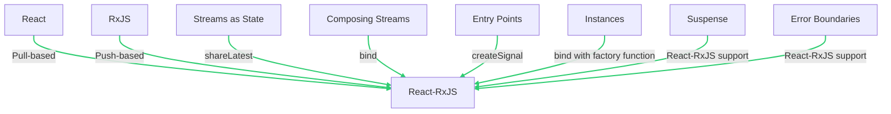
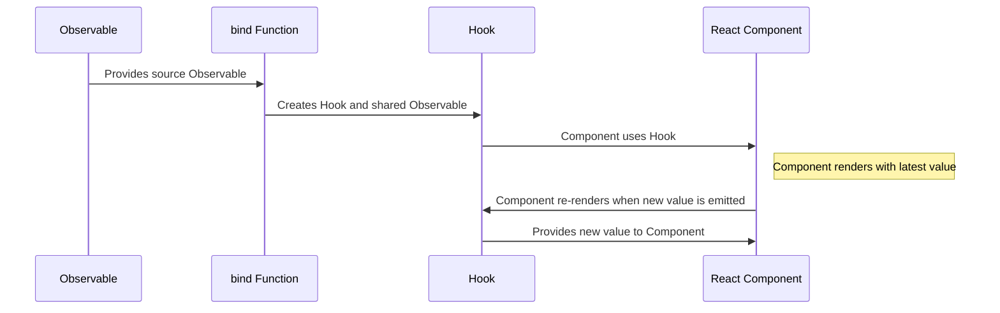
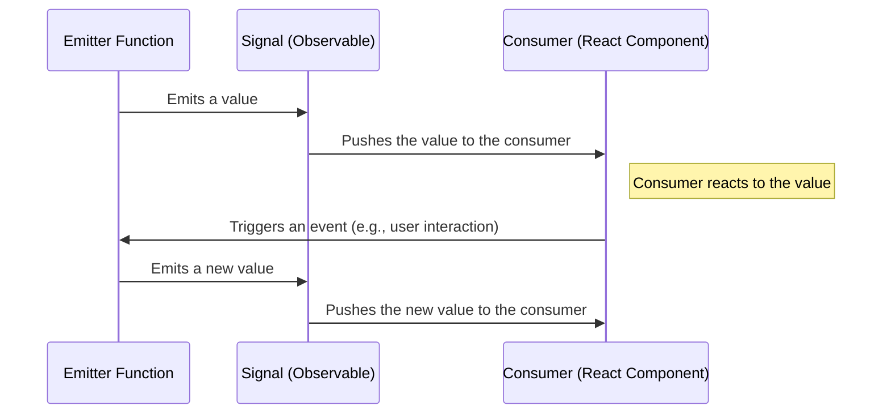

# Getting Started with react-rxjs Hooks

React-RxJS is a library that combines the principles of React and RxJS. It allows you to create a **push-based application state** that works seamlessly with the **pull-based nature of React**. Here are the core concepts you will need to understand in order to effectively use the library:





## Push vs Pull

React uses a pull-based architecture where it requests a new value when it needs to re-render. On the other hand, RxJS uses a push-based approach where changes are propagated from one stream to the next. React-RxJS bridges the gap between these two behaviors.

## Streams as State

RxJS streams are used to represent events or changing values over time. They are declarative and don't execute the effect until someone subscribes to it. React-RxJS provides `shareLatest` to share the state between many components and keep the latest value.

```javascript
import { interval } from "rxjs"
import { take } from "rxjs/operators"
import { shareLatest } from "@react-rxjs/core"

const first5SpacedNumbers = interval(1000).pipe(take(5), shareLatest())
```

## Composing Streams

The stream returned by `bind` is shared and can be easily composed with other streams. 

```javascript
import { interval } from "rxjs"
import { take } from "rxjs/operators"
import { bind } from "@react-rxjs/core"

const [useSeconds, second$] = bind(interval(1000))
const [useLatestNSeconds, latestNSeconds$] = bind((n: number) => second$.pipe(take(n)))
```

## Entry Points

Data for the state can come from various sources. For data coming directly from the user, RxJS Subjects are used. In React-RxJS, this is abstracted into signals which separate the producer and the consumer of that subject.

```javascript
import { scan } from "rxjs/operators"
import { bind } from "@react-rxjs/core"
import { createSignal } from "@react-rxjs/utils"

const [newTodos$, postNewTodo] = createSignal();
const [useTodoList, todoList$] = bind(newTodos$.pipe(scan((acc, todo) => [...acc, todo], [])), [])
```

## Instances

`bind` can take a factory function that returns an Observable for a particular instance. This is useful when components need to access a particular instance.

## Suspense

React-RxJS comes with full support for Suspense, a feature in React that allows you to represent values that are not yet ready. By default, using a hook from a stream that hasn't emitted any value will result in that hook suspending the component.

## Error Boundaries

If a stream emits an error, the components that are subscribed to that stream will propagate that error to the nearest Error Boundary. This allows for graceful error recovery.

```javascript
import { bind } from "@react-rxjs/core"
import { interval } from "rxjs"
import { map, startWith } from "rxjs/operators"
import { ErrorBoundary } from "react-error-boundary"

const [useTimedBomb, timedBomb$] = bind(interval(1000).pipe(map((v) => v + 1), startWith(0), map((v) => { if (v === 3) { throw new Error("boom") } return v })))
```

<hr>

Great, now you know the key terms & concepts behind this library. While nice to know, let's make this info more practical and dive into actually using `react-rxjs`. 

<hr>

## Getting Up & Running with React-RxJS

Getting started with React-RxJS involves understanding a few (more) key concepts and steps:

1. **Installation**: React-RxJS is available on npm and can be installed with the following commands:

   Using npm:
   ```bash
   npm i rxjs @react-rxjs/core @react-rxjs/utils
   ```
   Using yarn:
   ```bash
   yarn add rxjs @react-rxjs/core @react-rxjs/utils
   ```

2. **Creating a Hook from an Observable**: The `bind` function from `@react-rxjs/core` is used to connect a stream to a hook. A signal, which is an entry point to React-RxJS, can be created using `createSignal` from `@react-rxjs/utils`. Here's an example:

   ```javascript
   import { bind } from "@react-rxjs/core"
   import { createSignal } from "@react-rxjs/utils"

   const [textChange$, setText] = createSignal();
   const [useText, text$] = bind(textChange$, "")

   function TextInput() {
     const text = useText()

     return (
       <div>
         <input
           type="text"
           value={text}
           placeholder="Type something..."
           onChange={(e) => setText(e.target.value)}
         />
         <br />
         Echo: {text}
       </div>
     )
   }
   ```

3. **Using the Hook and Observable**: The `bind` function returns a tuple containing the hook and the underlying shared observable. The observable can be used by other streams. For instance, you can create a character count function that uses the text observable:

   ```javascript
   import { map } from "rxjs/operators"
   import { bind, Subscribe } from "@react-rxjs/core"

   const [useCharCount, charCount$] = bind(
     text$.pipe(
       map((text) => text.length)
     )
   )

   function CharacterCount() {
     const count = useCharCount()

     return <>Character Count: {count}</>
   }
   ```

4. **Subscription**: A subscription to the underlying observable must be present before the hook is executed. The `Subscribe` component can be used to ensure this:

   ```javascript
   function CharacterCounter() {
     return (
       <div>
         <Subscribe>
           <TextInput />
           <CharacterCount />
         </Subscribe>
       </div>
     )
   }
   ```

<hr>

So we see from above, that the `bind` function is really at the heart of the `react-rxjs` library. It is a key feature in connecting RxJS observables to React components. Let's review it in more depth.
<hr>

## Connecting RxJS Observables to React Components

### A Guide on How to Use `bind`

The `bind` function from `react-rxjs` is a powerful tool that **creates a React hook connected to an RxJS Observable**. It manages the lifecycle of the Observable subscription within the React component lifecycle. 

Here's how it works:

1. **Subscription:** When a component that uses the hook returned by `bind` mounts, it subscribes to the Observable. This happens during the render phase of the component, before the actual effectful DOM updates take place. This is important because it ensures that the component has the latest value from the Observable when it renders.

2. **Unsubscription:** When the component unmounts, the subscription to the Observable is automatically cleaned up, preventing memory leaks. This is handled by React's built-in cleanup mechanism for hooks.

3. **Re-rendering:** Whenever a new value is emitted from the Observable, the component will re-render with the new value. This is achieved by using the `useState` and `useEffect` hooks internally within the hook returned by `bind`.

4. **Sharing Subscriptions:** The Observable returned by `bind` is a shared Observable, which means that it will share the subscription between multiple consumers. If multiple components use the hook returned by `bind`, they will all share a single subscription to the source Observable. This is efficient and avoids unnecessary side effects or computations.

5. **Suspense and Error Boundaries:** The hook returned by `bind` supports React's Suspense and Error Boundaries out of the box. If the Observable has not yet emitted a value, the hook will suspend. If the Observable emits an error, the hook will throw that error, which can be caught by an Error Boundary.

<hr>
Below is a visual representation of `bind`:



In this diagram:

- **Observable** represents the source Observable that you provide to the `bind` function.
- **bind Function** represents the `bind` function from React-RxJS.
- **Hook** represents the React hook that is returned by the `bind` function.
- **React Component** represents a React component that uses the hook.

This diagram shows how an Observable is provided to the `bind` function, which creates a hook and a shared Observable. The React component uses the hook to subscribe to the Observable and re-render whenever a new value is emitted.

### Basic Usage

The `bind` function takes an Observable and an optional default value as arguments. It returns a tuple containing a React hook and a shared Observable.

```typescript
import { bind } from "@react-rxjs/core"
import { interval } from "rxjs"

const [useCount, count$] = bind(interval(1000), 0)
```

In this example, `useCount` is a React hook that yields the latest emitted value of the Observable. If the Observable doesn't synchronously emit a value, it will return the default value (0 in this case). If no default value is provided, it will leverage React Suspense while it's waiting for the first value.

`count$` is the shared Observable that the hook uses. It replays the latest emitted value and can be used for composing other streams that depend on it.

### Factory Overload

`bind` can also take a factory function that returns an Observable. This is useful when you need to create an Observable based on some arguments.

```typescript
import { bind } from "@react-rxjs/core"
import { ajax } from "rxjs/ajax"

const [useUser, user$] = bind((id: number) => ajax.getJSON(`https://api.github.com/users/${id}`))
```

In this example, `useUser` is a React hook that takes a user ID as an argument and yields the latest user data from the GitHub API. `user$` is a function that takes a user ID as an argument and returns the shared Observable that the hook uses.

### Using the Hook and Observable

The hook returned by `bind` can be used in a React component to subscribe to the Observable and re-render the component whenever a new value is emitted.

```typescript
function CountDisplay() {
  const count = useCount()

  return <div>{count}</div>
}
```

The shared Observable can be used to compose other streams. For example, you can create a new Observable that emits a value every time the count is even:

```typescript
import { filter } from "rxjs/operators"

const evenCount$ = count$.pipe(filter(count => count % 2 === 0))
```


### Tricky Scenarios & Gotchas

While `bind` is designed to be straightforward to use, there are a few scenarios to be aware of:

- **Synchronous Emissions**: If the Observable emits a value synchronously (i.e., immediately upon subscription), the component will render with that value. However, if the Observable does not emit a value synchronously and no default value is provided, the hook will suspend until a value is emitted.

- **Completion**: `bind` does not propagate completions from the source stream. The shared subscription is closed as soon as there are no subscribers to that Observable. This means that you don't need to worry about unsubscribing from the Observable when the component unmounts.

- **Factory Overload**: `bind` can take a factory function that returns an Observable. This is useful when components need to access a particular instance. However, it's important to remember that each unique argument to the factory function will create a new Observable instance, so it's best to avoid passing objects or arrays directly as arguments.

- **Error Handling**: If the Observable emits an error, all components subscribed to that Observable will unmount and the error will be propagated to the nearest Error Boundary. It's important to have Error Boundaries in place to handle these scenarios.

<hr>

If you've been paying attention, you'll have noticed the term `signal` being thrown about. Like `bind`, `signals` are at the heart of this library. Let's make sure we truly understand what they are, how they can be created, and how to use them in our applications.
<hr>

## A Guide on `Signals`
In React-RxJS, **a Signal is a concept that is similar to a Subject in RxJS, but with a key difference: it splits the producer and the consumer**. This means that the part of your code that emits values (the producer) is separated from the part of your code that reacts to those values (the consumer).

The `createSignal` function is used to create a Signal. It optionally takes a mapper function as an argument, which is used to map the arguments of the emitter function into the value of the Observable. It returns a tuple containing an Observable and an emitter function.



In this diagram:

- **Emitter Function** represents the function returned by `createSignal` that is used to emit values.
- **Signal (Observable)** represents the Observable returned by `createSignal` that emits the values.
- **Consumer (React Component)** represents a React component that uses a hook created by `bind` to subscribe to the Observable and react to the emitted values.

The diagram shows how a value is emitted by the Emitter Function, pushed through the Signal, and then reacted to by the Consumer. It also shows how an event in the Consumer (like a user interaction) can trigger the Emitter Function to emit a new value, starting the cycle again.

### Creating a Signal

You can create a Signal using the `createSignal` function. If you don't provide a mapper function, the arguments of the emitter function will be used as the value of the Observable.

```typescript
import { createSignal } from "@react-rxjs/utils"

const [value$, setValue] = createSignal<number>()
```

In this example, `value$` is an Observable that emits a number, and `setValue` is a function that takes a number as an argument and emits it through the Observable.

### Using the Observable

You can use the Observable returned by `createSignal` just like any other Observable. For example, you can subscribe to it to react to the emitted values:

```typescript
value$.subscribe(value => {
  console.log(`The current value is ${value}`)
})
```

You can also use it with the `bind` function from `@react-rxjs/core` to create a React hook:

```typescript
import { bind } from "@react-rxjs/core"

const [useValue] = bind(value$, 0)
```

### Using the Emitter Function

The emitter function returned by `createSignal` is used to emit values through the Observable. You can call this function whenever you want to emit a new value:

```typescript
setValue(42)
```

In a React component, you might use the emitter function in an event handler:

```typescript
function NumberInput() {
  const [value, setValue] = useState(0)

  const handleChange = (event: React.ChangeEvent<HTMLInputElement>) => {
    setValue(Number(event.target.value))
  }

  const handleSubmit = () => {
    setValue(value)
  }

  return (
    <div>
      <input type="number" value={value} onChange={handleChange} />
      <button onClick={handleSubmit}>Submit</button>
    </div>
  )
}
```

In this example, the `setValue` function is called when the Submit button is clicked, emitting the current value of the input through the `value$` Observable.

### Tricky Scenarios & Gotchas

Signals in `react-rxjs` are a powerful tool for handling events in a reactive manner. However, like any tool, there are some scenarios and gotchas to be aware of:

1. **Signal Emission**: Signals are not like typical RxJS Observables. They are designed to be "hot", meaning they start emitting as soon as they are created. This is different from typical "cold" Observables, which start emitting only when they are subscribed to. This means that if you create a Signal and then subscribe to it later, you might miss some emissions.

2. **Signal Completion**: Unlike typical Observables, Signals do not complete. This means that you don't need to worry about unsubscribing from a Signal, but it also means that you can't use operators that rely on completion, like `toArray` or `takeLast`.

3. **Signal Error Handling**: If a Signal emits an error, it will not stop emitting. This is different from typical Observables, which stop emitting as soon as they encounter an error. This means that you need to handle errors at the point of subscription, rather than at the point of emission.

4. **Signal Multicasting**: Signals are multicasted, meaning they can have multiple subscribers and they share the same execution among all subscribers. This is different from typical Observables, which are unicast and create a separate execution for each subscriber. This means that side effects in a Signal will only be executed once, no matter how many subscribers there are.

5. **Signal Backpressure**: Because Signals are designed to be used with user events, they do not support backpressure. This means that if you have a slow consumer, it might miss some emissions if the Signal is emitting too quickly. If you need to handle backpressure, you might need to use a different tool or pattern.

6. **Signal and React Component Lifecycle**: Signals are not tied to the React component lifecycle. This means that a Signal can continue emitting even after the component that created it has unmounted. If you need to clean up a Signal when a component unmounts, you will need to handle this manually.

<hr>
Okay...so there are many pitfalls to using signals. How are they different from observables again? And when should I use an observable vs. signal?

### Observables vs. Signals
In `react-rxjs`, Signals and Observables serve different purposes and their usage depends on the specific needs of your application.

**Observables** are a core concept of RxJS and represent a stream of values or events over time. They are used when you need to handle asynchronous or event-based data flows. Observables are particularly useful when you need to:

- Handle streams of values over time, such as user input events, API responses, or timer events.
- Compose, transform, or combine multiple streams of values.
- Handle complex asynchronous operations, such as retrying failed requests or debouncing user input.

**Signals** in `react-rxjs` are a concept similar to Subjects in RxJS, but with a key difference: they split the producer and the consumer. This means that the part of your code that emits values (the producer) is separated from the part of your code that reacts to those values (the consumer). Signals are particularly useful when:

- You need to handle events in a reactive manner, such as user interactions or form submissions.
- You want to separate the producer and the consumer of events, which can make your code more declarative and easier to reason about.
- You need to share a single event source among multiple consumers.

In general, you would use Observables when you need to handle, transform, or compose asynchronous data flows, and you would use Signals when you need to handle events in a reactive manner and separate the producer and consumer of those events. It's also common to use Signals and Observables together in a `react-rxjs` application. For example, you might use a Signal to handle user interactions and then use an Observable to transform and react to those events.


<hr>


With an in-depth understanding of `bind` & `signals` vs. `observables` we have the majority of what we need to start using react-rxjs -- before we dive into the challenges found in `day-1/challenges`, let's quickly review how TypeScript fits into all of this.

<hr>

## Using TypeScript Types with react-rxjs Hooks

React-RxJS is fully compatible with TypeScript and provides type safety for your observables and hooks. When you use the `bind` function to create a hook, TypeScript can infer the type of the values that the hook will return based on the observable.

Here's an example:

```typescript
import { bind } from "@react-rxjs/core"
import { of } from "rxjs"

const [useNumber] = bind(of(42))

function NumberDisplay() {
  const number = useNumber() // TypeScript knows that `number` is a number

  return <div>{number}</div>
}
```

In this example, TypeScript infers that `number` is a number because it comes from the `useNumber` hook, which is connected to an observable that emits numbers.

You can also explicitly specify the type of the values that the observable will emit by providing a type argument to the `bind` function:

```typescript
import { bind } from "@react-rxjs/core"
import { of } from "rxjs"

const [useString] = bind<string>(of("Hello, world!"))

function StringDisplay() {
  const string = useString() // TypeScript knows that `string` is a string

  return <div>{string}</div>
}
```

In this example, the `bind<string>` function call tells TypeScript that the observable will emit strings, so the `useString` hook will return strings.


