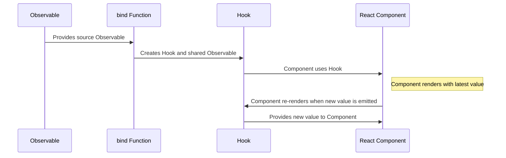
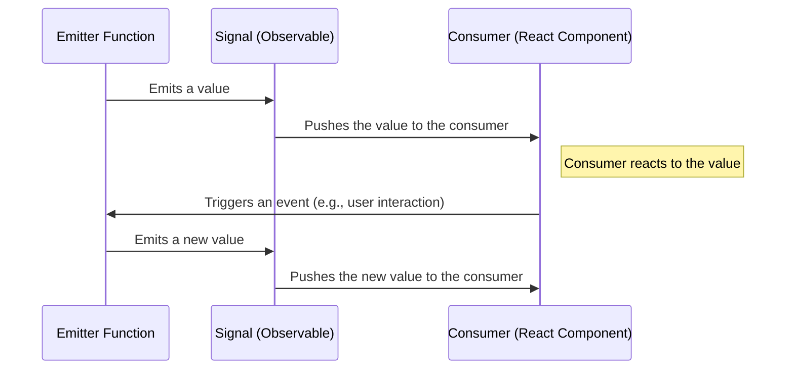

# Getting Started with react-rxjs Hooks
React-RxJS is a library that combines the principles of React and RxJS. It allows you to create a **push-based application state** that works seamlessly with the **pull-based nature of React**. Here are the core concepts you will need to understand in order to effectively use the library:

1. **Push vs Pull**: React uses a pull-based architecture where it requests a new value when it needs to re-render. On the other hand, RxJS uses a push-based approach where changes are propagated from one stream to the next. React-RxJS bridges the gap between these two behaviors.

2. **Streams as State**: RxJS streams are used to represent events or changing values over time. They are declarative and don't execute the effect until someone subscribes to it. React-RxJS provides `shareLatest` to share the state between many components and keep the latest value.

   ```javascript
   import { interval } from "rxjs"
   import { take } from "rxjs/operators"
   import { shareLatest } from "@react-rxjs/core"

   const first5SpacedNumbers = interval(1000).pipe(take(5), shareLatest())
   ```

3. **Composing Streams**: The stream returned by `bind` is shared and can be easily composed with other streams. 

   ```javascript
   import { interval } from "rxjs"
   import { take } from "rxjs/operators"
   import { bind } from "@react-rxjs/core"

   const [useSeconds, second$] = bind(interval(1000))
   const [useLatestNSeconds, latestNSeconds$] = bind((n: number) => second$.pipe(take(n)))
   ```

4. **Entry Points**: Data for the state can come from various sources. For data coming directly from the user, RxJS Subjects are used. In React-RxJS, this is abstracted into signals which separate the producer and the consumer of that subject.

   ```javascript
   import { scan } from "rxjs/operators"
   import { bind } from "@react-rxjs/core"
   import { createSignal } from "@react-rxjs/utils"

   const [newTodos$, postNewTodo] = createSignal();
   const [useTodoList, todoList$] = bind(newTodos$.pipe(scan((acc, todo) => [...acc, todo], [])), [])
   ```

5. **Instances**: `bind` can take a factory function that returns an Observable for a particular instance. This is useful when components need to access a particular instance.

6. **Suspense**: React-RxJS comes with full support for Suspense, a feature in React that allows you to represent values that are not yet ready. By default, using a hook from a stream that hasn't emitted any value will result in that hook suspending the component.

7. **Error Boundaries**: If a stream emits an error, the components that are subscribed to that stream will propagate that error to the nearest Error Boundary. This allows for graceful error recovery.

   ```javascript
   import { bind } from "@react-rxjs/core"
   import { interval } from "rxjs"
   import { map, startWith } from "rxjs/operators"
   import { ErrorBoundary } from "react-error-boundary"

   const [useTimedBomb, timedBomb$] = bind(interval(1000).pipe(map((v) => v + 1), startWith(0), map((v) => { if (v === 3) { throw new Error("boom") } return v })))
   ```


<hr>

Great, now you know the key terms & concepts behind this library. While nice to know, let's make this info more practical and dive into actually using `react-rxjs`. 
<hr>

## Getting Up & Running with React-RxJS

Getting started with React-RxJS involves understanding a few (more) key concepts and steps:

1. **Installation**: React-RxJS is available on npm and can be installed with the following commands:

   Using npm:
   ```bash
   npm i rxjs @react-rxjs/core @react-rxjs/utils
   ```
   Using yarn:
   ```bash
   yarn add rxjs @react-rxjs/core @react-rxjs/utils
   ```

2. **Creating a Hook from an Observable**: The `bind` function from `@react-rxjs/core` is used to connect a stream to a hook. A signal, which is an entry point to React-RxJS, can be created using `createSignal` from `@react-rxjs/utils`. Here's an example:

   ```javascript
   import { bind } from "@react-rxjs/core"
   import { createSignal } from "@react-rxjs/utils"

   const [textChange$, setText] = createSignal();
   const [useText, text$] = bind(textChange$, "")

   function TextInput() {
     const text = useText()

     return (
       <div>
         <input
           type="text"
           value={text}
           placeholder="Type something..."
           onChange={(e) => setText(e.target.value)}
         />
         <br />
         Echo: {text}
       </div>
     )
   }
   ```

3. **Using the Hook and Observable**: The `bind` function returns a tuple containing the hook and the underlying shared observable. The observable can be used by other streams. For instance, you can create a character count function that uses the text observable:

   ```javascript
   import { map } from "rxjs/operators"
   import { bind, Subscribe } from "@react-rxjs/core"

   const [useCharCount, charCount$] = bind(
     text$.pipe(
       map((text) => text.length)
     )
   )

   function CharacterCount() {
     const count = useCharCount()

     return <>Character Count: {count}</>
   }
   ```

4. **Subscription**: A subscription to the underlying observable must be present before the hook is executed. The `Subscribe` component can be used to ensure this:

   ```javascript
   function CharacterCounter() {
     return (
       <div>
         <Subscribe>
           <TextInput />
           <CharacterCount />
         </Subscribe>
       </div>
     )
   }
   ```

<hr>

So we see from above, that the `bind` function is really at the heart of the `react-rxjs` library. Let's review it in more depth.
<hr>


## A Guide on How to Use `bind`
The `bind` function is a core part of the React-RxJS library. It is used to connect an Observable to React, returning a hook and a shared stream representing the source Observable.




In this diagram:

- **Observable** represents the source Observable that you provide to the `bind` function.
- **bind Function** represents the `bind` function from React-RxJS.
- **Hook** represents the React hook that is returned by the `bind` function.
- **React Component** represents a React component that uses the hook.

This diagram shows how an Observable is provided to the `bind` function, which creates a hook and a shared Observable. The React component uses the hook to subscribe to the Observable and re-render whenever a new value is emitted.

### Basic Usage

The `bind` function takes an Observable and an optional default value as arguments. It returns a tuple containing a React hook and a shared Observable.

```typescript
import { bind } from "@react-rxjs/core"
import { interval } from "rxjs"

const [useCount, count$] = bind(interval(1000), 0)
```

In this example, `useCount` is a React hook that yields the latest emitted value of the Observable. If the Observable doesn't synchronously emit a value, it will return the default value (0 in this case). If no default value is provided, it will leverage React Suspense while it's waiting for the first value.

`count$` is the shared Observable that the hook uses. It replays the latest emitted value and can be used for composing other streams that depend on it.

### Factory Overload

`bind` can also take a factory function that returns an Observable. This is useful when you need to create an Observable based on some arguments.

```typescript
import { bind } from "@react-rxjs/core"
import { ajax } from "rxjs/ajax"

const [useUser, user$] = bind((id: number) => ajax.getJSON(`https://api.github.com/users/${id}`))
```

In this example, `useUser` is a React hook that takes a user ID as an argument and yields the latest user data from the GitHub API. `user$` is a function that takes a user ID as an argument and returns the shared Observable that the hook uses.

### Using the Hook and Observable

The hook returned by `bind` can be used in a React component to subscribe to the Observable and re-render the component whenever a new value is emitted.

```typescript
function CountDisplay() {
  const count = useCount()

  return <div>{count}</div>
}
```

The shared Observable can be used to compose other streams. For example, you can create a new Observable that emits a value every time the count is even:

```typescript
import { filter } from "rxjs/operators"

const evenCount$ = count$.pipe(filter(count => count % 2 === 0))
```

### Note

`bind` does not propagate completions from the source stream - the shared subscription is closed as soon as there are no subscribers to that Observable. This means that you don't need to worry about unsubscribing from the Observable when the component unmounts.

<hr>

If you've been paying attention, you'll have noticed the term `signal` being thrown about. Like `bind`, `signals` are at the heart of this library. Let's make sure we truly understand what they are, how they can be created, and how to use them in our applications.
<hr>

## A Guide on `Signals`
In React-RxJS, **a Signal is a concept that is similar to a Subject in RxJS, but with a key difference: it splits the producer and the consumer**. This means that the part of your code that emits values (the producer) is separated from the part of your code that reacts to those values (the consumer).

The `createSignal` function is used to create a Signal. It optionally takes a mapper function as an argument, which is used to map the arguments of the emitter function into the value of the Observable. It returns a tuple containing an Observable and an emitter function.



In this diagram:

- **Emitter Function** represents the function returned by `createSignal` that is used to emit values.
- **Signal (Observable)** represents the Observable returned by `createSignal` that emits the values.
- **Consumer (React Component)** represents a React component that uses a hook created by `bind` to subscribe to the Observable and react to the emitted values.

The diagram shows how a value is emitted by the Emitter Function, pushed through the Signal, and then reacted to by the Consumer. It also shows how an event in the Consumer (like a user interaction) can trigger the Emitter Function to emit a new value, starting the cycle again.

### Creating a Signal

You can create a Signal using the `createSignal` function. If you don't provide a mapper function, the arguments of the emitter function will be used as the value of the Observable.

```typescript
import { createSignal } from "@react-rxjs/utils"

const [value$, setValue] = createSignal<number>()
```

In this example, `value$` is an Observable that emits a number, and `setValue` is a function that takes a number as an argument and emits it through the Observable.

### Using the Observable

You can use the Observable returned by `createSignal` just like any other Observable. For example, you can subscribe to it to react to the emitted values:

```typescript
value$.subscribe(value => {
  console.log(`The current value is ${value}`)
})
```

You can also use it with the `bind` function from `@react-rxjs/core` to create a React hook:

```typescript
import { bind } from "@react-rxjs/core"

const [useValue] = bind(value$, 0)
```

### Using the Emitter Function

The emitter function returned by `createSignal` is used to emit values through the Observable. You can call this function whenever you want to emit a new value:

```typescript
setValue(42)
```

In a React component, you might use the emitter function in an event handler:

```typescript
function NumberInput() {
  const [value, setValue] = useState(0)

  const handleChange = (event: React.ChangeEvent<HTMLInputElement>) => {
    setValue(Number(event.target.value))
  }

  const handleSubmit = () => {
    setValue(value)
  }

  return (
    <div>
      <input type="number" value={value} onChange={handleChange} />
      <button onClick={handleSubmit}>Submit</button>
    </div>
  )
}
```

In this example, the `setValue` function is called when the Submit button is clicked, emitting the current value of the input through the `value$` Observable.

### Conclusion

Signals in React-RxJS provide a way to handle events in a reactive manner, separating the producer and the consumer of those events. By understanding how to create and use Signals, you can write more declarative and reactive code with React-RxJS.


