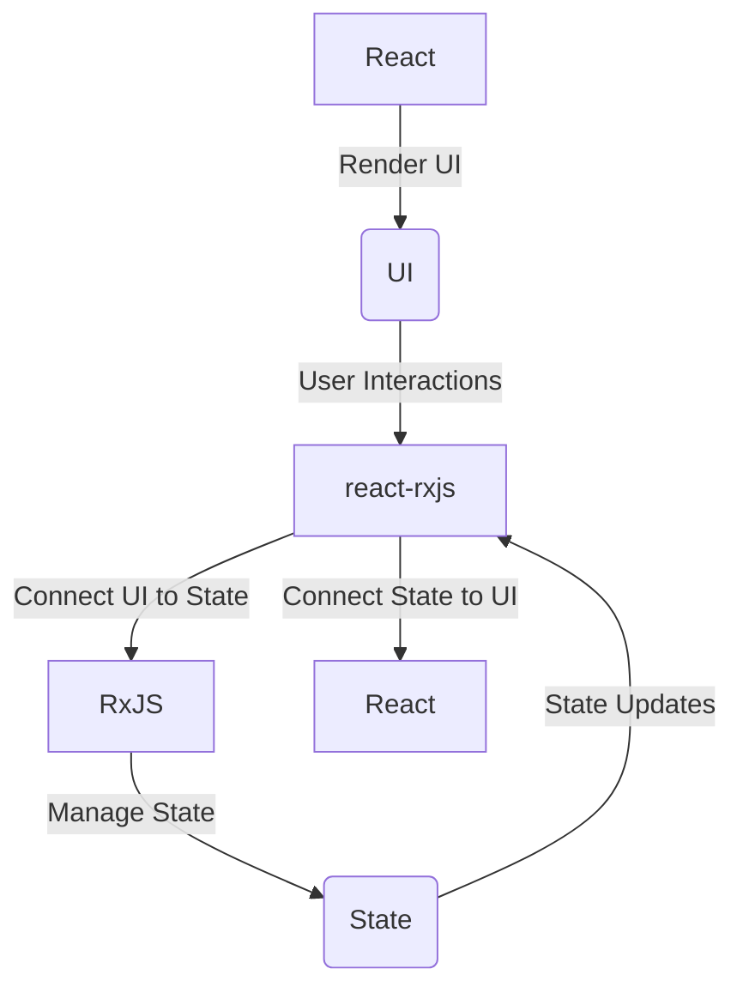

# Thinking in Streams

In a traditional React application, state is often managed using a combination of local component state (via the `useState` hook) and global application state (via context or a state management library like Redux). User interactions trigger event handlers, which update the state, and these state updates trigger re-renders of the UI.

When we introduce RxJS and react-rxjs into the mix, we start to think of state and events not as discrete values and actions, but as streams of data. **User interactions, state updates, even API calls - these can all be modeled as streams**.

In this model, React's responsibility is primarily rendering the UI based on the current state. It's not concerned with how that state is updated - that's where RxJS comes in.

**RxJS is responsible for managing the state of our application. It takes user interactions, API calls, and other events, and processes them to produce new state values. These state values are then passed to React to render the updated UI.**

react-rxjs acts as the bridge between React and RxJS. It provides utilities like `bind` and `createSignal` to connect our React components to our RxJS observables and subjects. It also provides the `Subscribe` component to subscribe to observables and update our components when new values are emitted.




In this diagram:

- React (A) is responsible for rendering the UI (B). It takes the current state of the application and renders the appropriate UI.
- RxJS (C) is responsible for managing the state (D) of the application. It handles user interactions and updates the state accordingly.
- react-rxjs (E) acts as a bridge between React and RxJS. It connects the state managed by RxJS to the UI rendered by React, and vice versa. It also handles user interactions from the UI and passes them to RxJS to update the state.

---

Let's see how this works in practice with a real-world example: a financial application that displays real-time and historical price data.

---

## Real-Time and Historical Price Data

In our application, we have two buttons: one for fetching real-time price data, and one for fetching historical price data. When the user clicks a button, we want to fetch the corresponding data and display it on the screen.

First, we'll create two signals using the `createSignal` function from react-rxjs. These signals will be triggered when the user clicks the corresponding button.

```jsx
const [fetchRealTimePrice$, onFetchRealTimePriceClick] = createSignal<void>();
const [fetchHistoricalPrice$, onFetchHistoricalPriceClick] = createSignal<void>();
```

Next, we'll create two observables that fetch the real-time and historical price data when the corresponding signal is triggered. We'll use the `switchMap` operator from RxJS to switch to a new observable each time a signal is triggered.

```jsx
const realTimePrice$ = fetchRealTimePrice$.pipe(
  switchMap(() => fetchRealTimePrice()),
  catchError((error) => {
    console.error(error);
    return of({ type: "real-time",

data: { price: "N/A" } });
  })
);

const historicalPrice$ = fetchHistoricalPrice$.pipe(
  switchMap(() => fetchHistoricalPrice()),
  catchError((error) => {
    console.error(error);
    return of({ type: "historical", data: { price: "N/A" } });
  })
);
```

We're using the `catchError` operator to handle any errors that occur during the fetch operation. If an error occurs, we return a default value.

Now, we'll use the `merge` operator from RxJS to combine these two observables into a single observable. This observable will emit a new value each time either the real-time price data or the historical price data is updated.

```jsx
const priceData$ = merge(
  realTimePrice$,
  historicalPrice$
);
```

Finally, we'll use the `bind` function from react-rxjs to connect this observable to our React component. **The `bind` function returns a hook that we can use in our component to subscribe to the observable and get the current value.**

```jsx
const [usePriceData] = bind(priceData$, { type: "real-time", data: { price: "N/A" } });

function PriceDisplay() {
  const priceData = usePriceData();
  return (
    <div>
      <button onClick={onFetchRealTimePriceClick}>Fetch Real-Time Price</button>
      <button onClick={onFetchHistoricalPriceClick}>Fetch Historical Price</button>
      <p>Price: {priceData.data.price}</p>
      <p>Type: {priceData.type}</p>
    </div>
  );
}
```

In our component, we now have two buttons: one for fetching real-time price data, and one for fetching historical price data. Clicking either button triggers the corresponding signal, which in turn updates the `priceData$` Observable and the component.

## Conclusion

Remember, the key is to keep your React components as dumb as possible, and let RxJS handle the heavy lifting of state management. This separation of concerns makes your code easier to understand, test, and maintain.
