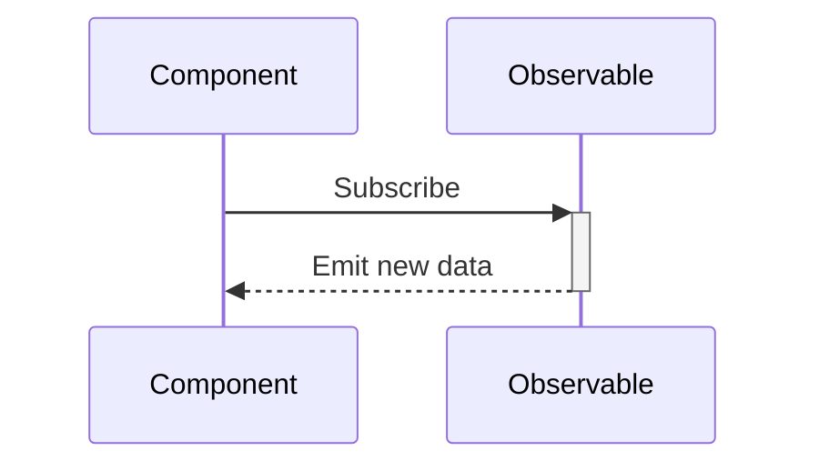
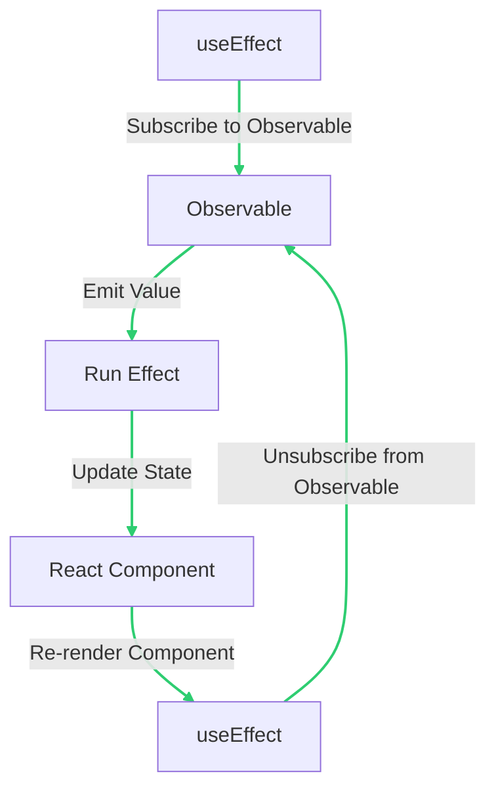
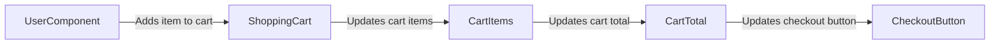

# Connecting RxJS to React Components: An In-Depth Guide

## Connecting Observables with React Hooks

React hooks are functions that let you "hook into" React state and lifecycle features from function components. They're a great way to use stateful logic and side effects in your components. In this document, we will explore how to connect RxJS Observables with React hooks.

## `useEffect` Hook

The `useEffect` hook is a built-in React hook that allows you to add side effects to function components. It is a powerful tool for managing side effects and can be used in a variety of scenarios.

### Basic Example

Let's say we have a stream of weather data that we want to display in a component. Here's how we might use `useEffect` with an Observable to make it more explanatory:

```jsx
import { useState, useEffect } from 'react';
import { from } from 'rxjs';

const weatherData$ = from(fetch('/api/weather').then(response => response.json()));

function WeatherComponent() {
  // We declare a state variable called "weather" and a function called "setWeather"
  // to update this state variable.
  const [weather, setWeather] = useState(null);

  // We use the useEffect hook to subscribe to the "weatherData$" Observable
  // when the component mounts. The "setWeather" function is called every time
  // a new value is emitted from the Observable.
  useEffect(() => {
    const subscription = weatherData$.subscribe(setWeather);
    return () => subscription.unsubscribe();
  }, []);

  // We return a div with the weather data if the weather is not null, and
  // a "Loading..." div otherwise.
  return weather ? <div>{`Temperature: ${weather.temperature}°C`}</div> : <div>Loading...</div>;
}

```

In this example, we're using the `useEffect` hook to subscribe to our Observable `weatherData$` when the component mounts. The `setWeather` function is called every time a new value is emitted from the Observable. When the component unmounts, we unsubscribe from the Observable to prevent memory leaks.

##### Here's a technical diagram using mermaid.js to illustrate how the data flows in this example:



### Gotchas and Potential Pitfalls

When using `useEffect` with RxJS Observables, there are a few things to keep in mind:

- **Memory Leaks**: It's important to unsubscribe from the Observable when the component unmounts to prevent memory leaks. You can do this by returning a function from the `useEffect` hook that calls `unsubscribe` on the subscription.

- **Overhead of Memoization**: Memoizing the Observable using `useMemo` or `useCallback` can improve performance by avoiding unnecessary re-renders. However, memoization does have a cost in terms of memory and CPU usage, so be sure to use it judiciously.

- **Stale Data Issues**: If the component unmounts and remounts quickly, it's possible that it will receive stale data from the Observable. To avoid this, you can use the `switchMap` operator to cancel the previous subscription when a new one is created.

### Advanced Example

In a real-world scenario, we often come across situations where we need to handle multiple streams of data and combine them to display in a single component. This can be achieved using RxJS's `combineLatest` function and the `useEffect` hook in React.

Let's consider an example where we want to display a list of comments for a particular post and have the ability to add comments to that post. We can create two Observables: one for fetching comments and another for adding comments.

```jsx
import { useState, useEffect } from 'react';
import { from, combineLatest } from 'rxjs';
import { switchMap } from 'rxjs/operators';

const postId = '123';

const comments$ = from(fetch(`/api/post/${postId}/comments`).then(response => response.json()));
const addComment$ = new Subject();

function PostCommentsComponent() {
  const [comments, setComments] = useState([]);

  useEffect(() => {
    const subscription = combineLatest([comments$, addComment$])
      .pipe(
        switchMap(([comments]) => {
          // Concatenate the new comment to the existing comments array
          const updatedComments = [...comments, newComment];
          return of(updatedComments);
        })
      )
      .subscribe(setComments);

    return () => subscription.unsubscribe();
  }, []);

  const handleAddComment = (comment) => {
    // Emit the new comment to the "addComment$" Observable
    addComment$.next(comment);
  };

  return (
    <div>
      <h1>Comments</h1>
      <ul>
        {comments.map(comment => (
          <li key={comment.id}>{comment.text}</li>
        ))}
      </ul>
      <AddCommentForm onAddComment={handleAddComment} />
    </div>
  );
}

function AddCommentForm({ onAddComment }) {
  const [commentText, setCommentText] = useState('');

  const handleSubmit = (event) => {
    event.preventDefault();
    onAddComment({ postId, text: commentText });
    setCommentText('');
  };

  return (
    <form onSubmit={handleSubmit}>
      <label htmlFor="comment">Add Comment:</label>
      <input id="comment" type="text" value={commentText} onChange={(e) => setCommentText(e.target.value)} />
      <button type="submit">Submit</button>
    </form>
  );
}
```

In this example, we first create two Observables: `comments$` and `addComment$`. The `comments$` Observable fetches comments for a particular post, while the `addComment$` Observable is used to add new comments to that post.

We use the `useEffect` hook to subscribe to the `comments$` and `addComment$` Observables when the component mounts. When a new comment is added, we use the `switchMap` operator to concatenate the new comment to the existing comments array and update the component state using the `setComments` function.

We also create a form component `AddCommentForm` that accepts a callback function `onAddComment` that is called when the form is submitted. The `onAddComment` function emits the new comment to the `addComment$` Observable.

It's worth noting that `useEffect` can be used in three ways: with no dependency array, with an empty dependency array, and with an array of dependencies. When used with no dependency array, the effect runs every time the component renders. When used with an empty dependency array, the effect runs only once when the component mounts. When used with an array of dependencies, the effect runs when any of the dependencies change.

##### For a visual representation of the flow of data when using `useEffect` with an Observable, refer to this diagram:



It's important to note that using `useEffect` with Observables can lead to potential issues such as stale data and memory leaks. To avoid these issues, it's recommended to unsubscribe from the Observables when the component unmounts, as shown in the example above. Additionally, it's best to use memoization techniques such as `useMemo` and `useCallback` to prevent unnecessary re-renders of the component.

---

## Creating Global State with RxJS and Functional React

RxJS provides a simple yet powerful way to manage global state in a React application. By creating an Observable that represents the state and using React hooks to connect this Observable to your components, you can create a custom hook that allows you to retrieve and update the global state.

To create a global state Observable, you can use the `BehaviorSubject` class from RxJS, which keeps track of the last emitted value. Here's an example:

```jsx
import { BehaviorSubject } from 'rxjs';

const initialState = { user: null };
const state$ = new BehaviorSubject(initialState);

function login(user) {
  state$.next({ ...state$.value, user });
}

function logout() {
  state$.next({ ...state$.value, user: null });
}
```

Next, create a custom hook that retrieves and subscribes to the global state Observable:

```jsx
import { useState, useEffect } from 'react';

function useGlobalState() {
  const [state, setState] = useState(state$.value);

  useEffect(() => {
    const subscription = state$.subscribe(setState);
    return () => subscription.unsubscribe();
  }, []);

  return state;
}
```

Finally, use the custom hook in your components to retrieve and update the global state:

```jsx
function UserComponent() {
  const { user } = useGlobalState();

  return (
    <div>
      {user ? (
        <>
          <h1>Welcome, {user.name}!</h1>
          <button onClick={logout}>Logout</button>
        </>
      ) : (
        <button onClick={() => login({ name: 'John Doe' })}>Login</button>
      )}
    </div>
  );
}
```

An example of how to use `useGlobalState` in a real-world scenario could be to manage the state of a shopping cart in an e-commerce application. By creating an Observable that represents the shopping cart, and using `useGlobalState` to connect this Observable to your components, you can easily retrieve and update the items in the cart without having to pass the state down through multiple levels of the component hierarchy.

##### To illustrate this, here's a technical diagram using Mermaid.js:



One potential gotcha when using `useMemo` and `useEffect` with RxJS is that if you're not careful, you can create an infinite loop of re-renders. To avoid this, make sure that any dependencies you pass to `useMemo` and `useEffect` are memoized themselves using `useMemo`. Additionally, be mindful of when you subscribe and unsubscribe from Observables, as subscribing too often can lead to performance issues.

Finally, here's a more complex example of using `useEffect` with RxJS:

```jsx
function UserComponent() {
  const [user, setUser] = useState(null);

  useEffect(() => {
    const subscription = Rx.Observable.fromEvent(document, 'click')
      .pipe(
        Rx.operators.flatMap(() => fetch('/api/user')),
        Rx.operators.map(response => response.json())
      )
      .subscribe(setUser);

    return () => subscription.unsubscribe();
  }, []);

  return (
    <div>
      {user ? (
        <h1>Welcome, {user.name}!</h1>
      ) : (
        <p>Loading...</p>
      )}
    </div>
  );
}
```

In this example, we're using RxJS to make an API call to fetch the current user when the user clicks anywhere on the page. We then update the local state using `useState` and render the user's name if it's available, or a loading message if it's not. This illustrates the three ways `useEffect` can be used: to perform side effects when the component mounts, to clean up side effects when the component unmounts, and to respond to changes in dependencies.

---


---
##### For further reading, we recommend the following resources for learning more about connecting vanilla RxJS with functional React components:

1. "Managing State in React with RxJS" by Andrei Kashcha (2021) - This article explains how to use RxJS to manage state in a React application, including how to create and subscribe to observables, handle concurrency and cancellation, and use RxJS with Redux. <https://blog.usejournal.com/managing-state-in-react-with-rxjs-5eabcf487b4d>

2. "RxJS Observables and React" by Ben Lesh (2019) - This video tutorial provides an introduction to RxJS observables and their use in React applications, including how to create observables, subscribe to them, and handle concurrency and cancellation. <https://www.youtube.com/watch?v=Jd_nWpKqlz0>

3. "Using RxJS with React" by Jack Hsu (2019) - In this article, the author explains how to use RxJS with React to create functional, reactive components, including how to create and subscribe to observables, handle concurrency and cancellation, and use RxJS with Redux. <https://medium.com/@jhsware/using-rxjs-with-react-e6c8c9f4c129>

4. "RxJS with React: An Introduction" byJecelyn Yeen (2019) - This article provides a beginner-friendly introduction to using RxJS with React, including how to create observables, subscribe to them, and handle errors. The author also covers how to use RxJS with React hooks and provides examples of common use cases. <https://blog.bitsrc.io/rxjs-with-react-an-introduction-6f8d2d5efb5a>

5. "React + RxJS: Getting Started" by Ryan Chenkie (2019) - In this video tutorial, the author provides a step-by-step guide for getting started with RxJS and React, including how to install and import RxJS, create observables, subscribe to them, and handle errors. The tutorial also covers how to use RxJS with React hooks. <https://www.youtube.com/watch?v=PhggNGsSQyg>

