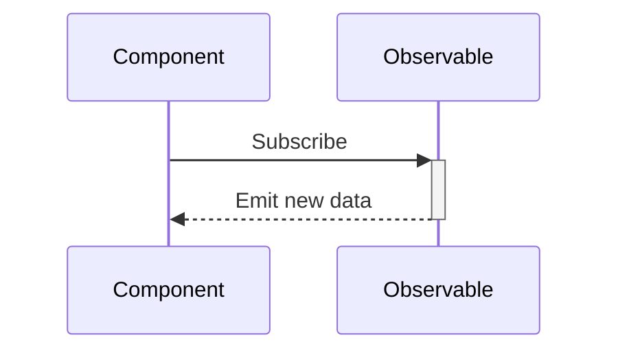
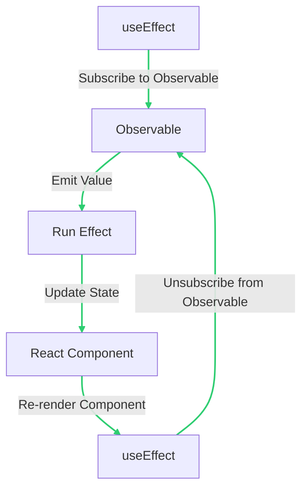
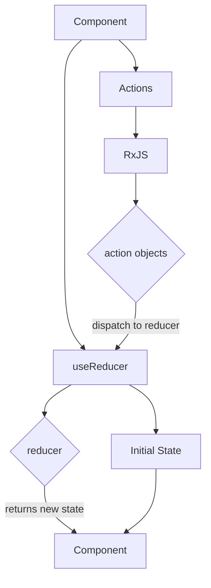
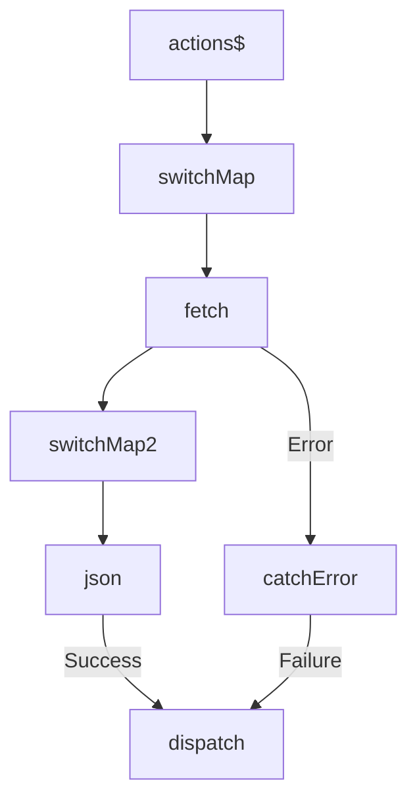
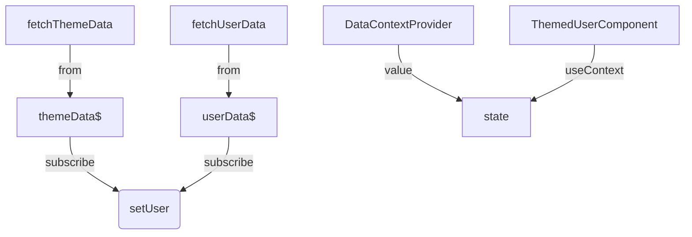
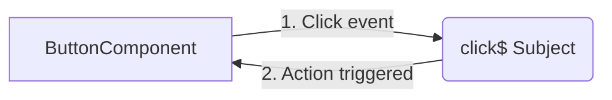
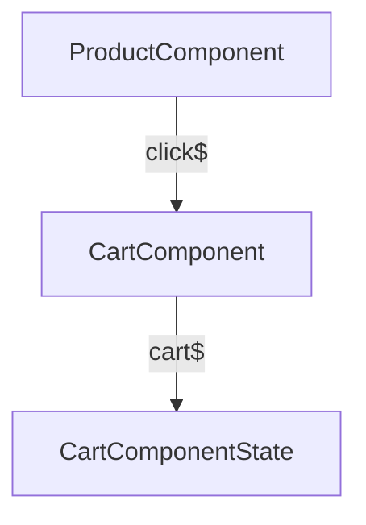

# Connecting RxJS to React Components: An In-Depth Guide

> 💡 There will be times where you want more control over how the connection and cleanup of observables in React components are handled compared to using `react-rxjs`, and when that time arrives, this will be your guide.

## Connecting Observables with React Hooks

React hooks are functions that let you "hook into" React state and lifecycle features from function components. They're a great way to use stateful logic and side effects in your components. In this document, we will explore how to connect RxJS Observables with React hooks.

## Table of Contents

- [useEffect Hook](#useeffect-hook)
- [useReducer Hook](#usereducer-hook)
- [useContext Hook](#usecontext-hook)
- [useCallback Hook](#usecallback-hook)
- [useMemo Hook](#usememo-hook)

---

## `useEffect` Hook

The `useEffect` hook is a built-in React hook that allows you to add side effects to function components. It is a powerful tool for managing side effects and can be used in a variety of scenarios.

### Basic Example

Let's say we have a stream of weather data that we want to display in a component. Here's how we might use `useEffect` with an Observable to make it more explanatory:

```jsx
import { useState, useEffect } from 'react';
import { from } from 'rxjs';

const weatherData$ = from(fetch('/api/weather').then(response => response.json()));

function WeatherComponent() {
  // We declare a state variable called "weather" and a function called "setWeather"
  // to update this state variable.
  const [weather, setWeather] = useState(null);

  // We use the useEffect hook to subscribe to the "weatherData$" Observable
  // when the component mounts. The "setWeather" function is called every time
  // a new value is emitted from the Observable.
  useEffect(() => {
    const subscription = weatherData$.subscribe(setWeather);
    return () => subscription.unsubscribe();
  }, []);

  // We return a div with the weather data if the weather is not null, and
  // a "Loading..." div otherwise.
  return weather ? <div>{`Temperature: ${weather.temperature}°C`}</div> : <div>Loading...</div>;
}
```

In this example, we're using the `useEffect` hook to subscribe to our Observable `weatherData$` when the component mounts. The `setWeather` function is called every time a new value is emitted from the Observable. When the component unmounts, we unsubscribe from the Observable to prevent memory leaks.

Here's a diagram to illustrate how the data flows in this example:



### Advanced Example

In a real-world scenario, we often come across situations where we need to handle multiple streams of data and combine them to display in a single component. This can be achieved using RxJS's `combineLatest` function and the `useEffect` hook in React.

Let's consider an example where we want to display a list of comments for a particular post and have the ability to add comments to that post. We can create two Observables: one for fetching comments and another for adding comments.

```jsx
import { useState, useEffect } from 'react';
import { from, combineLatest } from 'rxjs';
import { switchMap } from 'rxjs/operators';

const postId = '123';

const comments$ = from(fetch(`/api/post/${postId}/comments`).then(response => response.json()));
const addComment$ = new Subject();

function PostCommentsComponent() {
  const [comments, setComments] = useState([]);

  useEffect(() => {
    const subscription = combineLatest([comments$, addComment$])
      .pipe(
        switchMap(([comments]) => {
          // Concatenate the new comment to the existing comments array
          const updatedComments = [...comments, newComment];
          return of(updatedComments);
        })
      )
      .subscribe(setComments);

    return () => subscription.unsubscribe();
  }, []);

  const handleAddComment = (comment) => {
    // Emit the new comment to the "addComment$" Observable
    addComment$.next(comment);
  };

  return (
    <div>
      <h1>Comments</h1>
      <ul>
        {comments.map(comment => (
          <li key={comment.id}>{comment.text}</li>
        ))}
      </ul>
      <AddCommentForm onAddComment={handleAddComment} />
    </div>
  );
}

function AddCommentForm({ onAddComment }) {
  const [commentText, setCommentText] = useState('');

  const handleSubmit = (event) => {
    event.preventDefault();
    onAddComment({ postId, text: commentText });
    setCommentText('');
  };

  return (
    <form onSubmit={handleSubmit}>
      <label htmlFor="comment">Add Comment:</label>
      <input id="comment" type="text" value={commentText} onChange={(e) => setCommentText(e.target.value)} />
      <button type="submit">Submit</button>
    </form>
  );
}
```

In this example, we first create two Observables: `comments$` and `addComment$`. The `comments$` Observable fetches comments for a particular post, while the `addComment$` Observable is used to add new comments to that post.

We use the `useEffect` hook to subscribe to the `comments$` and `addComment$` Observables when the component mounts. When a new comment is added, we use the `switchMap` operator to concatenate the new comment to the existing comments array and update the component state using the `setComments` function.

We also create a form component `AddCommentForm` that accepts a callback function `onAddComment` that is called when the form is submitted. The `onAddComment` function emits the new comment to the `addComment$` Observable.

It's worth noting that `useEffect` can be used in three ways: with no dependency array, with an empty dependency array, and with an array of dependencies. When used with no dependency array, the effect runs every time the component renders. When used with an empty dependency array, the effect runs only once when the component mounts. When used with an array of dependencies, the effect runs when any of the dependencies change.



It's important to note that using `useEffect` with Observables can lead to potential issues such as stale data and memory leaks. To avoid these issues, it's recommended to unsubscribe from the Observables when the component unmounts, as shown in the example above. Additionally, it's best to use memoization techniques such as `useMemo` and `useCallback` to prevent unnecessary re-renders of the component.

### Gotchas and Potential Pitfalls

When using `useEffect` with RxJS Observables, there are a few things to keep in mind:

- **Memory Leaks**: It's important to unsubscribe from the Observable when the component unmounts to prevent memory leaks. You can do this by returning a function from the `useEffect` hook that calls `unsubscribe` on the subscription.
- **Overhead of Memoization**: Memoizing the Observable using `useMemo` or `useCallback` can improve performance by avoiding unnecessary re-renders. However, memoization does have a cost in terms of memory and CPU usage, so be sure to use it judiciously.
- **Stale Data Issues**: If the component unmounts and remounts quickly, it's possible that it will receive stale data from the Observable. To avoid this, you can use the `switchMap` operator to cancel the previous subscription when a new one is created.

---

## `useReducer` Hook

The `useReducer` hook is a powerful alternative to the `useState` hook for managing complex state logic in React. It is especially useful when dealing with state transitions that involve multiple sub-values, or when the next state depends on the previous one.

The `useReducer` hook accepts two arguments: a **reducer function** and an **initial state**. The reducer function takes in the current state and an action, and returns the new state after applying the action.

Here's an example of how we might use `useReducer` with RxJS to manage the state of a document editor:

```jsx
import { useReducer, useEffect } from 'react';
import { fromEvent } from 'rxjs';
import { map, filter } from 'rxjs/operators';

// Define the initial state of the document editor
const initialState = {
  title: 'Untitled Document',
  content: '',
};

// Define the reducer function that handles state transitions
function documentReducer(state, action) {
  switch (action.type) {
    case 'SET_TITLE':
      return { ...state, title: action.payload };
    case 'SET_CONTENT':
      return { ...state, content: action.payload };
    default:
      return state;
  }
}

function DocumentEditor() {
  // Use the useReducer hook to manage the state of the document editor
  const [document, dispatch] = useReducer(documentReducer, initialState);

  // Use RxJS to handle user input events for the document editor
  useEffect(() => {
    const titleInput = document.querySelector('#title-input');
    const contentInput = document.querySelector('#content-input');

    const title$ = fromEvent(titleInput, 'input').pipe(
      map(event => ({ type: 'SET_TITLE', payload: event.target.value }))
    );
    const content$ = fromEvent(contentInput, 'input').pipe(
      map(event => ({ type: 'SET_CONTENT', payload: event.target.value }))
    );

    const subscription = title$.merge(content$).subscribe(dispatch);
    return () => subscription.unsubscribe();
  }, []);

  return (
    <div>
      <input id="title-input" type="text" value={document.title} />
      <textarea id="content-input" value={document.content} />
    </div>
  );
}
```

In this example, we're using `useReducer` to manage the state of a document editor. The initial state is defined as an object with a `title` and `content` property. The `documentReducer` function handles state transitions by returning a new state object based on the current state and the action passed in.

We then use RxJS to handle user input events for the document editor. We create two observables for the title and content input fields, and use the `map` operator to transform the input events into action objects that can be dispatched to the reducer. We then merge the two observables and subscribe to the resulting stream, calling `dispatch` on each action.

Finally, we render the document editor as a simple form with an input field for the title and a textarea for the content.



In this diagram, the component calls the `useReducer` hook with a reducer function and an initial state. The reducer function takes in the current state and an action object, and returns the new state based on the action. The component also subscribes to a stream of actions using RxJS, transform them into action objects and dispatches them to the reducer. The new state is then returned to the component and used to update the UI.

### Advanced Example

In a more advanced scenario, we might want to perform some asynchronous operations in response to an action. We can use the `switchMap` operator from RxJS to achieve this.

```jsx
import { useReducer, useEffect } from 'react';
import { from, of } from 'rxjs';
import { switchMap, catchError } from 'rxjs/operators';

const actions$ = from([
  { type: 'FETCH_USER', payload: '1' },
  { type: 'FETCH_USER', payload: '2' },
]);

function userReducer(state, action) {
  switch (action.type) {
    case 'FETCH_USER_SUCCESS':
      return { ...state, [action.payload.id]: action.payload };
    case 'FETCH_USER_FAILURE':
      return { ...state, error: action.payload };
    default:
      return state;
  }
}

function UserComponent() {
  const [users, dispatch] = useReducer(userReducer, {});

  useEffect(() => {
    const subscription = actions$
      .pipe(
        switchMap(action =>
          from(fetch(`/api/users/${action.payload}`)).pipe(
            switchMap(response => response.json()),
            catchError(error => of({ type: 'FETCH_USER_FAILURE', payload: error }))
          )
        )
      )
      .subscribe(user => dispatch({ type: 'FETCH_USER_SUCCESS', payload: user }));

    return () => subscription.unsubscribe();
  }, []);

  return (
    <div>
      {Object.values(users).map(user => (
        <div key={user.id}>{user.name}</div>
      ))}
    </div>
  );
}
```

In this example, we're using `useReducer` to manage a map of users. We then subscribe to a stream of actions in the `useEffect` hook, fetching a user for each `FETCH_USER` action and dispatching a `FETCH_USER_SUCCESS` or `FETCH_USER_FAILURE` action depending on the result of the fetch request.

Here's a diagram to illustrate the flow of data in this example:



The `actions$` stream emits actions that are transformed by the `switchMap` operator into fetch requests. The response is then transformed to JSON by another `switchMap` operator. If the fetch request succeeds, a `FETCH_USER_SUCCESS` action is dispatched to the reducer. If the fetch request fails, a `FETCH_USER_FAILURE` action is dispatched instead.

### Potential Pitfalls and Gotchas

When using `useReducer` with RxJS, it's important to keep in mind that the reducer function should always return a new object. Returning the same object reference can cause issues with React's component update cycle.

Another thing to keep in mind is that RxJS operators that return observables, such as `switchMap`, should always be used inside the `pipe` function. This ensures that the operator is applied to the stream correctly.

Finally, it's important to handle errors properly when using RxJS. In the example above, we use the `catchError` operator to catch any errors that occur during the fetch request and dispatch a `FETCH_USER_FAILURE` action to the reducer. This ensures that the state is updated correctly even if an error occurs.

Here's a diagram to illustrate the flow of data in these examples:

https://showme.redstarplugin.com/s/b0YXVonm

---

## `useContext` Hook

The `useContext` hook is a built-in React hook that allows you to access the value of a context without wrapping your component in a `Context.Consumer` . This can be particularly useful when working with RxJS if you want to provide an Observable to multiple components.

### Basic Example

Let's say we have a stream of theme data that we want to provide to multiple components. Here's how we might use `useContext` with an Observable:

```jsx
import { createContext, useContext, useEffect, useState } from 'react';
import { from } from 'rxjs';

const themeData$ = from(fetch('/api/theme').then(response => response.json()));

const ThemeContext = createContext();

function ThemeProvider({ children }) {
  const [theme, setTheme] = useState('light');

  useEffect(() => {
    const subscription = themeData$.subscribe(setTheme);
    return () => subscription.unsubscribe();
  }, []);

  return <ThemeContext.Provider value={theme}>{children}</ThemeContext.Provider>;
}

function ThemedComponent() {
  const theme = useContext(ThemeContext);

  return <div className={`theme-${theme}`}>This component is themed!</div>;
}
```

In this example, we're using `useContext` to access the current theme from a `ThemeContext`. We then apply this theme as a class to the `div` element.

Managing state in React applications can be challenging, especially when dealing with complex scenarios that require multiple streams of data. In such cases, `useReducer` and RxJS can be used together to create reactive applications that respond to changes in data in real-time.

Consider the example below, where we want to provide multiple streams of data to our components using a single `DataContext`. We can achieve this by providing an object that contains multiple Observables:

```jsx
import { createContext, useContext, useEffect, useReducer } from 'react';
import { from } from 'rxjs';
import { catchError, map } from 'rxjs/operators';

const themeData$ = from(fetch('/api/theme').then(response => response.json()));
const userData$ = from(fetch('/api/user').then(response => response.json()));

const initialState = { theme: 'light', user: null };

function reducer(state, action) {
  switch (action.type) {
    case 'setTheme':
      return { ...state, theme: action.payload };
    case 'setUser':
      return { ...state, user: action.payload };
    default:
      return state;
  }
}

const DataContext = createContext();

function DataProvider({ children }) {
  const [state, dispatch] = useReducer(reducer, initialState);

  useEffect(() => {
    const subscription = themeData$.subscribe(theme => dispatch({ type: 'setTheme', payload: theme }));
    return () => subscription.unsubscribe();
  }, []);

  useEffect(() => {
    const subscription = userData$.subscribe(user => dispatch({ type: 'setUser', payload: user }));
    return () => subscription.unsubscribe();
  }, []);

  return <DataContext.Provider value={state}>{children}</DataContext.Provider>;
}

function ThemedUserComponent() {
  const { theme, user } = useContext(DataContext);

  return (
    <div className={`theme-${theme}`}>
      {user ? `Welcome, ${user.name}!` : 'Loading...'}
    </div>
  );
}
```

In this example, we're using `useReducer` to manage the state of our `DataContext`. We define an `initialState` object and a `reducer` function that handles the state changes based on the action type and payload.

We then use `useEffect` to subscribe to our `themeData$` and `userData$` Observables, and update the state using the `dispatch` function provided by `useReducer`. Finally, we provide the state to our components using the `DataContext.Provider` and access it using `useContext`.

To ensure that our code is in line with the latest coding conventions for functional React and RxJS, we use the `useReducer` hook instead of `useState` to manage the state of our `DataContext`. We also use RxJS operators inside the `pipe` function, such as `catchError` and `map`, to handle errors properly and transform the data before it's subscribed to.



In this diagram, the `fetchThemeData` and `fetchUserData` functions fetch the theme and user data from our API endpoints, respectively. These functions return Promises that are then converted to Observables using the `from` function.

The `themeData$` and `userData$` Observables then emit the data to the `dispatch` function, which updates the state of our `DataContext` using the `setTheme` and `setUser` actions.

Finally, the `state` object is provided to our components using the `DataContext.Provider` and accessed using `useContext` in our `ThemedUserComponent`.

By using `useReducer` and RxJS together, we can create powerful and reactive React applications that can handle complex scenarios with ease.

### Gotchas and Potential Pitfalls

When using `useContext` with functional React and RxJS, there are a few potential pitfalls to keep in mind.

Firstly, it's important to remember that `useContext` is designed to be used with the `Context` API in React, which can be a bit tricky to use with RxJS. One common issue is that observables can emit multiple values, which can cause components to re-render more often than anticipated. This can be mitigated by using the `distinctUntilChanged` operator on the observable to ensure that only unique values are emitted.

Another potential pitfall is that `useContext` can cause a component to re-render even if the relevant state hasn't changed. This can be particularly problematic when using RxJS, which can emit values even when the state hasn't changed. To avoid this, you can use the `useMemo` hook to memoize any values that are derived from the context.

Finally, it's important to be careful when using `useContext` with RxJS subscriptions. In many cases, it's best to use the `useEffect` hook to subscribe to the observable and then unsubscribe when the component unmounts. This can help prevent memory leaks and ensure that the component is properly cleaned up.

Overall, while `useContext` can be a powerful tool for working with RxJS in functional React, it's important to be aware of these potential pitfalls and take steps to avoid them in your code.

---

## `useCallback` Hook

In functional React, the `useCallback` hook is used to return a memoized version of a callback function that only changes if one of its dependencies has changed. This is particularly useful when passing callbacks to optimized child components that rely on reference equality to prevent unnecessary renders.

### Basic Example

Let's say we have a real-world scenario where we have a `ButtonComponent` that triggers an action when clicked. Here's how we might use `useCallback` with RxJS:

```jsx
import { useCallback } from 'react';
import { Subject } from 'rxjs';

const click$ = new Subject();

function ButtonComponent() {
  const handleClick = useCallback(() => {
    click$.next();
  }, []);

  return <button onClick={handleClick}>Click me!</button>;
}
```

In this example, we're using `useCallback` to create a memoized click handler that triggers an action on the `click$` Subject. This ensures that the click handler's reference doesn't change between renders, preventing unnecessary re-renders of the `ButtonComponent`.



In this diagram, the `ButtonComponent` triggers a click event, which in turn triggers an action on the `click$` Subject. The action is then received by the `ButtonComponent`, causing it to re-render.

By using `useCallback` to memoize the click handler, we ensure that the reference to the handler function doesn't change between renders, preventing unnecessary re-renders of the `ButtonComponent`. This results in improved performance and a better user experience.

### Advanced Example

React is a popular JavaScript library for building user interfaces, and RxJS is a library for reactive programming using Observables. One common use case is to use `useCallback` with RxJS to prevent unnecessary re-renders of a component that uses Observables.

In a more advanced scenario, we might want to pass some data to the action when the button is clicked. We can do this by using `useCallback` with a parameter:

```jsx
import { useCallback } from 'react';
import { Subject } from 'rxjs';

const click$ = new Subject();

function ButtonComponent({ id }) {
  const handleClick = useCallback(() => {
    click$.next(id);
  }, [id]);

  return <button onClick={handleClick}>Click me!</button>;
}
```

In this example, we're passing the `id` prop to the `click$` Subject each time the button is clicked. We include `id` in the dependencies array to ensure that the click handler is updated whenever `id` changes.

To illustrate this scenario, consider a real-world example of an e-commerce website where a user can add products to their cart. In this case, we can use `useCallback` to prevent unnecessary re-renders of the cart component.

```jsx
import { useCallback, useEffect, useState } from 'react';
import { Subject } from 'rxjs';

const cart$ = new Subject();

function ProductComponent({ id, name, price }) {
  const handleClick = useCallback(() => {
    cart$.next({ id, name, price });
  }, [id, name, price]);

  return (
    <div>
      <h3>{name}</h3>
      <p>{price}</p>
      <button onClick={handleClick}>Add to cart</button>
    </div>
  );
}

function CartComponent() {
  const [cart, setCart] = useState([]);

  useEffect(() => {
    const subscription = cart$.subscribe((item) => {
      setCart((prevCart) => [...prevCart, item]);
    });
    return () => subscription.unsubscribe();
  }, []);

  return (
    <div>
      <h2>Cart</h2>
      {cart.map((item) => (
        <div key={item.id}>
          <p>{item.name}</p>
          <p>{item.price}</p>
        </div>
      ))}
    </div>
  );
}
```

In this example, we have a `ProductComponent` that renders a product with a button to add it to the cart. When the button is clicked, we use `useCallback` to pass the `id`, `name`, and `price` props to the `cart$` Subject. Then, we have a `CartComponent` that subscribes to the `cart$` Subject and updates the cart state whenever a new item is added.



In this diagram, we can see that the `ProductComponent` triggers a click event that is received by the `click$` Subject. The `CartComponent` subscribes to the `cart$` Subject and updates the `CartComponentState` whenever a new item is added. This flow of data is optimized using `useCallback` to prevent unnecessary re-renders of the `CartComponent`.

### Gotchas and Potential Pitfalls

When using `useCallback` with RxJS in React, there are a few things to keep in mind:

- Be careful not to overuse `useCallback`, as it can lead to unnecessary complexity and performance issues. Only use it for computationally expensive operations or when passing functions as props to child components.
- When using `useCallback` with synchronous operations, be mindful of the overhead and consider alternative solutions like web workers or splitting the computation into smaller chunks.
- Remember to return an observable from `useMemo` and use `useEffect` to subscribe to it and update the state.
- Always include all dependencies in the dependencies array of `useCallback` or you may run into stale data issues.

---

## `useMemo` Hook

`useMemo` is a React hook that optimizes performance by memoizing the return value of a function, which is only re-computed when its dependencies change. This can be especially helpful when working with computationally expensive operations like those found in RxJS. With the `useMemo` hook, you can define a computed value that will be recalculated only when a dependency changes.

### Basic Example

Here's an example of how to use `useMemo` with RxJS to transform data before displaying it:

```jsx
import { useMemo, useEffect, useState } from 'react';
import { from } from 'rxjs';
import { map } from 'rxjs/operators';

const data$ = from(fetch('/api/data').then(response => response.json()));

function DataComponent() {
  const [data, setData] = useState([]);

  const transformedData = useMemo(() => data.map(item => item * 2), [data]);

  useEffect(() => {
    const subscription = data$.subscribe(setData);
    return () => subscription.unsubscribe();
  }, []);

  return (
    <ul>
      {transformedData.map((item, index) => (
        <li key={index}>{item}</li>
      ))}
    </ul>
  );
}
```

In this example, we're using `useMemo` to transform the data by doubling each item. This transformation is only performed when the `data` state changes.

`useMemo` is different from `useCallback` in that `useMemo` memoizes a computed value, while `useCallback` memoizes a function. `useMemo` is useful when you have a computationally expensive operation that you don't want to perform on every render, while `useCallback` is useful when you want to memoize a function to prevent unnecessary re-renders.

### Advanced Example

In a more complex scenario, we might want to perform multiple transformations on the data. We can do this by chaining multiple `useMemo` calls.

Consider the following example:

```jsx
import { useMemo, useEffect, useState } from 'react';
import { from } from 'rxjs';
import { map, filter } from 'rxjs/operators';

const data$ = from(fetch('/api/data').then(response => response.json()));

function DataComponent() {
  const [data, setData] = useState([]);

  const transformedData = useMemo(() => {
    return data$.pipe(
      map(data => data.map(item => item * 2)),
      map(data => data.filter(item => item > 10))
    );
  }, [data$]);

  useEffect(() => {
    const subscription = transformedData.subscribe(data => setData(data));
    return () => subscription.unsubscribe();
  }, [transformedData]);

  return (
    <ul>
      {data.map((item, index) => (
        <li key={index}>{item}</li>
      ))}
    </ul>
  );
}
```

In this example, we're first doubling each item in the data, and then filtering out any items that are less than or equal to 10. Each transformation is only performed when its dependencies change.

### Gotchas and Potential Pitfalls

When using `useMemo` with RxJS, it's important to remember that the memoized value should be a stream, not the data itself. This means that you should return an observable from `useMemo`, and use `useEffect` to subscribe to it and update the state.

Additionally, be careful when using `useMemo` with synchronous operations. If the computation is cheap, it may not be worth the overhead of memoization. On the other hand, if the computation is expensive, you may want to consider using a web worker or splitting the computation into smaller chunks to avoid blocking the main thread.

Here's a diagram to illustrate the flow of data in these examples:

https://showme.redstarplugin.com/s/JQbY7w1e

By the end of this section, you should have a solid understanding of how to use `useReducer`, `useContext`, `useCallback`, and `useMemo` with RxJS. These hooks can be powerful tools when combined with RxJS, allowing you to create highly reactive and efficient components.

---

### For further reading, check out the following resources:

1. "RxJS + React Hooks: A Simple Tutorial": This tutorial covers the basics of RxJS and how to integrate it with React Hooks, with code examples and step-by-step instructions.https://www.robinwieruch.de/rxjs-react-hooks-tutorial/
2. "RxJS and React Hooks": This article provides an overview of what RxJS is and how to integrate it with React applications using React Hooks for state management, with a demo chat application as an example. https://blog.logrocket.com/rxjs-and-react-hooks/
3. "React + RxJS: Using Observables to Handle State": This video tutorial covers how to use RxJS Observables to manage state in a React application, with code examples and explanations. https://www.youtube.com/watch?v=rdK92pf3abs
4. "React Hooks and RxJS": This article explores how to use RxJS with React Hooks to manage state, with examples of using useReducer, useContext, useCallback, and useMemo. https://www.smashingmagazine.com/2021/09/react-hooks-rxjs/
5. "RxJS and React: A Comprehensive Guide": This comprehensive guide covers everything you need to know about using RxJS with React, including basic concepts, advanced techniques, and best practices, with code examples and explanations.https://www.robinwieruch.de/rxjs-react-comprehensive-guide/
6. "Managing State in React with RxJS" by Andrei Kashcha (2021) - This article explains how to use RxJS to manage state in a React application, including how to create and subscribe to observables, handle concurrency and cancellation, and use RxJS with Redux. https://blog.usejournal.com/managing-state-in-react-with-rxjs-5eabcf487b4d
7. "RxJS Observables and React" by Ben Lesh (2019) - This video tutorial provides an introduction to RxJS observables and their use in React applications, including how to create observables, subscribe to them, and handle concurrency and cancellation. https://www.youtube.com/watch?v=Jd_nWpKqlz0
8. "Using RxJS with React" by Jack Hsu (2019) - In this article, the author explains how to use RxJS with React to create functional, reactive components, including how to create and subscribe to observables, handle concurrency and cancellation, and use RxJS with Redux. https://medium.com/@jhsware/using-rxjs-with-react-e6c8c9f4c129
9. "RxJS with React: An Introduction" byJecelyn Yeen (2019) - This article provides a beginner-friendly introduction to using RxJS with React, including how to create observables, subscribe to them, and handle errors. The author also covers how to use RxJS with React hooks and provides examples of common use cases. https://blog.bitsrc.io/rxjs-with-react-an-introduction-6f8d2d5efb5a
10. "React + RxJS: Getting Started" by Ryan Chenkie (2019) - In this video tutorial, the author provides a step-by-step guide for getting started with RxJS and React, including how to install and import RxJS, create observables, subscribe to them, and handle errors. The tutorial also covers how to use RxJS with React hooks. https://www.youtube.com/watch?v=PhggNGsSQyg
