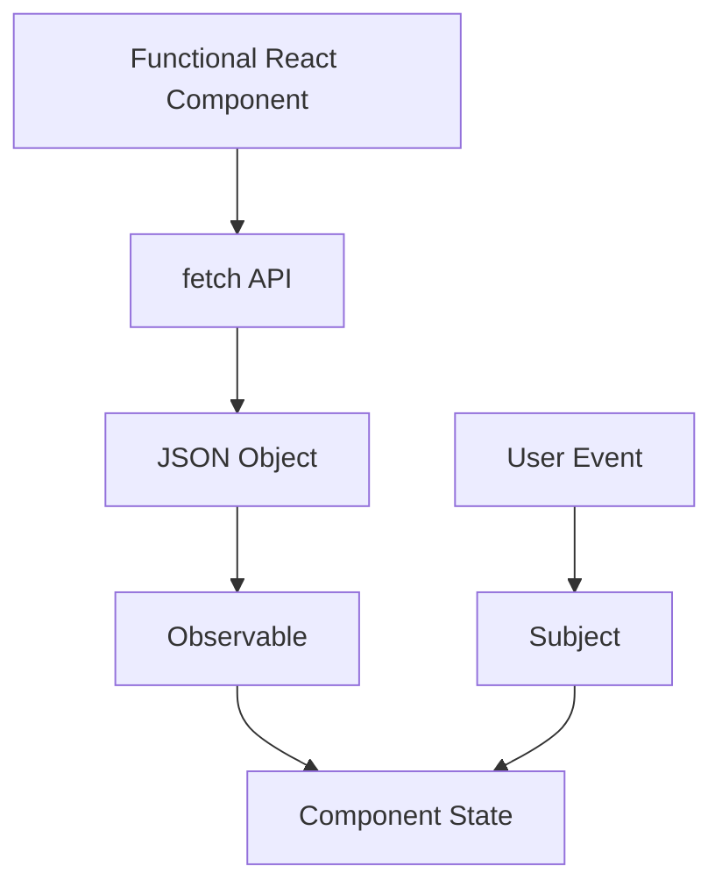

# Subjects & Observables in React

## Using Subjects and Observables in React Applications

In a functional React application, Observables and Subjects are powerful tools for managing state and handling user events. Observables represent a stream of values that occur over time and can be subscribed to by an Observer. Observables are useful for representing events such as API requests, user input events, timers, and more. Subjects are a special type of Observable that can multicast to multiple Observers and are not lazy, meaning they start emitting values as soon as they are created. **Subjects are great for representing shared state, user actions, event buses, and more**.

---

### Using Observables

To use an Observable in a functional React component, you can subscribe to it using the `useEffect` hook. When the component mounts, we can subscribe to the Observable and update the component state with the emitted values. Here's an example that uses an Observable to fetch data from an API:

```jsx
import React, { useState, useEffect } from 'react';
import { from } from 'rxjs';
import { map } from 'rxjs/operators';

const API_URL = 'https://jsonplaceholder.typicode.com/posts';

const PostList = () => {
  const [posts, setPosts] = useState([]);

  useEffect(() => {
    const observable = from(fetch(API_URL).then(response => response.json())).pipe(
      map(data => data)
    );
    const subscription = observable.subscribe({
      next: data => setPosts(data),
      error: error => console.log(error)
  });

    return () => subscription.unsubscribe();
  }, []);

  return (
    <ul>
      {posts.map(post => (
        <li key={post.id}>{post.title}</li>
      ))}
    </ul>
  );
};

export default PostList;
```

In this example, we're using the `from` function to create an Observable from the API call. We're then using the `map` operator to transform the response into the data we want. We're subscribing to the Observable in the `useEffect` hook and setting the component state to the emitted values. Finally, we're returning a function that unsubscribes from the Observable when the component unmounts.

---

### Using Subjects

To use a Subject in a functional React component, we can create a Subject instance and use its `next` method to emit values. Here's an example that uses a Subject to handle user events:

```jsx
import React, { useState } from 'react';
import { Subject } from 'rxjs';

const UserForm = () => {
  const [username, setUsername] = useState('');
  const [password, setPassword] = useState('');

  const submitSubject = new Subject();

  const handleSubmit = event => {
    event.preventDefault();
    submitSubject.next({ username, password });
  };

  submitSubject.subscribe(value => console.log(value));

  return (
    <form onSubmit={handleSubmit}>
      <input
        type="text"
        value={username}
        onChange={event => setUsername(event.target.value)}
      />
      <input
        type="password"
        value={password}
        onChange={event => setPassword(event.target.value)}
      />
      <button type="submit">Submit</button>
    </form>
  );
};

export default UserForm;
```

In this example, we're creating a Subject instance called `submitSubject`. When the form is submitted, we're calling the `next` method on the `submitSubject` instance with an object containing the username and password values. We're also subscribing to the `submitSubject` instance and logging the emitted values to the console.

---

### Four Types of Subjects & Their Use Cases

RxJS provides several types of Subjects, each with their own specific uses. Let's go over the most common types and how you might use them in a functional React application:

1. **Subject:** This is the base type for other subject types. It doesn't have an initial value or a current value. When data is produced, it multicasts to multiple observers.

    *Use Cases:* A plain Subject can be useful when you simply need to multicast an Observable to multiple Observers, and there is no requirement to get the current value. This might be used, for example, when you're dealing with discrete events such as user clicks or form submissions.


```jsx
import { Subject } from 'rxjs';
import { bind } from '@react-rxjs/core';

const productAddedToCart$ = new Subject();
const useProductAddedToCart = bind(productAddedToCart$);

// In your Product component:
const Product = ({ product }) => {
  const [_, pushToCart] = useProductAddedToCart();
  // ...
  // when the product is added to the cart
  pushToCart(product);
};

```

1. **BehaviorSubject:** This is a variant of Subject that has a current value. It stores the latest value emitted to its consumers, and whenever a new Observer subscribes, it will immediately receive the "current value" from the BehaviorSubject.

    *Use Cases:* A BehaviorSubject is typically used when you want to share a value that changes over time and components need to get the latest value as soon as they subscribe. It can be used to model things like the current time, the current user, a theme setting, or other pieces of state that need to be shared and observed throughout a React application.


```jsx
import { BehaviorSubject } from 'rxjs';
import { bind } from '@react-rxjs/core';

const initialUserData = null;
const user$ = new BehaviorSubject(initialUserData);
const useUser = bind(user$);

// In your User component:
const User = () => {
  const [userData] = useUser();
  // ... use userData
};
// When the user data updates:
user$.next(newUserData);

```

1. **ReplaySubject:** Similar to BehaviorSubject, ReplaySubject can send old values to new subscribers, but it can also record a part or all of the Observable execution.

    *Use Cases:* A ReplaySubject is used when you need to cache or buffer multiple values and you want new subscribers to receive those cached values. This can be useful for scenarios like message history in a chat application, where a new subscriber (like a newly opened chat window) should receive a history of previous messages.


```jsx
import { ReplaySubject } from 'rxjs';
import { bind } from '@react-rxjs/core';

const messages$ = new ReplaySubject(5); // Buffer size of 5
const useMessages = bind(messages$);

// In your Chat component:
const Chat = () => {
  const [messages] = useMessages();
  // ... display messages
};
// When a new message is received:
messages$.next(newMessage);

```

1. **AsyncSubject:** This variant of Subject only emits the last value (and only the last value) emitted by the source Observable, and only after that source Observable completes.

    *Use Cases:* An AsyncSubject can be useful when you only care about the final value and you want to ensure that this final value is propagated to all observers. A common use case for AsyncSubject is when you're making a network request and you want to share the result of this request among multiple parts of your application.


```jsx
import { AsyncSubject } from 'rxjs';
import { bind } from '@react-rxjs/core';

const data$ = new AsyncSubject();
const useData = bind(data$);

// In your Component:
const Component = () => {
  const [data] = useData();
  // ... use data
};
// When data is fetched:
data$.next(fetchedData);
data$.complete();  // Only now will the fetchedData be emitted

```

---

### Using both Observables and Subjects

In a functional React component, we can use both Observables and Subjects to fetch data from an API and handle user events. Here's an example that demonstrates how to use both:

```jsx
import React, { useState, useEffect, ChangeEvent, FormEvent } from 'react';
import { ajax } from 'rxjs/ajax';
import { Subject, Subscription } from 'rxjs';
import { switchMap, map } from 'rxjs/operators';

const API_URL = 'https://jsonplaceholder.typicode.com/posts';

interface Post {
  id: number;
  title: string;
}

const PostList: React.FC = () => {
  const [posts, setPosts] = useState<Post[]>([]);
  const [title, setTitle] = useState<string>('');

  const createPostSubject = new Subject<{ title: string }>();

  useEffect(() => {
    const subscription: Subscription = createPostSubject
      .pipe(
        switchMap(() => ajax.getJSON<Post[]>(API_URL)),
        map((data) => data)
      )
      .subscribe({
        next: (data) => {
          console.log({ data });
          setPosts(data);
        },
        error: (e) => console.error(e),
      });

    return () => subscription.unsubscribe();
  }, [posts]);

  const handleSubmit = (event: FormEvent): void => {
    event.preventDefault();
    console.log('here');
    createPostSubject.next({ title });
    setTitle('');
  };

  return (
    <>
      <form onSubmit={handleSubmit}>
        <input
          type="text"
          value={title}
          onChange={(event: ChangeEvent<HTMLInputElement>) =>
            setTitle(event.target.value)
          }
        />
        <button type="submit" onSubmit={handleSubmit}>
          Create Post
        </button>
      </form>
      <ul>
        {posts.map((post: Post) => (
          <li key={post.id}>{post.title}</li>
        ))}
      </ul>
    </>
  );
};

export default PostList;

```

In this example, we're using the `fetch` function to make an HTTP request to the API and returning the response data as a JSON object. We're then using an Observable to convert the JSON data into an observable stream and subscribing to it in the `useEffect` hook. When the observable emits data, we're setting the component state to the emitted values.

We're also using a Subject to handle user events. When the form is submitted, we're calling the `next` method on the `createPostSubject` instance with an object containing the post title value. We're also subscribing to the `createPostSubject` instance and logging the emitted values to the console.



This diagram shows that the component uses the `fetch` function to get data from the API, which returns a JSON object. The JSON object is then converted to an Observable, and the observable emits data to update the component state. The component also handles user events using a Subject, which emits data to update the component state.

---

### Real-World Use Cases

Here are some real-world use cases for using Subjects vs Observables in functional React components with RxJS:

| Use Case | Observable | Subject |
| --- | --- | --- |
| Fetching data from an API | ✅ | ❌ |
| Handling user events | ❌ | ✅ |
| Sharing data between components | ✅ | ✅ |
| Implementing a Redux-like store | ❌ | ✅ |

---

### Potential Pitfalls and Gotchas

Here are some potential pitfalls and gotchas to keep in mind when using Observables and Subjects in functional React components with RxJS:

- Be sure to unsubscribe from Observables when the component unmounts to avoid memory leaks.
- Be careful when using Subjects to share state between components. It can be easy to introduce bugs if you're not careful.
- Remember that Subjects are not lazy and will start emitting values as soon as they are created. Be sure this behavior is what you want before using a Subject.
- Avoid using Observables to handle user events. It can be difficult to manage the lifecycle of an Observable in this context and can lead to memory leaks. Use a Subject instead.
****
