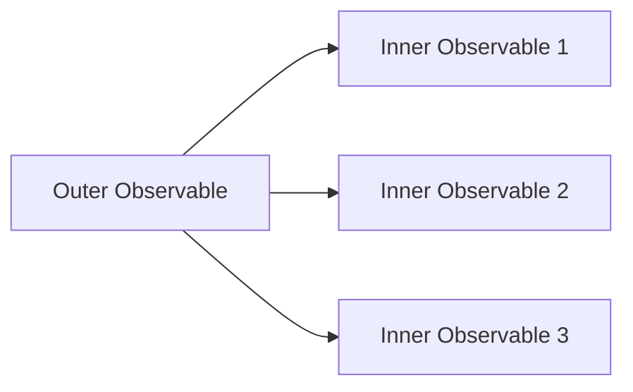
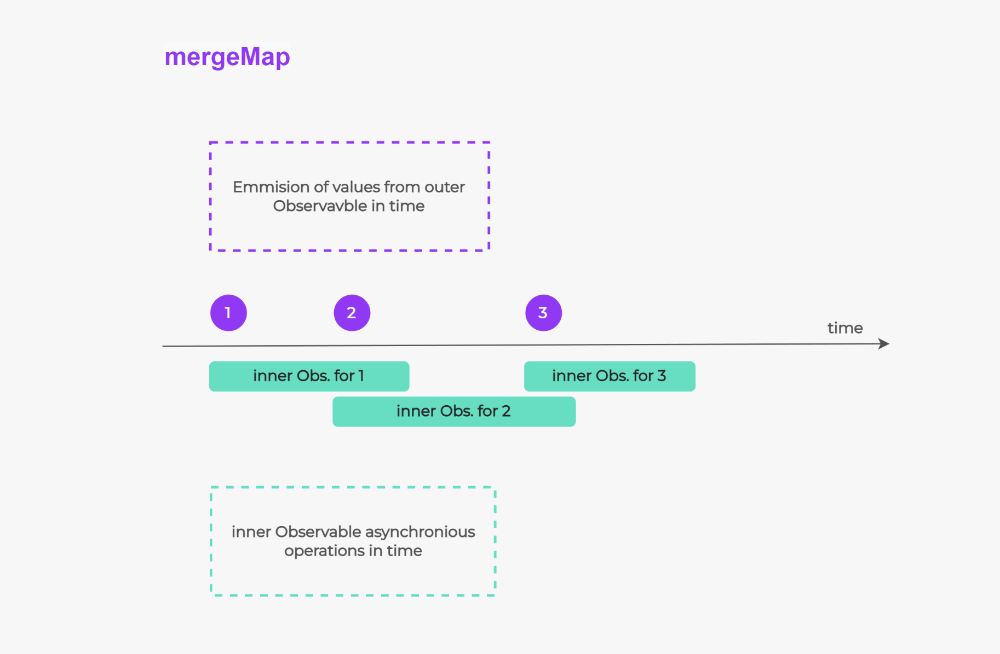
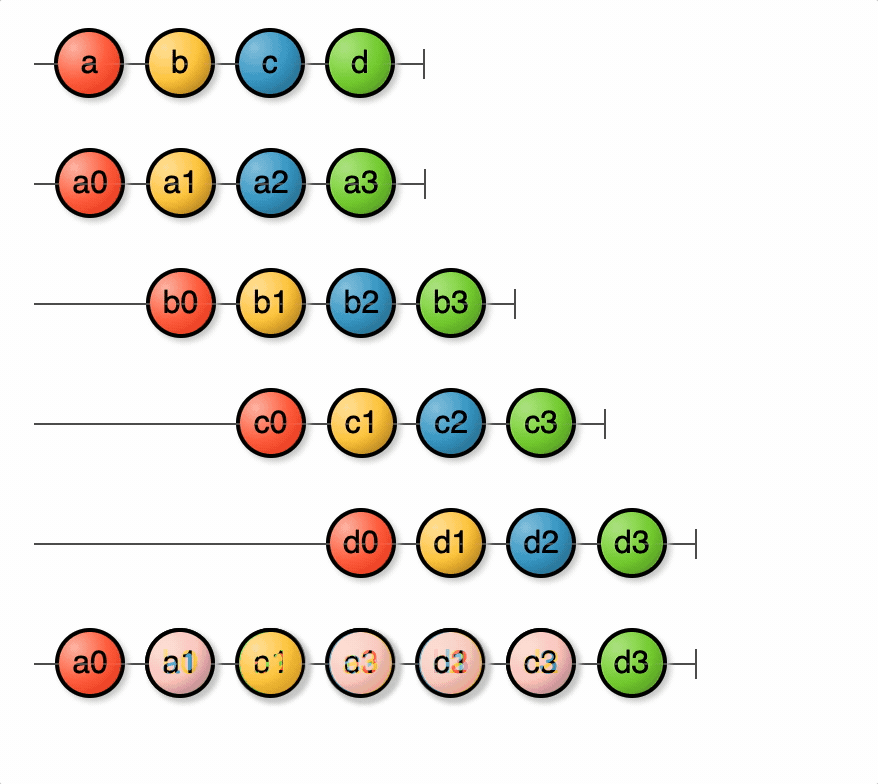
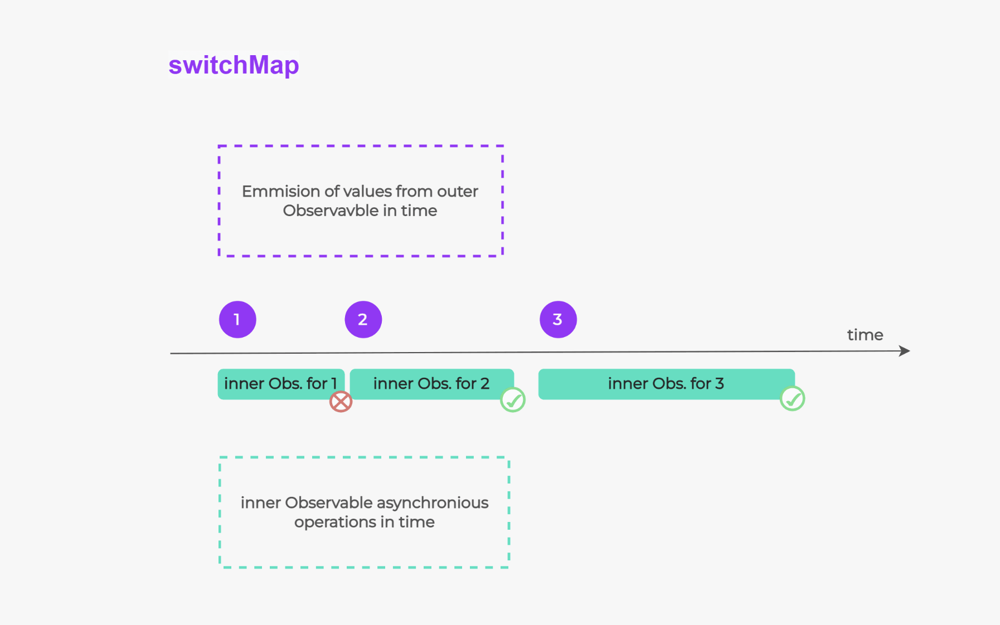
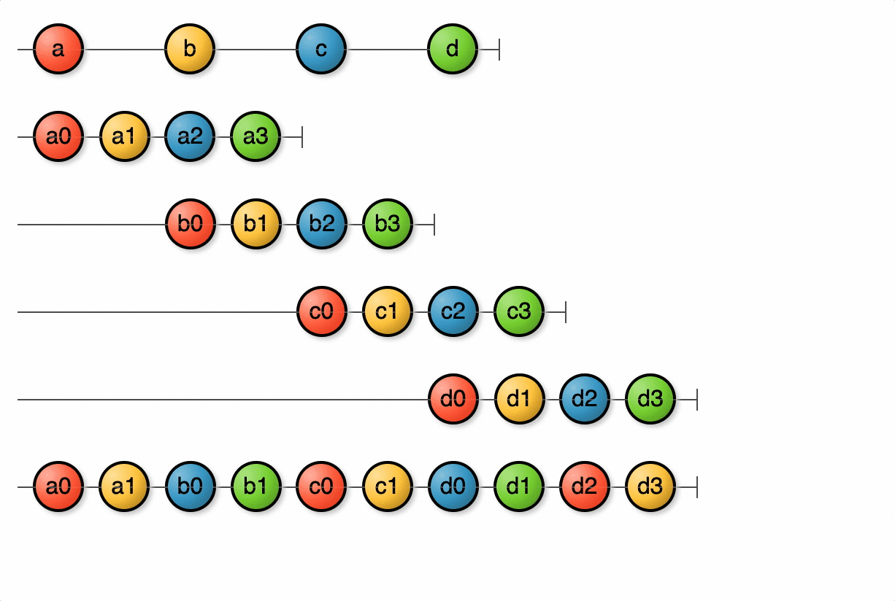
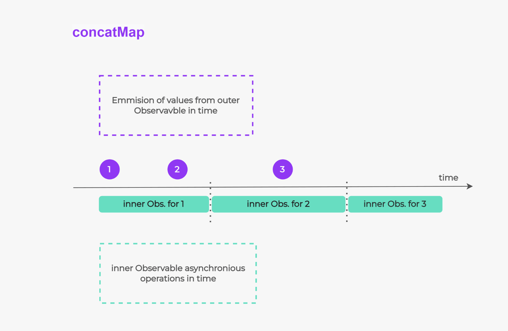
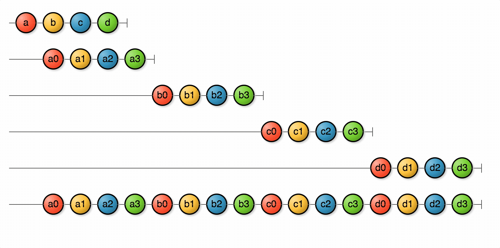

# Higher-Order Observables with React-RxJS

Higher-order observables are a powerful concept in RxJS that allow you to manage multiple active inner observables at the same time. They are observables that emit other observables. In this tutorial, we'll explore how to use higher-order observables in a React application using the `mergeMap`, `switchMap`, and `concatMap` operators from RxJS, with TypeScript for type safety.

| Operator | Scenario | Best Practice | Example |
| --- | --- | --- | --- |
| mergeMap | Handling concurrent HTTP requests | Use when order does not matter and tasks may overlap. | Autocomplete search results, fetching multiple resources in parallel. |
| switchMap | Cancelling pending HTTP requests | Use when you want to discard previous tasks in favor of new ones. | Canceling a slow-loading resource in favor of a faster one. |
| concatMap | Ensuring order of HTTP requests | Use when order is important and tasks should not overlap. | A sequential process, such as a tutorial or a survey. |

## Introduction to Higher-Order Observables

Before we dive into the specific operators, let's understand what higher-order observables are. In RxJS, an Observable is a stream of values over time. A higher-order Observable, then, is an Observable that emits other Observables.



**This concept becomes useful when you have complex asynchronous tasks that depend on each othe**r. For example, you might have a stream of user input events, and for each input event, you want to make an HTTP request. The HTTP requests themselves are asynchronous and can be represented as Observables, so you end up with an Observable that emits Observables.

## Using `mergeMap`, `switchMap`, and `concatMap`

The `mergeMap`, `switchMap`, and `concatMap` operators are used to handle these higher-order Observables. They all subscribe to the outer Observable and then subscribe to each inner Observable as it is emitted. However, they differ in how they manage these inner subscriptions.

Let's see how we can use these operators in a React application with react-rxjs and TypeScript.

## Setup

First, make sure you have the necessary packages installed:

```bash
npm install rxjs @react-rxjs/core @react-rxjs/utils

```

## Example: Search Autocomplete

Let's consider a search autocomplete feature. As the user types in a search box, we want to make an API request to fetch the autocomplete suggestions.

### Creating the Search Input Stream

We'll start by creating a stream of search input events. We'll use the `createSignal` function from react-rxjs to create a signal, which is an entry point for our stream.

```tsx
import { createSignal } from "@react-rxjs/utils";

const [onSearchChange$, onSearchChange] = createSignal<string>();

```

In our React component, we can now call `onSearchChange` whenever the search input changes:

```tsx
function SearchBox() {
  const handleSearchChange = (event: React.ChangeEvent<HTMLInputElement>) => {
    onSearchChange(event.target.value);
  };

  return <input type="search" onChange={handleSearchChange} />;
}

```

### Using [mergeMap](https://rxjs.dev/api/operators/mergeMap)






The `mergeMap` operator **subscribes to each inner Observable as it is emitted, without unsubscribing from the previous ones**. This means that all requests will be made and their **results will be emitted as they arrive, possibly out of order**.

```tsx
import { mergeMap } from "rxjs/operators";
import { bind } from "@react-rxjs/core";

const searchResults$ = onSearchChange$.pipe(
  mergeMap((query) => fetchSearchResults(query))
);

const [useSearchResults] = bind(searchResults$);

```

In our component, we can now use the `useSearchResults` hook to get the search results:

```tsx
function SearchResults() {
  const searchResults = useSearchResults();

  return (
    <ul>
      {searchResults.map((result) => (
        <li key={result.id}>{result.title}</li>
      ))}
    </ul>
  );
}

```

### Using [switchMap](https://rxjs.dev/api/index/function/switchMap)







The `switchMap` operator also **subscribes to each inner Observable as it is emitted, but it unsubscribes from the previous one as soon as a new one is emitted**. This means that if a new search query is entered before the previous request has completed, the previous request will be cancelled. This is often the desired behavior for search autocompletes, as we're only interested in the results of the latest query.

```tsx
import { switchMap } from "rxjs/operators";

const searchResults$ = onSearchChange$.pipe(
  switchMap((query) => fetchSearchResults(query))
);

const [useSearchResults] = bind(searchResults$);

```

The usage in the component remains the same.

### Using [concatMap](https://rxjs.dev/api/operators/concatMap)






The `concatMap` operator subscribes to each inner Observable in order, waiting for each one to complete before subscribing to the next. This means that if a new search query is entered before the previous request has completed, the new request will be delayed until the previous one completes. This ensures that the results are always emitted in the correct order, but it can lead to a backlog of requests if the user types quickly.

```tsx
import { concatMap } from "rxjs/operators";

const searchResults$ = onSearchChange$.pipe(
  concatMap((query) => fetchSearchResults(query))
);

const [useSearchResults] = bind(searchResults$);

```

Again, the usage in the component remains the same.

## Conclusion

In this tutorial, we've seen how to use the `mergeMap`, `switchMap`, and `concatMap` operators from RxJS to handle higher-order Observables in a React application using react-rxjs and TypeScript. These operators provide powerful ways to manage complex asynchronous tasks that depend on each other.

Remember:

- Use `mergeMap` when you want to start all tasks immediately and handle results as they arrive, possibly out of order.
- Use `switchMap` when you want to start a new task immediately and cancel the previous one.
- Use `concatMap` when you want to ensure tasks are completed in order, waiting for each task to complete before starting the next.

Choose the operator that best fits your specific use case.

---

## Further Reading & Interactive Visuals
- [Flattening map Operators in RxJS](https://hello-js.com/articles/flattening-map-operators-rxjs/)
- [mergeMap Interactive Diagram](https://rxmarbles.com/#mergeMap)
- [switchMap Interactive Diagram](https://rxmarbles.com/#switchMap)
- [concatMap Interactive Diagram](https://rxmarbles.com/#concatMap)