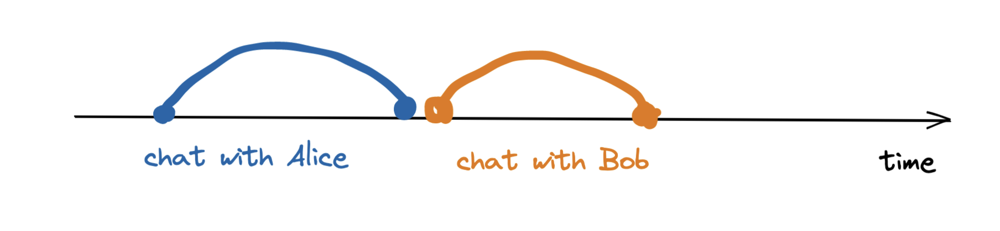
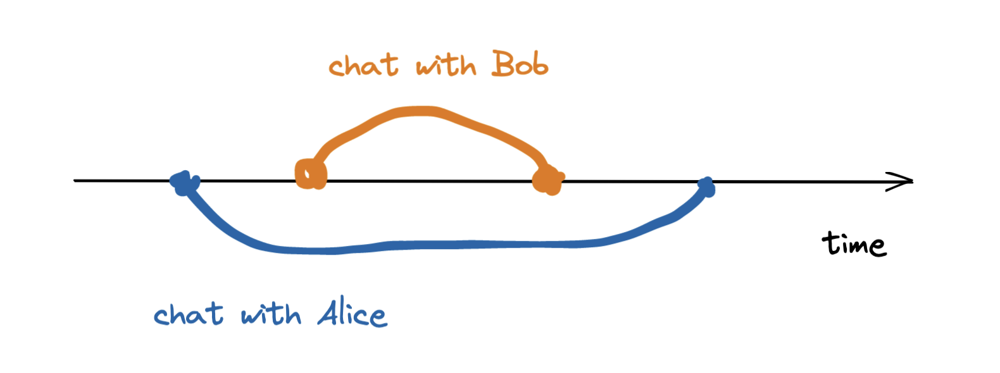

# Week 4 Day 1: React Concurrent Features and Suspense

## Understanding concurrent rendering in React and its benefits

To understand concurrency, let’s use [this example](https://github.com/reactwg/react-18/discussions/46#discussioncomment-846786) by Dan Abramov.

Let’s say that we need to call two people – Alice and Bob. In a non-concurrent setting, we can only have one call at a time. We would first call Alice, end the call, and then call Bob. If we are still on the phone with Alice, and Bob calls, we have to finish the call before we can talk to Bob.



In a concurrent setting, we could call Alice and, once we were put on hold, we could then call Bob.

This doesn’t mean that we are talking to two people at the same time. It just means that we can have two or more concurrent calls at the same time and decide which call is more important.



With React 16.6+ developers have access to "Concurrent Features", these features leverage a low level behind the scenes technology called concurrent rendering. Concurrent rendering allows React to work on multiple tasks simultaneously, improving the performance and responsiveness of applications. In traditional rendering, React performs a full render of the component tree in one pass, which can block the main thread and result in a less responsive user interface. Concurrent rendering, on the other hand, introduces a new reconciliation algorithm called "Fiber Reconciler" that enables React to pause, interrupt, and resume rendering work as needed to provide a more fluid user experience.

To take advantage of concurrency in React all you have to do is make sure you are using React 18+ and use the new root API which enables the new concurrent renderer.

```jsx
// Before
import { render } from 'react-dom'
const container = document.getElementById('app')
render(<App tab="home" />, container)

// After
import { createRoot } from 'react-dom/client'
const container = document.getElementById('app')
const root = createRoot(container) // createRoot(container!) if you use TypeScript
root.render(<App tab="home" />)
```

The benefits with concurrency in React:

- Improves the application’s performance: This is the primary benefit as it breaks the component into smaller, prioritized chunks, rendered efficiently according to importance, resulting in faster user interface response and rendering.
- Boosts user experience: The rendering of component trees based on importance, especially when dealing with large and complex component trees, results in better user experiences.
- Predictable rendering: Concurrent Mode can also improve rendering predictability, especially when dealing with real-time data updates.
- Enables new features such as Suspense, Streaming Server Rendering, and Transitions.

<hr>

## Working with Suspense for data fetching

One major feature that leverages Reacts concurrent rendering ability is [Suspense](https://react.dev/reference/react/Suspense). Suspense is a first-party React component that helps with handling async operations by letting you wait for some code to load and declaratively specify a loading UI while waiting. Any time a child component performs some action resulting in a loading state, a wrapping `<Suspense>` component can toggle its rendering to show a loading UI.

It's important to keep in mind that an "action resulting in a loading state" could be anything involving a `Promise`. It might be a network request. It might be a time-consuming mathematical computation. `<Suspense>` doesn’t care, as long as it’s contained within a `Promise`.

Rendering a loading UI in our applications is not something new, below is an example of one way we can conditionally render an `<Albums>` component that needs to await a data fetch.

```jsx
const [albums, isLoading] = fetchData('/albums')

if (isLoading) {
  return <Spinner />
}

return <Albums data={albums} />
```

In this example whe can see we are using the `isLoading` variable to track the status of the data request and returning a component based on that variable. While this is valid and will provide the app user the expected behavior, this approach is imperative and as the application grows these patterns can get complex and hard to follow.

Instead we can use Suspense to get the same result.

```jsx
const albums = fetchData('/albums')

return (
  <Suspense fallback={<Spinner />}>
    <Albums data={albums} />
  </Suspense>
)
```

By using Suspense, we no longer need the `isLoading` state variable with logic to render `<Spinner />` based on that value, it’s now being managed by React. With Suspense, we are now rendering a fallback component declaratively.

Another important change is that React now knows that a network call is happening and it delays (or suspends) rendering it until the network call is done.

**How does React know that a network call was made and is pending?**

Suspense is only used to render a fallback component, but in no place in the code above do we communicate to React that we are making a network request. That part is being take care of by `fetchData()`. Let's dig into how `fetchData()` is able to tell React that there is a pending network call so that it can handle the loading UI with Suspense.

First we will create the `fetchData()` function that we could export to other components.

In the `fetchData()` function, we initialize a new variable, `promise`, and set its value to a fetch request Promise. When this request is completed, we get the data from the response object using `res.json()` and then return `res.data`, which contains the data that we need.

Finally, we pass this `promise` to the `wrapPromise` function and return it.

```jsx
import wrapPromise from './wrapPromise'

export const fetchData = (url) => {
  const promise = fetch(url)
    .then((res) => res.json())
    .then((res) => res.data))

  return  wrapPromise(promise)
}
```

Now we are going to create a `wrapPromise` function that will communicate with Suspense. This function wraps a `Promise` and tells if the fetched data is completed or ready to be read.
This Promise argument is usually going to be a network request to retrieve some data from an API, but it could technically be any Promise object. The actual implementation is left for whoever is implementing it to figure out.

The wrapPromise function has the following requirements:

- It takes in a Promise as an argument.
- When the Promise is resolved, it returns the resolved value.
- When the Promise is rejected, it throws the rejected value.
- When the Promise is still pending, it throws back the Promise.
- It exposes a method to read the status of the Promise.

```jsx
export const wrapPromise = (promise) => {
  let status = 'pending'
  let response

  const suspender = promise.then(
    (res) => {
      status = 'success'
      response = res
    },
    (err) => {
      status = 'error'
      response = err
    }
  )
  const read = () => {
    switch (status) {
      case 'pending':
        throw suspender
      case 'error':
        throw response
      default:
        return response
    }
  }

  return { read }
}
```

We’re defining two variables: `status`, which tracks the status of the promise argument and `response`, which holds the result of the Promise (whether resolved or rejected)

`status` is initialized to “pending” by default, because that’s the default state of any new Promise. We then initialize a new variable, `suspender`, and set its value to the Promise and attach a `then` method to it.

Inside this `then` method, we have two callback functions: the first to handle the resolved value, and the second to handle the rejected value. If the Promise resolves successfully, we update the `status` variable to be “success” and set the `response` variable to the resolved value.

If the Promise rejects, we update the `status` variable to be “error” and set the `response` variable to the rejected value.

We also create a new function called `read`, and inside this function, we have a `switch` statement that checks the value of the `status` variable. If the `status` of the promise is “pending,” we throw the `suspender` variable we just defined. If it is “error,” we throw the `response` variable. And, finally, if it is anything other than the two (i.e., “success”), we return the `response`variable.

The reason we throw either the `suspender` variable or the error `response` variable is because we want to communicate back to Suspense that the Promise is not yet resolved.

We’re doing that by simulating an error in the component (using `throw`), which will get intercepted by the Suspense component. The Suspense component then looks at the thrown value to determine if it’s an actual error or if it’s a Promise.

If it is a Promise, the Suspense component will recognize that the component is still waiting for some data, and it will render the fallback. If it’s an error, it bubbles the error back up to the nearest Error Boundary until it is either caught or it crashes the application.

At the end of the `wrapPromise` function, we return an object containing the `read` function as a method, and this is what our React components will interact with to retrieve the value of the Promise.

**Now we can use `fetchData()` and `<Suspense>` in our application components:**

```jsx
import { Suspense } from 'react'
import { SpellList } from './components/SpellList'

const App = () => {
  return (
    <>
      <h1>List of Wizarding World Spells:</h1>
      <Suspense fallback={<h2>Fetching data...</h2>}>
        <SpellList />
      </Suspense>
    </>
  )
}

export default App
```

Here we create our `App.tsx` and import `Suspense` from the react library. We also import our `SpellList` component that will be using the `fetchData()` function. We make use of `<Suspense>` component by wrapping it around the `<SpellList>` component and passing a `fallback` prop. In this example we just pass `<h2>Fetching Data...</h2>` so that React will render a message while the data is not ready.

Now we can create the `<SpellList>` component.

```jsx
import { fetchData } from '../api/fetchData'

const resource = fetchdata('https://api.potterdb.com/v1/spells')

export const SpellList = () => {
  const spellData = resource.read()

  return (
    <ul>
      {spellData.map((spell) => {
        const spellAttributes = spell.attributes

        return (
          <p>
            {spellAttributes.name} ({spellAttributes.category}):
            {spellAttributes.effect}
          </p>
        )
      })}
    </ul>
  )
}
```

We start by importing `fetchData`, our function that we created earlier, and invoking it to make a network request to the [potterdb](https://potterdb.com/) API's spells endpoint that will provide us with a list of magic spells and their details. We will store the result of `fetchData()` in a variable called `resource`.

The `resource` variable is an object with reference to the network request Promise which we query by calling the `.read()` method. If the network request has not resolved when we call this method an exception will be thrown to `Suspense`. If the network request has resolved the data from the Promise will be returned.

We then can map through the data returned, stored in the `spellData` variable, and render our list of spells.

While there is a bit more required to set up the communication between the network call and Suspense, we are now able to declaratively define a loading state UI for React to render. We are also able to take advantage of the Render-as-you-fetch pattern, which will invoke fetching before rendering but does not have to wait for a response to start rending the UI. In this example we are manually writing the logic to communicate with Suspense, but there are libraries such as [Relay](https://relay.dev/docs/guided-tour/rendering/loading-states/#internaldocs-banner), [SWR](https://swr.vercel.app/docs/suspense), and [React-RxJS](https://react-rxjs.org/docs/api/core/suspense) that have this built in already.

<hr>

## Working with Suspense for lazy loading

We can also use Suspense for lazy loading components. Lazy loading is a design pattern that allows for loading parts of an application on-demand to reduce the initial load time. In situations where we know that certain code will not be accessible to all the users or the user does not access it frequently, it is best to load them when the user requests for it. This improves both the user experience and the application’s performance.

Lazy loading in React has been enabled in the past by using external libraries, but with introduction of `React.lazy()` in React 16.6 we now have it built in. `lazy()` allows developers to easily create components with dynamic imports and render them as normal components. The `lazy()` function accepts a function as an input parameter, and that function should return a promise after loading the component using `import()`. Finally, the returned promise from `lazy()` will give you a module with a default export containing the React component.

Let's say we want to add a `<SpellDisplay>` component to our Spell List app that will render a componet that gives the user more information on a spell when the user clicks on it. We do not need to render the `<SpellDisplay>` on the initial render of the application because need to wait for both list to finish rendering and the user to click on a spell in that list, so let's use `lazy()` to lazy load the `<SpellDisplay>` component.

```jsx
// Without lazy()
import SpellDisplay from './SpellDisplay '

// With lazy()
import { lazy } from 'react'
const SpellDisplay = lazy(() => import('./SpellDisplay '))

const App = () => {
  return (
    <>
      <div>
        <h1>List of Wizarding World Spells:</h1>
        <Suspense fallback={<h2>Fetching data...</h2>}>
          <SpellList />
        </Suspense>
      </div>
      <SpellDisplay />
    </>
  )
}

export default App
```

If we were trying to run our application with the above code, we will see an error. This is because when using lazy loading components are suspended until they are loaded and ready to be rendered. So we need to have a placeholder for those components until they are loaded, that is where Suspense comes in.

```jsx
import { lazy, Suspense } from 'react'
import { SpellList } from './components/SpellList'

const SpellDisplay = lazy(() => import('./SpellDisplay '))

const App = () => {
  return (
    <>
      <div>
        <h1>List of Wizarding World Spells:</h1>
        <Suspense fallback={<h2>Fetching data...</h2>}>
          <SpellList />
        </Suspense>
      </div>
      <Suspense fallback={<h2>Loading...</h2>}>
        <SpellDisplay />
      </Suspense>
    </>
  )
}

export default App
```

In reality we wouldn't use lazy loading in an application this small since it would not have much benefit. But lazy loading can be very beneficial in large-scale projects. Applications with large bundle sizes take a significant amount of time for the initial load, and it is a significant drawback in terms of user experience. So, think of application requirements, scale, and current performance of the application before choosing lazy loading.

<hr>

## Integrating RxJS observables and react-rxjs with concurrent mode and Suspense

Now let's take what we learned about concurrency in React and apply that to working with React-RxJS. As we saw earlier, RxJS is based on a push-based architecture and React is based on a pull-based architecture. So when we use them together React will pull state data that will be pushed out by React-RxJS, by adding Suspense to our application we can dynamically render the parts of the application that are ready, and display loading indicators to the part of the app that may be waiting for React-RxJS to emit data.

The best way to show this is by seeing it in action. Let's navigate into the project located in the directory `week-4/day-1/concurrency-example`. Then run the application using:

1. `npm i`
2. `npm run dev`

Here we have a small application that uses the [Star Wars API](https://swapi.dev/) to fetch and display a list of Star Wars films. When clicking on the name of a film, we initiate another fetch call to get the details of the film clicked and display that in a modal.

This application uses 3 components `App.tsx`, `FilmList.tsx`, and `FilmModal.tsx`, a `AppState.ts` file to initialize shared state, and a `SWApi.ts` file to set up the service. (You may notice there are more components and files, we'll be using those later.)

First we'll take a look at the `SWApi.ts` service file located at `concurrency-example/src/services`, which contains the code that will be handling our fetch calls. Here we create the `fetchData` function that uses the [ajax](https://rxjs.dev/api/ajax/ajax) operator provided by RxJS. This operator contains a `getJSON` method that takes a url as an argument and returns the response of the API as an Observable. We also have the `fetchFilms` and `fetchFilm` functions that will return a list of films or a specific film based on the argument passed to it. (Note: We'll be using the `fetchCharacters` and `fetchCharacter` functions later.)

Next let's look at `AppState.ts` in `concurrency-example/src`, here we are initializing a new [BehaviorSubject](https://rxjs.dev/guide/subject#behaviorsubject) and storing reference to the variable `selectedFilmId$`, we add a `$` symbol to the end of the variable name to represent an Observable. We also create a function `setSelectedFilmId` which will take the argument of a film Id and emit that value from `selectedFilmId$`. Finally we define the `useSelectedFilmId` hook which is returned from calling the [bind](https://react-rxjs.org/docs/api/core/bind) React-RxJS method and passing it `selectedFilmId$`.

Now let's take a look at `FilmList.tsx` which exposes the `<FilmList>` component. The first thing we are doing in this file is calling the `fetchFilms` function that we defined earlier, this function will return an Observable that emits the list of films returned by the API. We then use the bind function to get a hook called `useFilms`. We call that hook in our `FilmList` component to get access to the value emitted by the `films$` observable and then use that value to display a list of films. There is also an onClick event we add to the film list item that calls the `setSelectedFilmId` function and emits the selected film Id.

The `<FilmModal>` component will display a modal containing the data for the specific film clicked on in the `<FilmList>` component. To achieve this we create an observable `filmData$` that is composed from `selectedFilmId$` and will either invoke `Suspense` or the `fetchFilm` function. [`Suspense`](https://react-rxjs.org/docs/api/core/suspense) is a special symbol provided by React-RxJS that will let React know that a value is on its way and that we want to leverage React Suspense while we are waiting for that value. `fetchFilm` will make an API call to get the data for the film selected.

In `App.tsx` we tie everything together. We also use the `lazy` function provided by React to import the `FilmModal` component. We do this since this modal component will only be rendered when a film from the `<FilmList>` component is selected. You can see in this file that we wrap both `<FilmList>` and `<FilmModal>` with `<Suspense>`, this is so that while the component is waiting for the data needed to render React will suspend and display the fallback.

In this application we do not need to manually set up the communication with Suspense like we had to in the earlier example, it is already built into the React-RxJS library that we are using for our network calls and handling state changes.

<hr>

## Resources

Listed here are some resources we used to create this training content. Feel free to read through if you want to learn more about specific topics.

- https://tsh.io/blog/react-concurent-rendering/
- https://www.freecodecamp.org/news/react-18-new-features/
- https://blog.logrocket.com/async-rendering-react-suspense/
- https://www.telerik.com/blogs/concurrent-rendering-react-18
- https://blog.openreplay.com/concurrent-mode-in-react--an-overview/
- https://react.dev/blog/2022/03/29/react-v18#what-is-concurrent-react
- https://medium.com/dailyjs/three-practical-examples-of-concurrent-react-b2dba2272a4d
