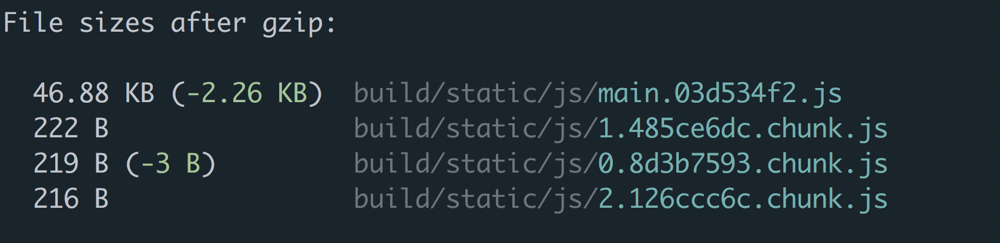
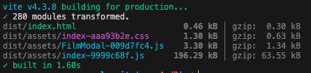
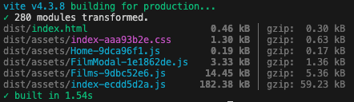

# Week 4 Day 2: React Router and Code Splitting

**\* In this write up we are using React Router v6.**

## Exploring React Router library for navigation in React apps

React is one of the most popular libraries for creating single page applications (SPAs), but sometimes we need more than a SPA to fulfill the requirements. In the case when we need to create a React app that allows for navigation to different pages, we need to add a tool to enable that. That is where we can utilize the [React Router](https://reactrouter.com/en/main) library. This library was created to add the functionality of navigation within React apps by enabling developers to create routes that load specific components based on a user's request without reloading the webpage.

In traditional routing the client will request the server to provide different `index.html` files of different pages. But with a React app with Client Side Rendering, we will only have one `index.html` file and use Client Side Routing. This will provide the user with the ability to use forward and backward navigation as well as updating the URL but not actually reloading the page while navigating.

### **Install React Router**

To add routing to a React app we just have to install the React router package. Within the project directory run the following command in the terminal.

Using npm:

```bash
npm i react-router-dom
```

Using yarn:

```bash
yarn add react-router-dom
```

### **Setup React Router**

To set up React Router we have to navigate to the applications root file, if using Vite this file will be named `main.tsx` and located within the src directory. We then need to import the `BrowserRouter` from the `react-router-dom` package and wrap it around our `<App>` component.

```tsx
// main.tsx
import { StrictMode } from 'react'
import { createRoot } from 'react-dom/client'
import { BrowserRouter } from 'react-router-dom'

import App from './App.tsx'
import './index.css'

const root = createRoot(document.getElementById('root') as HTMLElement)

root.render(
  <StrictMode>
    <BrowserRouter>
      <App />
    </BrowserRouter>
  </StrictMode>
)
```

### **Configure Routes**

Next we can implement routing by configuring all of our routes (pages/components) that we want to be able to navigate to.

To do this we have to first create components for each page we want. For example if we were creating an application for a store we might want to have a Home page, an About page, and a Products page. Once the components are finished we can configure the routes to each within our `<App>` component.

```tsx
// App.tsx
import { Routes, Route } from 'react-router-dom'

import Home from './Pages/Home'
import About from './Pages/About'
import Products from './Pages/Products'

const App: FC = (): JSX.Element => {
  return (
    <>
      <Routes>
        <Route path="/" element={<Home />} />
        <Route path="/about" element={<About />} />
        <Route path="/products" element={<Products />} />
      </Routes>
    </>
  )
}

export default App
```

We import `Routes` and `Route` from `react-router-dom` and use them to define the routes we want. We have to wrap all of the routes in the `<Routes>` component. Then we define each route with a `<Route>` and pass two properties. `path` which identifies the path we want to reach the component, and `element` which contains the component that we want the path to load. So now when we add `/about` to the url we will see the `<About>` component render.

### **Access Configured Routes with Links**

Now we know how to manually access routes by changing the url, but users should not have to navigate this way. Let's add some links in our app. To do this we need to import the `Link` component from `react-router-dom`. This component is just a wrapper around an anchor tag that we would normally use when linking in html, but adds functionality to make sure all the routing and re-rendering is handled properly. Now we can create a `<NavBar>` component that will be added to our `App.tsx` so users use it to navigate our app from any route.

```tsx
// NavBar.tsx
import { Link } from 'react-router-dom'

const NavBar: FC = (): JSX.Element => {
  return (
    <nav>
      <ul>
        <li>
          <Link to="/">Home</Link>
        </li>
        <li>
          <Link to="/about">About</Link>
        </li>
        <li>
          <Link to="/products">Products</Link>
        </li>
      </ul>
    </nav>
  )
}

export default NavBar
```

Here we create links for all the pages we set up routes for and use the `to` prop of the `<Link>` component to set the path we specified when configuring the routes. This `to` prop works just like an `href` would for an `<a>` element. Now let's add the navbar to our `App.tsx`

```tsx
// App.tsx
import { Routes, Route } from 'react-router-dom'

import Home from './Pages/Home'
import About from './Pages/About'
import Products from './Pages/Products'
import NavBar from './Components/NavBar'

const App: FC = (): JSX.Element => {
  return (
    <>
      <NavBar />

      <Routes>
        <Route path="/" element={<Home />} />
        <Route path="/about" element={<About />} />
        <Route path="/products" element={<Products />} />
      </Routes>
    </>
  )
}

export default App
```

### **Advanced Route Definitions**

We just touched the surface of what React Router is capable of when it comes to routing. There are more complex and more functional ways to route including:

1. [Dynamic Routing](https://blog.webdevsimplified.com/2022-07/react-router/#:~:text=useRoutes%20Hook-,Dynamic%20Routing,-The%20simplest%20and)
2. [Routing Priority](https://blog.webdevsimplified.com/2022-07/react-router/#:~:text=Book%203.-,Routing%20Priority,-When%20we%20were)
3. [Nested Routes](https://blog.webdevsimplified.com/2022-07/react-router/#:~:text=have%20also%20matched.-,Nested%20Routes,-Finally%2C%20we%20have)
4. [Multiple Routes](https://blog.webdevsimplified.com/2022-07/react-router/#:~:text=for%20this%20context.-,Multiple%20Routes,-Another%20incredibly%20powerful)
5. [`useRoutes` Hook](https://blog.webdevsimplified.com/2022-07/react-router/#:~:text=the%20NotFound%20component.-,useRoutes%20Hook,-The%20final%20thing)

Take a look at this [Ultimate React Router v6 Guide](https://blog.webdevsimplified.com/2022-07/react-router/#:~:text=the%20URL%20changes.-,Advanced%20Route%20Definitions,-This%20is%20where) to learn more about these advanced features, or click on the links in the list above to navigate directly to each topic.

<hr>

## Utilizing code splitting for optimizing bundle size

### **Bundling**

When we developers create applications it is typical to break up the app into modules, components, and functions that we export and import between files to build larger pieces of the app. This creates a complex web of files needed to build the application.

Most React apps we build will have their files "bundled" by tools such as [esbuild](https://esbuild.github.io/) or [webpack](https://webpack.js.org/). Bundling is a process where imported files are merged into a single file. This single file, or "bundle", is then included on a webpage to load the entire app at once with the goal of reducing the number of requests for files when a user visits the web page.


Bundling is great for reducing the network requests needed when loading a page, but as the app grows, so will the bundle. If the bundle becomes too large it can cause the app to take a long time to load and result in a bad user experience. To avoid large bundle files we can split our bundle using "code splitting".

### **Code Splitting**

Code Splitting is a feature supported by bundlers which can create multiple bundles that can be dynamically loaded at runtime. By splitting your app into smaller "chunks", the browser will only load the code needed by the user for the initial render of the app, which can dramatically improve its performance.


This does not reduce the overall amount of code in the application, we are now just not loading code that a user may never need. The application will then load the smaller chunks on demand or in parallel, as needed as the user navigates through the application.

One way to introduce code splitting into our app is through dynamic imports. Traditionally we import modules from other files like this:

```js
import { add } from './math'

console.log(add(16, 26))
```

But we can dynamically import to get the same results:

```js
import('./math').then((math) => {
  console.log(math.add(16, 26))
})
```

By using import like a function that returns a Promise we can have it resolve with the module once the module is completely loaded.

<hr>

## Implementing dynamic imports and lazy loading with React Router

When creating a React app utilizing React Router can easily take advantage of code splitting to reduce the bundle size since the user will only need the code to load the initial page. We can then load the code for the additional page as the user accesses them through the routes.

Lets modify our `App.tsx` file from earlier to take advantage of code splitting. We've already seen how to use `lazy()` provided by the react library, this function invokes a dynamic import which returns a React component. Let's use this to add code splitting to our application.

Lets replace:

```tsx
// App.tsx
...

import Home from './Pages/Home'
import About from './Pages/About'
import Products from './Pages/Products'

...
```

with:

```tsx
// App.tsx
...

import { lazy } from 'react'

const Home = lazy(() => import ('./Pages/Home'))
const About = lazy(() => import ('./Pages/About'))
const Products = lazy(() => import ('./Pages/Products'))

...
```

Now that we have added our lazy loaded components we have to remember that these dynamic imports are asynchronous. This means that there will be an unspecified amount of time before the components will be loaded, rendered, and displayed to the user, so we are going to have to tell React how to handle this. We can add `Suspense` to help us with this. With Suspense we can give it multiple lazily loaded components, let's take a look at our new `App.tsx` file.

```tsx
// App.tsx
import { lazy, Suspense } from 'react'
import { Routes, Route } from 'react-router-dom'

import NavBar from './Components/NavBar'

const Home = lazy(() => import('./Pages/Home'))
const About = lazy(() => import('./Pages/About'))
const Products = lazy(() => import('./Pages/Products'))

const App: FC = (): JSX.Element => {
  return (
    <>
      <NavBar />

      <Suspense fallback={<h1>Loading...</h1>}>
        <Routes>
          <Route path="/" element={<Home />} />
          <Route path="/about" element={<About />} />
          <Route path="/products" element={<Products />} />
        </Routes>
      </Suspense>
    </>
  )
}

export default App
```

Now when we run the `npm run build` command in our terminal we can see our app is split into three chunks because we have included three dynamic imports by using `lazy()` three times.



<hr>

## Incorporating RxJS observables and react-rxjs with React Router and code splitting

Let's get React Router and code splitting incorporated into a React app with React-RxJS. This time we'll have put what you just learned into practice by adding routing to the Star Wars application from yesterday.

From your terminal let's navigate back into the `week4/concurrency-example` and run `npm run dev` to fire up the application. Currently we have a typical React SPA, let's get started on changing that. Let's start by adding two new page components one for a landing page `<Home>` and one for our existing films page `<Films>`.

If you take a look in our `src` directory you will see that we already have created a `pages` directory for you. Here we have the `Home.tsx` and `Films.tsx`, let's open up `Home.tsx` and add the code below to create a component for our home page.

```tsx
// Home.tsx
import { FC } from 'react'

const Home: FC = (): JSX.Element => {
  return (
    <div className="page">
      <h1>Welcome to our week 4 tutorial Star Wars Data app!</h1>
    </div>
  )
}

export default Home
```

Now let's create our `<Films>` page, open up the `Films.tsx` file and ad the following to it:

```tsx
// Films.tsx
import { FC, Suspense, lazy } from 'react'

import FilmList from '../components/FilmList'
import { useSelectedFilmId } from '../AppState'
import Loading from '../components/Loading'

const FilmModal = lazy(() => import('../components/FilmModal'))

const Films: FC = (): JSX.Element => {
  const selectedFilmId = useSelectedFilmId()

  return (
    <>
      <div className="page">
        <h1>Star Wars films:</h1>
        <Suspense fallback={<Loading message="films" />}>
          <FilmList />
        </Suspense>
      </div>
      {selectedFilmId && (
        <div className="modal">
          <div className="modal-content">
            <Suspense fallback={<Loading message="film data" />}>
              <FilmModal />
            </Suspense>
          </div>
        </div>
      )}
    </>
  )
}

export default Films
```

This code should look very familiar, this is because it was originally within our `<App>` component. We have now extracted that out so that this can now be used as a page within our routes.

Now that we have both of our pages created let's start integrating React Router. We've already installed the npm package for you in this app so we can jump right into importing the tools we need. The first tool we need is the `BrowserRouter`, to add this open up `main.tsx` located in `concurrency-example/src`, import the `BrowserRouter` form `react-router-dom` and wrap our app with the `<BrowserRouter>` component.

Your `main.tsx` should look like this:

```tsx
// main.tsx
import { StrictMode } from 'react'
import { createRoot } from 'react-dom/client'
import { Subscribe } from '@react-rxjs/core'
import { BrowserRouter } from 'react-router-dom'

import App from './App.tsx'
import './index.css'

const root = createRoot(document.getElementById('root') as HTMLElement)

root.render(
  <StrictMode>
    <BrowserRouter>
      <Subscribe>
        <App />
      </Subscribe>
    </BrowserRouter>
  </StrictMode>
)
```

Next we have to configure our routes. To accomplish this we need to open up our `App.tsx` file, this file will also be in the `src` folder.

First we need to import `Routes` and `Route` from the `react-router-dom` package

```js
import { Routes, Route } from 'react-router-dom'
```

Then let's import our `Home` and `Films` pages using the traditional import statements:

```js
import Home from './pages/Home'
import Films from './pages/Films'
```

Now we can remove both the `FilmList` and `FilmModal` imports. We do not need these imports anymore because this is now handled by our `Films` page. We can also remove our import and use of `useSelecedFilmId` for the same reason.

Let's set up our routes. We can delete everything within the return method of our `<App>` component and replace it with routes specifying the home and films pages. Our `App.tsx` file will look like:

```tsx
// App.tsx
import { FC } from 'react'
import { Routes, Route, Link } from 'react-router-dom'

import './App.css'

import Home from './pages/Home'
import Films from './pages/Films'
import Loading from './components/Loading'

const App: FC = (): JSX.Element => {
  return (
    <Routes>
      <Route path="/" element={<Home />} />
      <Route path="/films" element={<Films />} />
    </Routes>
  )
}

export default App
```

We have now specified two routes:

1. `/` which is our root route that will render our `<Home>` page component.
2. `/films` that will render our `<Films>` page component.

Like earlier, even though we now have our routes configured there is no easy way for the user to access them. Let's add a navigation bar for a better user experience. We first need to add the `Link` component to our imports from `react-router-dom` then add the following code.

```tsx
<nav>
  <ul>
    <li>
      <Link to="/">Home</Link>
    </li>
    <li>
      <Link to="/films">Films</Link>
    </li>
  </ul>
</nav>
```

Here we are creating a navigation bar by using the nav, ul, and li html elements but each list item will contain a link to our pages. we specify the route we want each `<Link>` to link to with the `to` property. We want to add this navigation bar outside of the `<Routes>` component in our return method so that our nav bar will render on every page.

Our `App.tsx` will now look like this:

```tsx
// App.tsx
import { FC } from 'react'
import { Routes, Route, Link } from 'react-router-dom'

import './App.css'

import Home from './pages/Home'
import Films from './pages/Films'
import Loading from './components/Loading'

const App: FC = (): JSX.Element => {
  return (
    <>
      <nav>
        <ul>
          <li>
            <Link to="/">Home</Link>
          </li>
          <li>
            <Link to="/films">Films</Link>
          </li>
        </ul>
      </nav>

      <Routes>
        <Route path="/" element={<Home />} />
        <Route path="/films" element={<Films />} />
      </Routes>
    </>
  )
}

export default App
```

Now head to the url your application is on (most likely the vite default of `localhost:5173`) you should now see a navigation bar at the top of your screen with the links "Home" and "Films" and below that should be the welcome message we added to our `<Home>` component. When clicking on the "Films" link or changing the url to `/films` the application should re-render to display our film list and the app should work just as it has before.

**Let's add code splitting**

Now that we have routing implemented, let's add code splitting to make our application more performant.

To utilize code splitting we first have to change our import statement in our `App.tsx` to use the `lazy` function from React.

Old imports:

```js
import Home from './pages/Home'
import Films from './pages/Films'
```

New imports:

```js
const Home = lazy(() => import('./pages/Home'))
const Films = lazy(() => import('./pages/Films'))
```

Now that we are lazily loading our page components we have to add Suspense so that React can render a loading UI while the code needed to display our pages are asynchronously loaded.

`App.tsx` should now look like the following:

```tsx
// App.tsx
import { FC, lazy, Suspense } from 'react'
import { Routes, Route, Link } from 'react-router-dom'

import './App.css'
import Loading from './components/Loading'

const Home = lazy(() => import('./pages/Home'))
const Films = lazy(() => import('./pages/Films'))

const App: FC = (): JSX.Element => {
  return (
    <>
      <nav>
        <ul>
          <li>
            <Link to="/">Home</Link>
          </li>
          <li>
            <Link to="/films">Films</Link>
          </li>
        </ul>
      </nav>

      <Suspense fallback={<Loading />}>
        <Routes>
          <Route path="/" element={<Home />} />
          <Route path="/films" element={<Films />} />
        </Routes>
      </Suspense>
    </>
  )
}

export default App
```

Now when we reload our application and switch from our Home page to our Films page the user will briefly see our loading indicator while the Films page code is being retrieved, but the time of our initial render will be decreased. While this is not going to make a noticeable difference in our current application this will be significant in large applications.

One way we can see the advantage is in the bundle sizes when our app is built.

Before code splitting:



After adding code splitting:



Our original build generated 4 files:

1. `index.html`
2. `index-[hash].css`
3. `index-[hash].js`
4. `FilmModal-[hash].js`

We have two `.js` files because we already introduced code splitting by lazily loading our `<FilmModal>` component in our original application. You can see that the code specifically for our `<FilmModal>` has been broken out into its own chunk and not included in the bundled `index-[hash].js` which has a size of 196.29 kB.

After we add routing and lazily load all of our pages we can now see we have generated 6 files:

1. `index.html`
2. `index-[hash].css`
3. `index-[hash].js`
4. `Home-[hash].js`
5. `Films-[hash].js`
6. `FilmModal-[hash].js`

You can clearly see that the `index-[hash].js` has been reduced to the size of 182.38 kB. As mentioned earlier this will not make a noticeable difference in the current application, but you can see that code splitting will reduce the size size our index `.js` "chunk" and will make a significant impact in larger applications.

<hr>

## Week 4 Day 2 Code Challenge: Add Star Wars Characters Page

So far this week we have successfully created a React app that utilizes React-RxJS, React Router, Code Splitting, and Suspense, great job thats some pretty cool stuff! Now you'll work on your first coding challenge this week to give you a chance to solidify these concepts.

Let's continue building on to the Star Wars application we've been working with. We already have a home page and a films page, your challenge is to add a third page that will display a list of Star Wars characters.

You may have noticed we have already set up the service function for you to use in the `SWApi.ts` file:

- The `fetchCharacters()` function will return an Observable emitting a list of characters returned from the API.
- The `fetchCharacter()` function will return an Observable emitting the details for a specific character based on the id passed as an argument.

We've also provided you with some scaffolded out files for the page and components needed.

These files are:

`/pages`

- `Characters.tsx`

`/components`

- `CharacterList.tsx`
- `CharacterModal.tsx`

This feature will behave exactly as the Films page does so you can use that for reference. We've also already added the styles needed in `App.css` so keep the class names and the styles should be good to go.

Steps needed to complete:

1. `AppState.ts`:
   - Add `selectedCharacterId$`, `setSelectedCharacterId`, and `useSelectedCharacterId`
2. `Characters.tsx`:
   - Import all package tools, components, and functions needed.
   - Add the code needed to display the character list and character modal components.
3. `CharacterList.tsx`:
   - Import all package tools, components, and functions needed.
   - Add the code needed to access the character list returned from the `fetchCharacters` function. This file provides you with the code to display the list, just uncomment the implementation.
4. `CharacterModal.tsx`:
   - Import all package tools, components, and functions needed.
   - Add the code needed to access the selected character, invoke the `fetchCharacter` function, get access to the observable returned by `fetchCharatcher`, and use that data within the component.
5. `App.tsx`:
   - Import the character page.
   - Configure a route for the character page and add it to the navigation bar.

When finished open up your terminal and run:

```terminal
npm run test
```

If the tests pass, you have completed the coding challenge and can move on with your training!

<hr>

## Resources

- https://hygraph.com/blog/routing-in-react
- https://blog.webdevsimplified.com/2022-07/react-router/
