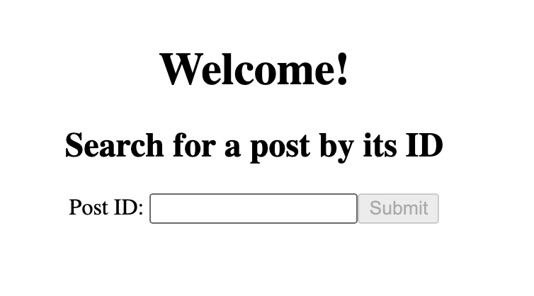
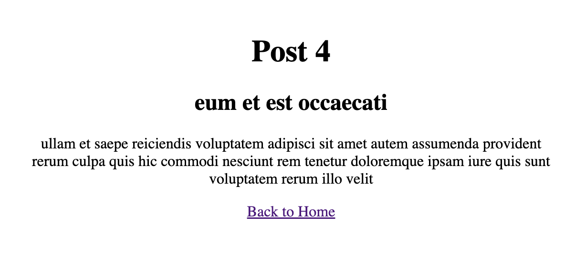
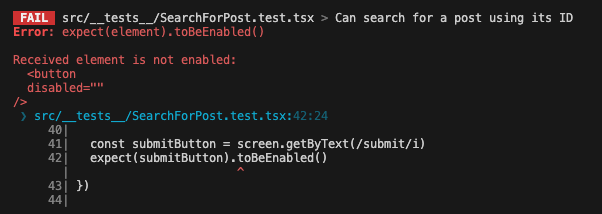

# Integration tests for React and RxJS applications

Current versions as of this write up:

- Vitest: v0.33
- React Router: v6
- Mock Service Worker: v1.2.2
- React Testing Library: v14

**Types of Tests**

The three most common types of tests are: unit, integration, and end to end.

Unit tests are faster to write and cheaper, but they also don't give you a lot of confidence. It's fine testing if component `A` renders correctly, but if you don't also test it together with `B` and `C`, you won't have much confidence in your application.

End to end tests give you a lot of confidence, because you are testing everything. But they also take a lot of time to write, and are of course the most expensive option.

Integration tests are the perfect balance. You test how your components work together, but mock some things (for example, HTTP requests) so it doesn't take you a lot of time to write them. And they give you a lot of confidence as well. Once you start testing your components this way, you'll see that you may not need a lot of your unit tests at all.

<hr>

**React Testing Library**

[React Testing Library](https://testing-library.com/docs/react-testing-library/intro/) is a testing utility tool that's built to test the actual DOM tree rendered by React on the browser. The goal of the library is to help you write tests that resemble how a user would use your application. This can give you more confidence that your application works as intended when a real user does use it.

The library does this by providing utility methods that will query the DOM in the same way a user would. For example, a user would find a button to 'Save' their work by its text, so the library provides you with the `getByText()` method.

We are going to use this library to write our integration tests!

<hr>

**Our Sample Application**

We need an application in order to test, we've created one for you located in `./post-search`. This sample React application that uses React Router and consists of two pages. A home page, with an input, where a user can enter a postId, and a submit button, which is disabled until you write something.



Once you write a postId and press the Submit button, you navigate to a second page, `/post/:postId`.

When you land on this page, you will first see a Loading... message.

A request is made to the [JSON Placeholder API](https://jsonplaceholder.typicode.com/) using the provided postId, and once the data is received, the post is displayed. This page also has a link to go back to the Home page.



<hr>

**Tests Configuration**

**We have already added the libraries and configurations to the application so you do not have to follow along to these steps**

To begin writing tests we first have to install all dependencies. We'll be using [Vitest](https://vitest.dev/), [jsdom](https://github.com/jsdom/jsdom#readme), [Mock Service Worker](https://mswjs.io/), and [React Testing Library](<(https://testing-library.com/docs/react-testing-library/intro/)>).

You can install these by running:

```bash
npm i -D vitest jsdom msw @testing-library/react @testing-library/jest-dom @testing-library/user-event
```

Once we have the libraries installed next we have to configure vitest. Let's add a `test` script to our `package.json`

```ts
// package.json

"scripts": {
  // ...
 "test": "vitest"
}
```

Then we can add a `vitest.setup.ts` file to our application root directory and add the code below to that file.

```ts
// vitest.setup.ts

import { expect, afterEach } from 'vitest'
import { cleanup } from '@testing-library/react'
import matchers from '@testing-library/jest-dom/matchers'

// extends Vitest's expect method with methods from react-testing-library
expect.extend(matchers)

// runs a cleanup after each test case (e.g. clearing jsdom)
afterEach(() => {
  cleanup()
})
```

The final step is to modify the Vite configuration file `vite.config.ts`, also located in the application root directory.

Here we will add the `test` property to the object passed to `defineConfig`.

```ts
// vite.config.ts

import { defineConfig } from 'vite'
import react from '@vitejs/plugin-react'

// https://vitejs.dev/config/
export default defineConfig({
  plugins: [react()],
  test: {
    globals: true,
    environment: 'jsdom',
    setupFiles: './vitest.setup.ts',
  },
})
```

Now we are ready to begin writing our tests.

<hr>

**Writing Tests**

We've added a blank test file called `SearchForPost.test.tsx` located in `./post-search/src/__test__/`. Open up that file and follow along to this guide.

First we will import `BrowserRouter` from React router and then import [render](https://testing-library.com/docs/react-testing-library/api/#render) and [screen](https://testing-library.com/docs/queries/about/#screen) from React Testing Library.

```tsx
// import Router Component
import { BrowserRouter } from 'react-router-dom'
// import react-testing methods
import { render, screen } from '@testing-library/react'
```

The `render` function allows us to render our component in order to start testing it, and `screen` provides us with all the queries we need to get elements.

Now we can import our `App` component and call the render function, because our app utilizes React Router the `App` component needs to be wrapped with `BrowserRouter`. In our application we handle this in our `main.tsx` file, but to recreate this behavior in our test we can pass an object with a wrapper property set as a second argument to the render function.

```tsx
// the component to test
import App from '../App'

test('Can search for a post using its ID', async () => {
  // Render a React element into the DOM
  render(<App />, { wrapper: BrowserRouter })
})
```

Our test should be passing. Now we can start using screen to check if our component is displaying what it should.

<hr>

**Testing The Home Page**

When on the Home Page the first thing we should see is a Welcome message, we can use the `getByText` query to check this. We get that element and then wrap it in an `expect` statement, expecting that it exists in the document.

We will add the following lines after the `render` function call within the callback function passed to `test`

```tsx
// assert that the welcome message is correct using toBeInTheDocument
expect(screen.getByText(/welcome/i)).toBeInTheDocument()
```

It's a good idea to use regular expressions for your text content and ignore cases. This is because your users do not care about text cases. Also, if it's a phrase, you may slightly change your words in the future, but you'll always keep a few important ones. Our Test should be looking for them, as they will always be there.

Let's see an example of that. In our home page we have an `h2` element that says "Search for a post by its ID". We could do this, and it would work:

```tsx
expect(screen.getByText('Search for a post by its ID')).toBeInTheDocument()
```

But what if the next week we change that phrase to "Here you can search for a post. The only thing you need is its ID"? Now our test would be broken! A better way to write this statement would be this one:

```tsx
expect(screen.getByText(/search.*post.*id/i)).toBeInTheDocument()
```

We know that we have three important words that will always be there (search, post, and id). With this statement, the test wouldn't break if we changed our phrase as we said before.

The last thing we need to check in our Home page is the Submit button, which should be there but be disabled.

```tsx
expect(screen.getByText(/submit/i)).toBeDisabled()
```

<hr>

**Searching for a Post**

Now that we know our Home page is rendering correctly. We need to simulate the user typing in our input field, and React Testing Library gives us the ability to do this.

First we need to set up our `userEvent` according to the [documentation](https://testing-library.com/docs/user-event/intro#writing-tests-with-userevent), import `userEvent` and invoking `setup()` before the component is rendered:

```tsx
// userEvent library simulates user interactions by dispatching the events that would happen if the interaction took place in a browser.
import userEvent from '@testing-library/user-event'

test('Can search for a post using its ID', async () => {
  const user = userEvent.setup()

  render(<App />, { wrapper: BrowserRouter })
  // testing code...
})
```

Then we need to get that element. A good practice when testing forms is to get elements by their `label`. This way we can also check if the `label` and the `input` field are associated correctly, which is important for accessibility.

So let's use the `getByLabelText` query to get that input and simulate the user typing in it, using the [`user-event`](https://testing-library.com/docs/user-event/intro) module:

```ts
user.type(screen.getByLabelText(/post id/i), '1')
```

Now that there is a value in the input, we expect to be enabled now.

```tsx
const submitButton = screen.getByText(/submit/i)
expect(submitButton).toBeEnabled()
```

If you run the test at this point you will see that it fails. with the following message:



The test failed because our Submit button is not enabled, but it should be because we have simulated a user input '1' in the post id field. What happened here is that we are using the `type()` utility API which is asynchronous, so we have to `await` this function to ensure that it completes before checking if our submit button is enabled.

Let's add the await now:

```tsx
await user.type(screen.getByLabelText(/post id/i), '1')
```

To finish the user interaction, we need to [click](https://testing-library.com/docs/user-event/convenience#clicks) the `Submit` button, which is enabled now.

```tsx
await userEvent.click(submitButton)
```

<hr>

**Landing on the Post page**

Now that we clicked the submit button, we should navigate to the `Post` page. The first thing we should see there is a "Loading..." message. To check that we should to use `find*` queries, along with `await`. The test will then wait until the loading message shows up.

```tsx
expect(await screen.findByText(/loading/i)).toBeInTheDocument()
```

<hr>

**Mocking HTTP Requests**

The next thing that happens in our application is that an HTTP request is fired to the API to get the post details. We don't want to fire an actual request in our test, so we need to mock it.

Vitest recommends using [Mock Service Worker](https://mswjs.io/), so will continue using that.

Mock Service Worker (MSW) works by intercepting the requests your tests make, allowing you to use it without changing any of your application code. In-browser, this uses the [Service Worker API](https://developer.mozilla.org/en-US/docs/Web/API/Service_Worker_API). In Node.js, and for Vitest, it uses [node-request-interceptor](https://mswjs.io/docs/api/setup-server#operation). To learn more about MSW, read their [introduction](https://mswjs.io/docs/).

We are going to use the `setupServer()` function provided by the MSW API, you can find the documentation [here](https://mswjs.io/docs/api/setup-server).

To get started we add the import for `setupServer` and `rest`

```tsx
import { rest } from 'msw'
import { setupServer } from 'msw/node'
```

Now we can define the service to mock, we'll add this code under the imports but above our tests.

```tsx
// Define the mock Post object to be returned by the API
const mockPost = {
  id: '1',
  title: 'Post Title',
  body: 'Post Body',
}

const server = setupServer(
  // Describe the requests to mock.
  rest.get('https://jsonplaceholder.typicode.com/posts/1', (req, res, ctx) => {
    return res(
      // Add a 1000ms delay to simulate the response time
      ctx.delay(1000),
      // Define the respose json
      ctx.json(mockPost)
    )
  })
)

// Start server before all tests
beforeAll(() => server.listen({ onUnhandledRequest: 'error' }))

//  Close server after all tests
afterAll(() => server.close())

// Reset handlers after each test `important for test isolation`
afterEach(() => server.resetHandlers())
```

Our mock service is all set up and we can now continue with our test.

<hr>

**Wrapping Up**

Now let's check that the actual post information is displayed on the screen for the user:

```tsx
expect(await screen.findByText(mockPost.title)).toBeInTheDocument()
expect(await screen.findByText(mockPost.body)).toBeInTheDocument()
```

The only thing left to test is the link back home. First we click it:

```tsx
await user.click(screen.getByText(/back.*home/i))
```

And then we should be in the Home page:

```tsx
expect(await screen.findByText(/welcome/i)).toBeInTheDocument()
```

And now we've completed our integration test!

We tested the happy path of searching for a post, navigating to a different page, waiting for it to load, seeing the post information on the screen and navigating back to the home page.

Here is the complete test:

```tsx
import { rest } from 'msw'
import { setupServer } from 'msw/node'
import { BrowserRouter } from 'react-router-dom'
import userEvent from '@testing-library/user-event'
import { render, screen } from '@testing-library/react'

import App from '../App'

const mockPost = {
  id: '1',
  title: 'Post Title',
  body: 'Post Body',
}

const server = setupServer(
  rest.get(
    'https://jsonplaceholder.typicode.com/posts/:id',
    (req, res, ctx) => {
      return res(ctx.delay(1000), ctx.json(mockPost))
    }
  )
)

beforeAll(() => server.listen())
afterAll(() => server.close())
afterEach(() => server.resetHandlers())

test('Can search for a post using its ID', async () => {
  const user = userEvent.setup()

  render(<App />, { wrapper: BrowserRouter })

  expect(screen.getByText(/welcome/i)).toBeInTheDocument()

  expect(screen.getByText(/search.*post.*id/i)).toBeInTheDocument()

  expect(screen.getByText(/submit/i)).toBeDisabled()

  await user.type(screen.getByLabelText(/post id/i), '1')

  const submitButton = screen.getByText(/submit/i)
  expect(submitButton).toBeEnabled()
  await userEvent.click(submitButton)

  expect(await screen.findByText(/loading/i)).toBeInTheDocument()

  expect(await screen.findByText(mockPost.title)).toBeInTheDocument()
  expect(await screen.findByText(mockPost.body)).toBeInTheDocument()

  await user.click(screen.getByText(/back.*home/i))

  expect(await screen.findByText(/welcome/i)).toBeInTheDocument()
})
```
